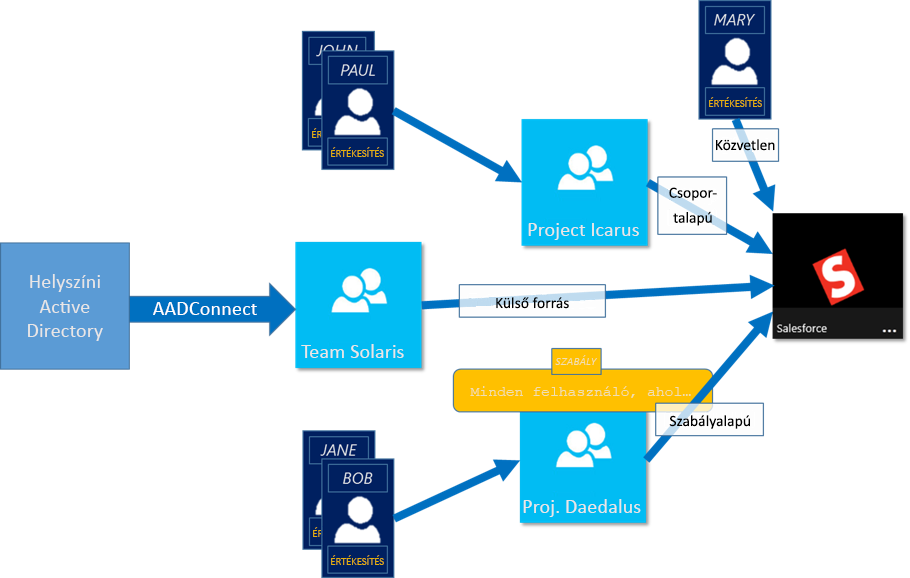
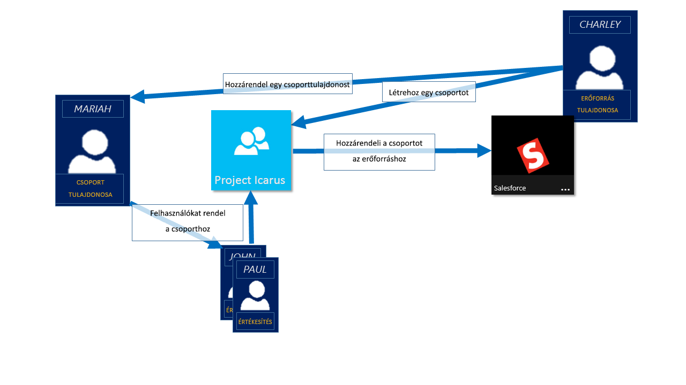

# Erőforrások hozzáférésének kezelése Azure Active Directory-csoportokkal
Az Azure Active Directory (Azure AD) egy átfogó identitás- és hozzáférés-kezelési megoldás, amely hatékony képességeket biztosít a hozzáférés kezeléséhez a helyszíni és felhőalapú alkalmazásokhoz és erőforrásokhoz kapcsolódóan, beleértve a Microsoft Online Servicest, mint az Office 365, valamint számos más, nem Microsoft SaaS-alkalmazást. A jelen cikk áttekintést biztosít, ha azonban azonnal szeretné megkezdeni az Azure AD-csoportok használatát, kövesse a [biztonsági csoportoknak az Azure AD-ben való kezelését](active-directory-groups-create-azure-portal.md) ismertető cikket. Ha szeretné megtudni, hogyan kezelhet csoportokat az Azure Active Directoryban a PowerShell használatával, a [csoportkezelésre szolgáló Azure Active Directory-parancsmagokat](../users-groups-roles/groups-settings-v2-cmdlets.md) ismertető cikkből tájékozódhat bővebben.

> [!NOTE]
> Az Azure Active Directory használatához Azure-fiókra lesz szükség. Ha nincs fiókja, [regisztrálhat egy ingyenes Azure-fiókot](https://azure.microsoft.com/pricing/free-trial/).
>
>

Az Azure AD egyik legfontosabb funkciója az erőforrásokhoz való hozzáférés kezelésének lehetősége. Ezek az erőforrások képezhetik a címtár részét, például az objektumok kezelésére szolgáló engedélyek esetében, amelyeket a címtár szerepkörei biztosítanak, vagy lehetnek a címtáron kívüli erőforrások, például SaaS-alkalmazások, Azure-szolgáltatások, SharePoint-webhelyek vagy helyszíni erőforrások. A felhasználókhoz négyféleképpen rendelhetők hozzáférési jogosultságok az erőforrásokra vonatkozóan:

1. Közvetlen hozzárendelés

    A felhasználókat az erőforrás tulajdonosa rendeli hozzá közvetlenül az erőforráshoz.
2. Csoporttagság

    Az erőforrás tulajdonosa egy csoportot rendelhet az erőforráshoz, és ezzel hozzáférést biztosít az erőforráshoz a csoport tagjai számára. A csoport tagságát ezután a csoport tulajdonosa kezelheti. A gyakorlatban az erőforrás tulajdonosa engedélyt biztosít a csoport tulajdonosának arra, hogy felhasználókat rendeljen az erőforráshoz.
3. Szabály alapján

    Az erőforrás tulajdonosa egy szabállyal megadhatja, hogy mely felhasználók kaphatnak hozzáférést az erőforrásokhoz. A szabály eredménye a szabályban használt attribútumoktól és azok adott felhasználókhoz tartozó értékétől függ, így az erőforrás tulajdonosa a gyakorlatban a szabályban használt attribútumok mérvadó forrása számára ruházza át az erőforráshoz való hozzáférés kezelésére vonatkozó jogosultságot. Az erőforrás tulajdonosa továbbra is saját maga kezeli a szabályt és határozza meg, hogy mely attribútumok és értékek biztosítanak hozzáférést az erőforráshoz.
4. Külső mérvadó forrás

    Az erőforráshoz való hozzáférés külső forrásból származik, ilyen lehet egy mérvadó forrásból, például egy helyszíni címtárból vagy SaaS-alkalmazásból (WorkDay) szinkronizált csoport. Az erőforrás tulajdonosa rendeli hozzá a csoportot az erőforráshoz való hozzáférés biztosítása érdekében, a csoport tagjait pedig a külső forrás kezeli.

   

## A hozzáférés-kezelést ismertető videó megtekintése
Megtekinthet egy rövid videót, amely részletesebben ismerteti a témát:

**Azure AD: Bevezetés a dinamikus csoporttagságba**

> [!VIDEO https://channel9.msdn.com/Series/Azure-Active-Directory-Videos-Demos/Azure-AD--Introduction-to-Dynamic-Memberships-for-Groups/player]
>
>

## Hogyan működik a hozzáférés-kezelés az Azure Active Directoryban?
Az Azure AD hozzáférés-kezelési megoldás középpontjában a biztonsági csoport áll. Az erőforrásokhoz való hozzáférés biztonsági csoportokkal való kezelése egy már jól ismert megközelítés, amely rugalmas és könnyen érhető módszert biztosít az erőforráshoz való hozzáféréshez a kívánt felhasználói csoport számára. Az erőforrás tulajdonosa (vagy a címtár rendszergazdája) hozzárendelhet egy csoportot a tulajdonában lévő erőforrásokhoz adott hozzáférési jogosultság biztosításához. A csoport tagjai megkapják a hozzáférést, az erőforrás tulajdonosa pedig átadhatja valaki másnak, például a részlegvezetőnek vagy az ügyfélszolgálat rendszergazdájának a csoport taglistájának kezelési jogosultságát.

A csoport tulajdonosa lehetővé teheti a csoportot önkiszolgáló kérésekhez is. Ezáltal a végfelhasználók megkereshetik a csoportot, és kérhetik a csoporthoz csatlakozást, amivel lényegében engedélyt kérnek a csoport segítségével kezelt erőforrásokhoz való hozzáféréshez. A csoport tulajdonosa beállíthatja, hogy a csatlakozásra irányuló kérések jóváhagyása automatikusan történjen vagy a csoport tulajdonosának jóváhagyását igényelje. Amikor egy felhasználó a csoporthoz való csatlakozásra irányuló kérést kezdeményez, a kérést a rendszer a csoport tulajdonosainak továbbítja. Ha a tulajdonosok valamelyike jóváhagyja a kérést, a kérést kezdeményező felhasználó értesítést kap erről, és a csoport tagja lesz. Ha a tulajdonosok valamelyike elutasítja a kérést, a kérést kezdeményező felhasználó értesítést kap erről, és nem válik a csoport tagjává.

## A hozzáférés-kezelés használatának megkezdése
Készen áll a kezdésre? Próbálja ki az Azure AD-csoportokkal végrehajtható alapszintű feladatokat. Ezekkel a képességekkel speciális hozzáférést biztosíthat a vállalat különböző erőforrásaihoz különböző személyekből álló csoportok számára. Az alapszintű első lépések listája az alábbiakban látható.

* [Egyszerű szabály létrehozása dinamikus tagság konfigurálásához egy csoport számára](active-directory-groups-create-azure-portal.md)
* [Csoport használata SaaS-alkalmazásokhoz való hozzáférés kezelésére](../users-groups-roles/groups-saasapps.md)
* [Csoport elérhetővé tétele önkiszolgáló végfelhasználói tevékenységhez](../users-groups-roles/groups-self-service-management.md)
* [Helyszíni csoport szinkronizálása az Azure-ba az Azure AD Connecttel](../connect/active-directory-aadconnect.md)
* [Csoporttulajdonosok kezelése](active-directory-accessmanagement-managing-group-owners.md)

## További lépések
Most, hogy megismerkedett a hozzáférés-kezelés alapjaival, áttekintheti az Azure Active Directory további speciális képességeit az alkalmazásokhoz és erőforrásokhoz való hozzáférés kezeléséhez.

* [Speciális szabályok létrehozása attribútumokkal](../users-groups-roles/groups-dynamic-membership.md)
* [Biztonsági csoportok kezelése az Azure AD-ben](active-directory-groups-create-azure-portal.md)
* [Graph API-referencia a csoportokhoz](https://msdn.microsoft.com/Library/Azure/Ad/Graph/api/groups-operations#GroupFunctions)
* [Azure Active Directory-parancsmagok csoportbeállítások konfigurálásához](../users-groups-roles/groups-settings-cmdlets.md)
