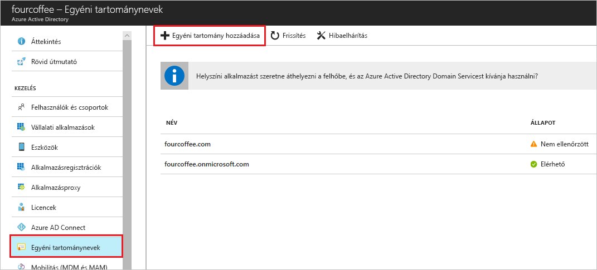

# Útmutató: az Azure Active Directory portál használatával egyéni tartománynév hozzáadása
Minden új Azure AD-bérlőt egy kezdeti tartománynevet tartalmaz *domainname*. onmicrosoft.com. Nem módosítható, és a kezdeti tartománynév törlése, de a szervezet neveket adhat hozzá a listában. Egyéni tartománynevek hozzáadása segítségével hozhat létre, amely számára is felismerhetők a felhasználók számára, például felhasználóneveket _alain@contoso.com_.

>[!Note]
>Meg kell ismételnie a teljes folyamatot, elejétől a végéig, az egyes egyéni tartománynév.

## Egyéni tartománynév hozzáadása
Először hozzá kell adnia az egyéni tartománynév Azure AD-bérlőhöz.

### Egyéni tartománynév hozzáadása
1. Jelentkezzen be a [Azure AD portálon](https://portal.azure.com/) a címtár egy globális rendszergazdai fiók használatával.

2. Válassza ki **Azure Active Directory**válassza **egyéni tartománynevek**, majd válassza ki **egyéni tartomány hozzáadása**.

    

3. Írja be az új vállalati tartománynevet a **egyéni tartománynév** mezőbe (például _contoso.com_), majd válassza ki **tartomány hozzáadása**.

    >[!Important]
    >Szerepelnie kell .com, .net vagy egyéb legfelső szintű kiterjesztés ennek megfelelően működjön.

    

4. Másolja a DNS-bejegyzés adatait a a **Contoso** panelen.

    

## A tartománynév regisztrálójánál az tartománynév hozzáadása
Ezután a DNS-zónafájlban kell frissítenie az új egyéni tartományhoz. Használhat [DNS-zónák](https://docs.microsoft.com/azure/dns/dns-getstarted-portal) az Azure-Office 365- vagy külső DNS-rekordok, vagy felveheti az új DNS-bejegyzés használatával egy másik DNS-regisztráló webhelyén (például [InterNIC](https://go.microsoft.com/fwlink/p/?LinkId=402770)).

### A tartománynév hozzáadása 
1. Jelentkezzen be a tartomány tartománynév, az egyéni tartományhoz. Nem rendelkezik a megfelelő engedélyekkel a bejegyzés frissítéséhez, ha valaki, ilyen engedélyekkel rendelkező szüksége.

2. A DNS-bejegyzést a regisztrálójánál frissítése után frissítenie kell a DNS-zónafájlban Azure AD által biztosított információkkal.

    >[!Note]
    >A DNS-bejegyzést a levélkezelési útválasztást vagy a webes üzemeltetés működése nem változik.

## Az egyéni tartománynév ellenőrzése
Miután regisztrálta az egyéni tartománynevet, is igénybe vehet pár másodpercet néhány óra múlva, mielőtt a DNS-információkat, ahol az Azure AD akkor láthatják őket, érvényes propagálása zajlik.

### Az egyéni tartománynév ellenőrzése
1. Jelentkezzen be a [Azure AD portálon](https://portal.azure.com/) a címtár egy globális rendszergazdai fiók használatával.

2. Válassza ki **Azure Active Directory**, majd válassza ki **egyéni tartománynevek**.

3. Az a **Fabrikam – egyéni tartománynevek** panelen válassza ki az egyéni tartománynév **Contoso**.

    

4. Az a **Contoso** panelen válassza ki **ellenőrizze** , hogy az egyéni tartomány megfelelően regisztrálva van, és érvényes Azure AD-hez.

    

### Gyakori hitelesítési hibák
Ha az Azure AD nem képes egyéni tartománynév ellenőrzésére, próbálkozzon a következőkkel:
- **Várjon legalább egy órát, és próbálkozzon újra**. DNS-rekordokat kell propagálása előtt az Azure AD ellenőrizni tudja a tartományt, és ez a folyamat egy vagy több óráig tarthat.

- **Győződjön meg arról, hogy a DNS-rekord helyességéről.** Lépjen vissza a tartomány nevét regisztráló helyre, és ellenőrizze, hogy a bejegyzés van-e, és, hogy megegyezik-e az Azure AD által támogatott DSN tétel adatait.

    Ha nem frissíti a rekordot a regisztrálójánál helyen, egy olyan személlyel, amely rendelkezik a megfelelő engedélyekkel a bejegyzést, és győződjön meg arról, pontosan meg kell osztania a bejegyzést.

- **Ellenőrizze, hogy egy másik címtárban már nem a tartomány nevét.** A tartománynév csak egy címtárban, ami azt jelenti, hogy a tartománynév jelenleg ellenőrizve van egy másik címtárban, ha azt nem is lehet ellenőrizni az új címtárban ellenőrizhető. Duplikáció a probléma elhárításához törölnie kell az a tartomány nevét a régi könyvtárból. További információ a tartománynevek törléséről: [egyéni tartománynevek kezelése](../users-groups-roles/domains-manage.md).    

## További lépések
- Felhasználók hozzáadása a tartományhoz, lásd: [egyéni tartománynevek kezelése](../users-groups-roles/domains-manage.md).

- Ha rendelkezik a helyszíni verzióját, amelyet szeretne használhatja az Azure Active Directory mellett, a Windows Server [a helyszíni címtárak integrálása az Azure Active Directory](../connect/active-directory-aadconnect.md).