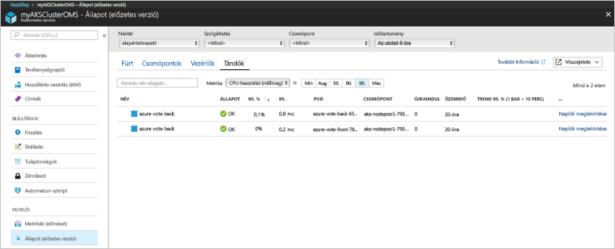
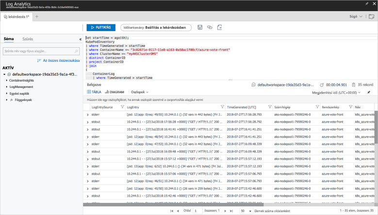

# <a name="quickstart-deploy-an-azure-kubernetes-service-aks-cluster"></a>Rövid útmutató: Azure Kubernetes Service- (AKS-) fürt üzembe helyezése

Ebben a rövid útmutatóban egy AKS-fürtöt helyezünk üzembe az Azure CLI-vel. Ezután egy webes előtérrendszert és egy Redis-példányt magában foglaló többtárolós alkalmazást futtatunk a fürtön. Miután végeztünk ezzel, az alkalmazás elérhető lesz az interneten.


Ez a rövid útmutató feltételezi, hogy ismeri a Kubernetes alapvető fogalmait. A Kubernetesszel kapcsolatos részletes információkért lásd a [Kubernetes dokumentációját][kubernetes-documentation].

[!INCLUDE [cloud-shell-try-it.md](../../includes/cloud-shell-try-it.md)]

Ha a parancssori felület helyi telepítését és használatát választja, akkor ehhez a rövid útmutatóhoz az Azure CLI 2.0.43-as vagy újabb verziójára lesz szükség. A verzió azonosításához futtassa a következőt: `az --version`. Ha telepíteni vagy frissíteni szeretne: [Az Azure CLI telepítése][azure-cli-install].

## <a name="create-a-resource-group"></a>Hozzon létre egy erőforráscsoportot

Hozzon létre egy erőforráscsoportot az [az group create][az-group-create] paranccsal. Az Azure-erőforráscsoport olyan logikai csoport, amelyben az Azure-erőforrások üzembe helyezése és kezelése zajlik. Az erőforráscsoportok létrehozásakor meg kell adnia egy helyet. Az erőforrások ezen a helyen futnak az Azure-ban.

A következő példában létrehozunk egy *myAKSCluster* nevű erőforráscsoportot az *eastus* helyen.

```azurecli-interactive
az group create --name myAKSCluster --location eastus
```

Kimenet:

```json
{
  "id": "/subscriptions/00000000-0000-0000-0000-000000000000/resourceGroups/myAKSCluster",
  "location": "eastus",
  "managedBy": null,
  "name": "myAKSCluster",
  "properties": {
    "provisioningState": "Succeeded"
  },
  "tags": null
}
```

## <a name="create-aks-cluster"></a>AKS-fürt létrehozása

Használja az [az aks create][az-aks-create] parancsot egy AKS-fürt létrehozásához. A következő példa egy *myAKSCluster* nevű fürtöt hoz létre egy csomóponttal. A tároló állapotfigyelése is engedélyezve van az *--enable-addons monitoring* paraméterrel. A tároló állapotmonitorozási megoldásának engedélyezéséről az [Azure Kubernetes Service állapotmonitorozásáról][aks-monitor] szóló témakörben talál további információt.

```azurecli-interactive
az aks create --resource-group myAKSCluster --name myAKSCluster --node-count 1 --enable-addons monitoring --generate-ssh-keys
```

Néhány perc múlva befejeződik a parancs végrehajtása, és visszaadja a fürttel kapcsolatos adatokat JSON formátumban.

## <a name="connect-to-the-cluster"></a>Csatlakozás a fürthöz

Kubernetes-fürtök kezeléséhez használja a [kubectl][kubectl] eszközt, a Kubernetes parancssori ügyfelét.

Az Azure Cloud Shell használata esetén a `kubectl` már telepítve van. Ha helyileg kívánja telepíteni, használja az [az aks install-cli][az-aks-install-cli] parancsot.


```azurecli
az aks install-cli
```

Az [aks get-credentials][az-aks-get-credentials] paranccsal konfigurálható`kubectl` a Kubernetes-fürthöz való csatlakozásra. Ebben a lépésben a rendszer hitelesítő adatokat tölt le, és konfigurálja a Kubernetes parancssori felületét azok használatára.

```azurecli-interactive
az aks get-credentials --resource-group myAKSCluster --name myAKSCluster
```

A fürthöz való csatlakozás ellenőrzéséhez használja a [kubectl get][kubectl-get] parancsot a fürtcsomópontok listájának lekéréséhez. Eltarthat egy pár percig, amíg a csomópontok megjelennek.

```azurecli-interactive
kubectl get nodes
```

Kimenet:

```
NAME                          STATUS    ROLES     AGE       VERSION
k8s-myAKSCluster-36346190-0   Ready     agent     2m        v1.7.7
```

## <a name="run-the-application"></a>Az alkalmazás futtatása

A Kubernetes-jegyzékfájl meghatározza a fürt célállapotát, például azt, hogy milyen tárolórendszerképeknek kell futniuk. Ebben a példában egy jegyzékfájlt használunk az Azure Vote alkalmazás futtatásához szükséges összes objektum létrehozásához. Ez a jegyzékfájl tartalmaz két [Kubernetes-telepítést][kubernetes-deployment], egyet az Azure Vote Python-alkalmazásoknak, egyet pedig a Redis-példánynak. Emellett létrejön két [Kubernetes-szolgáltatás][kubernetes-service]: egy belső szolgáltatás a Redis-példánynak, és egy külső szolgáltatás az Azure Vote-alkalmazás internetről való eléréséhez.

Hozzon létre egy `azure-vote.yaml` nevű fájlt, és másolja bele a következő YAML-kódot. Ha az Azure Cloud Shellben dolgozik, ez a fájl a vi vagy a Nano segítségével hozható létre, ugyanúgy, mint egy virtuális vagy fizikai rendszeren.

```yaml
apiVersion: apps/v1beta1
kind: Deployment
metadata:
  name: azure-vote-back
spec:
  replicas: 1
  template:
    metadata:
      labels:
        app: azure-vote-back
    spec:
      containers:
      - name: azure-vote-back
        image: redis
        ports:
        - containerPort: 6379
          name: redis
---
apiVersion: v1
kind: Service
metadata:
  name: azure-vote-back
spec:
  ports:
  - port: 6379
  selector:
    app: azure-vote-back
---
apiVersion: apps/v1beta1
kind: Deployment
metadata:
  name: azure-vote-front
spec:
  replicas: 1
  template:
    metadata:
      labels:
        app: azure-vote-front
    spec:
      containers:
      - name: azure-vote-front
        image: microsoft/azure-vote-front:v1
        ports:
        - containerPort: 80
        env:
        - name: REDIS
          value: "azure-vote-back"
---
apiVersion: v1
kind: Service
metadata:
  name: azure-vote-front
spec:
  type: LoadBalancer
  ports:
  - port: 80
  selector:
    app: azure-vote-front
```

Az alkalmazást a [kubectl apply][kubectl-apply] paranccsal futtathatja.

```azurecli-interactive
kubectl apply -f azure-vote.yaml
```

Kimenet:

```
deployment "azure-vote-back" created
service "azure-vote-back" created
deployment "azure-vote-front" created
service "azure-vote-front" created
```

## <a name="test-the-application"></a>Az alkalmazás tesztelése

Az alkalmazás futtatásakor a rendszer létrehoz egy [Kubernetes-szolgáltatást][kubernetes-service], amely közzéteszi az alkalmazás-előteret az interneten. A folyamat eltarthat pár percig.

A folyamat állapotának monitorozásához használja [kubectl get service][kubectl-get] parancsot a `--watch` argumentummal.

```azurecli-interactive
kubectl get service azure-vote-front --watch
```

Kezdetben az *azure-vote-front* szolgáltatás *EXTERNAL-IP* értéke *pending* állapotú.

```
NAME               TYPE           CLUSTER-IP   EXTERNAL-IP   PORT(S)        AGE
azure-vote-front   LoadBalancer   10.0.37.27   <pending>     80:30572/TCP   6s
```

Miután az *EXTERNAL-IP* cím *pending* állapotról egy *IP-címre* változik, a `CTRL-C` billentyűparanccsal állítsa le a kubectl figyelési folyamatát.

```
azure-vote-front   LoadBalancer   10.0.37.27   52.179.23.131   80:30572/TCP   2m
```

Most lépjen a külső IP-címre az Azure Vote alkalmazás megtekintéséhez.


## <a name="monitor-health-and-logs"></a>Állapot és naplók monitorozása

Az AKS-fürt létrejöttekor a monitorozás is engedélyezve lett, hogy rögzítse a fürtcsomópontok és a podok állapotmetrikáit. Ezek az állapotmetrikák elérhetők az Azure Portalon. A tároló állapotának monitorozásával kapcsolatos további információ [az Azure Kubernetes Service állapotmonitorozásáról][aks-monitor] szóló témakörben érhető el.

Az Azure Vote podok jelenlegi állapotának, üzemidejének és erőforrás-felhasználásának megjelenítéséhez hajtsa végre az alábbi lépéseket:

1. Nyissa meg egy webböngészőben az Azure Portalt [https://portal.azure.com][azure-portal].
1. Válassza ki az erőforráscsoportját (pl. *myResourceGroup*), majd válassza i az AKS-fürtöt (pl. *myAKSCluster*). 
1. Válassza ki a **Tároló állapotának monitorozása** lehetőséget > válassza az **alapértelmezett** névteret, majd a **Tárolók** lehetőséget.

Az adatok Azure Portalra történő feltöltése eltarthat néhány percig, ahogy az alábbi példában látható:



A pod (`azure-vote-front`) naplóinak megtekintéséhez kattintson a **Naplók megtekintése** hivatkozásra a tárolók listájának jobb oldalán. Ezek a naplók tartalmazzák a tároló *stdout* és *stderr* streamjét is.



## <a name="delete-cluster"></a>A fürt törlése

Ha a fürtre már nincs szükség, az [az group delete][az-group-delete] paranccsal törölheti az erőforráscsoportot, a tárolószolgáltatást és az összes kapcsolódó erőforrást.

```azurecli-interactive
az group delete --name myAKSCluster --yes --no-wait
```

> [!NOTE]
> A fürt törlésekor az AKS-fürt által használt Azure Active Directory-szolgáltatásnév nem lesz eltávolítva. A szolgáltatásnév eltávolításának lépéseiért lásd [az AKS-szolgáltatásnevekre vonatkozó szempontokat és a szolgáltatásnevek törlését][sp-delete] ismertető cikket.

## <a name="get-the-code"></a>A kód letöltése

Ebben a rövid útmutatóban előre elkészített tárolórendszerképekkel hoztunk létre egy üzemelő Kubernetes-példányt. A kapcsolódó alkalmazáskód, Docker-fájl és Kubernetes-jegyzékfájl a GitHubon érhetőek el.

[https://github.com/Azure-Samples/azure-voting-app-redis][azure-vote-app]

## <a name="next-steps"></a>További lépések

Ebben a rövid útmutatóban egy Kubernetes-fürtöt és azon egy többtárolós alkalmazást helyezett üzembe.

Az AKS-sel kapcsolatos további információkért és a kódtól az üzembe helyezésig terjedő teljes útmutatóért folytassa a Kubernetes-fürtöket bemutató oktatóanyaggal.

> [!div class="nextstepaction"]
> [AKS-oktatóanyag][aks-tutorial]

<!-- LINKS - external -->
[azure-vote-app]: https://github.com/Azure-Samples/azure-voting-app-redis.git
[kubectl]: https://kubernetes.io/docs/user-guide/kubectl/
[kubectl-apply]: https://kubernetes.io/docs/reference/generated/kubectl/kubectl-commands#apply
[kubernetes-deployment]: https://kubernetes.io/docs/concepts/workloads/controllers/deployment/
[kubernetes-documentation]: https://kubernetes.io/docs/home/
[kubectl-get]: https://kubernetes.io/docs/reference/generated/kubectl/kubectl-commands#get
[kubernetes-service]: https://kubernetes.io/docs/concepts/services-networking/service/

<!-- LINKS - internal -->
[aks-monitor]: https://aka.ms/coingfonboarding
[aks-tutorial]: ./tutorial-kubernetes-prepare-app.md
[az-aks-browse]: /cli/azure/aks?view=azure-cli-latest#az-aks-browse
[az-aks-create]: /cli/azure/aks?view=azure-cli-latest#az-aks-create
[az-aks-get-credentials]: /cli/azure/aks?view=azure-cli-latest#az-aks-get-credentials
[az-aks-install-cli]: /cli/azure/aks?view=azure-cli-latest#az-aks-install-cli
[az-group-create]: /cli/azure/group#az-group-create
[az-group-delete]: /cli/azure/group#az-group-delete
[azure-cli-install]: /cli/azure/install-azure-cli
[sp-delete]: kubernetes-service-principal.md#additional-considerations
[azure-portal]: https://portal.azure.com
