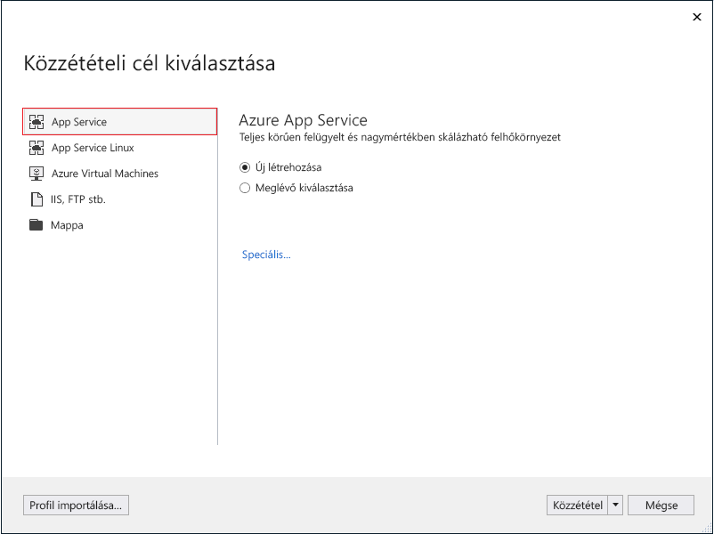
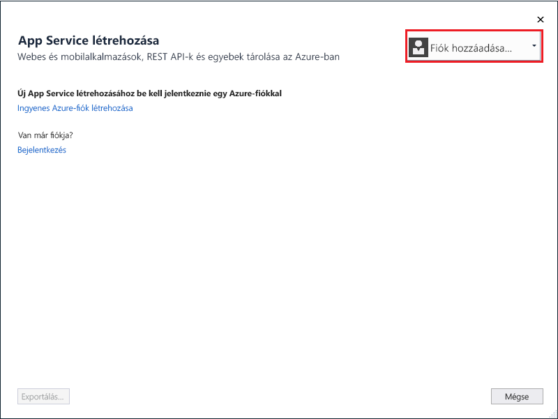
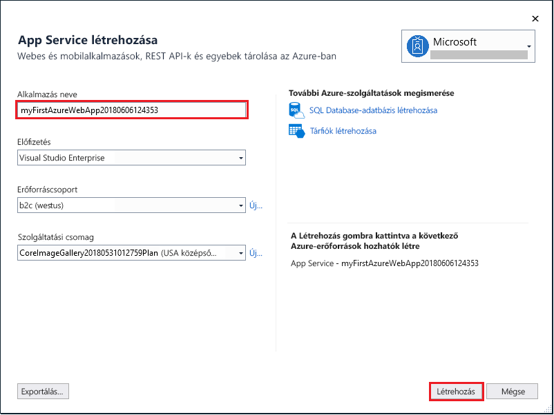

# <a name="create-an-aspnet-framework-web-app-in-azure"></a>ASP.NET Framework webalkalmazás létrehozása az Azure-ban

Az [Azure Web Apps](app-service-web-overview.md) egy hatékonyan méretezhető, önjavító webes üzemeltetési szolgáltatás.  Ez a gyorsútmutató az ASP.NET-webalkalmazás Azure Web Apps szolgáltatásban történő üzembe helyezésén vezeti végig. Az oktatóanyag végére egy olyan erőforráscsoport lesz elérhető, amely egy App Service-csomagból és egy üzembe helyezett webalkalmazással rendelkező Azure webalkalmazásból áll.

Tekintse meg a videót, amelyben működés közben láthatja ezt a gyorsútmutatót, majd kövesse végig a lépéseket az első .NET-alkalmazása közzétételéhez az Azure-on.

> [!VIDEO https://channel9.msdn.com/Shows/Azure-for-NET-Developers/Create-a-NET-app-in-Azure-Quickstart/player]

[!INCLUDE [quickstarts-free-trial-note](../../includes/quickstarts-free-trial-note.md)]

## <a name="prerequisites"></a>Előfeltételek

Az oktatóanyag elvégzéséhez:

* Telepítse a <a href="https://www.visualstudio.com/downloads/" target="_blank">Visual Studio 2017</a> szoftvert a következő számítási feladatokkal:
    - **ASP.NET és webfejlesztés**
    - **Azure-fejlesztés**

    

Ha már telepítette a Visual Studiót, adja hozzá a számítási feladatokat a Visual Studióban a **Tools** (Eszközök)  >  **Get Tools and Features** (Eszközök és funkciók beszerzése) elemre kattintva.

## <a name="create-an-aspnet-web-app"></a>ASP.NET-webapp létrehozása

Hozzon létre egy projektet a Visual Studióban a **File > New > Project** (Fájl > Új > Projekt) lehetőség kiválasztásával. 

A **New Project** (Új projekt) párbeszédpanelen válassza a **Visual C# > Web > ASP.NET Web Application (.NET Framework)** (ASP.NET-webalkalmazás (.NET-keretrendszer)) elemet.

Nevezze el az alkalmazást _myFirstAzureWebApp_ néven, majd kattintson az **OK** gombra.
   


Bármilyen ASP.NET-webappot üzembe helyezhet az Azure-ban. Ennél a gyorsútmutatónál válassza az **MVC** sablont, és ügyeljen arra, hogy a hitelesítés beállítása **No Authentication** (Nincs hitelesítés) legyen.
      
Kattintson az **OK** gombra.


A menüből válassza a **Debug > Start without Debugging** (Hibakeresés > Indítás hibakeresés nélkül) lehetőséget a webalkalmazás helyi futtatásához.


## <a name="publish-to-azure"></a>Közzététel az Azure platformon

A **Solution Explorer** (Megoldáskezelő) lapon kattintson a jobb gombbal a **myFirstAzureWebApp** projektre, és válassza a **Publish** (Közzététel) elemet.


Győződjön meg arról, hogy a **Microsoft Azure App Service** van kiválasztva, és kattintson a **Publish** (Közzététel) elemre.



Ez megnyitja a **Create App Service** (App Service létrehozása) párbeszédpanelt, amely segítségével létrehozhatja az összes, az ASP.NET-webalkalmazás Azure-ban való futtatásához szükséges Azure-erőforrást.

## <a name="sign-in-to-azure"></a>Bejelentkezés az Azure-ba

A **Create App Service** (App Service létrehozása) párbeszédpanelen kattintson az **Add an account** (Fiók hozzáadása) gombra, majd jelentkezzen be az Azure-előfizetésébe. Ha már bejelentkezett, válassza ki a kívánt előfizetést tartalmazó fiókot a legördülő listából.

> [!NOTE]
> Ha már be van jelentkezve, akkor még ne válassza a **Create** (Létrehozás) lehetőséget.
>
>
   


## <a name="create-a-resource-group"></a>Hozzon létre egy erőforráscsoportot

[!INCLUDE [resource group intro text](../../includes/resource-group.md)]

Az **Erőforráscsoport** mellett válassza az **Új** elemet.

Nevezze el a **myResourceGroup** erőforráscsoportot, majd kattintson az **OK** gombra.

## <a name="create-an-app-service-plan"></a>App Service-csomag létrehozása

[!INCLUDE [app-service-plan](../../includes/app-service-plan.md)]

Az **App Service Plan** (App Service-csomag) mellett válassza a **New** (Új) elemet. 

A **Configure App Service Plan** (App Service-csomag konfigurálása) párbeszédpanelen a képernyőképet követve használja a táblázatban szereplő beállításokat.


| Beállítás | Ajánlott érték | Leírás |
|-|-|-|
|App Service-csomag| myAppServicePlan | Az App Service-csomag neve. |
| Hely | Nyugat-Európa | Az adatközpont, ahol a webalkalmazást üzemeltetik. |
| Méret | Ingyenes | A [tarifacsomag](https://azure.microsoft.com/pricing/details/app-service/?ref=microsoft.com&utm_source=microsoft.com&utm_medium=docs&utm_campaign=visualstudio) meghatározza az üzemeltetési funkciókat. |

Kattintson az **OK** gombra.

## <a name="create-and-publish-the-web-app"></a>A webapp létrehozása és közzététele

A **Web App Name** (Webalkalmazás neve) mezőben adjon meg egy egyedi nevet az alkalmazáshoz (érvényes karakterek: `a-z`, `0-9` és `-`) vagy fogadja el az automatikusan létrehozott egyedi nevet. A webalkalmazás URL-címe `http://<app_name>.azurewebsites.net`, amelyben a `<app_name>` a webalkalmazás neve.

A **Create** (Létrehozás) gombra kattintva hozzákezdhet az Azure-erőforrások létrehozásához.



Miután a varázsló befejeződött, közzéteszi az ASP.NET webalkalmazást az Azure-on, majd elindítja azt az alapértelmezett böngészőben.


A [létrehozás és közzététel lépésben](#create-and-publish-the-web-app) megadott webalkalmazás neve lesz az URL-előtag `http://<app_name>.azurewebsites.net` formátumban.

Gratulálunk, az ASP.NET-webalkalmazás immáron elérhető az Azure App Service-ben.

## <a name="update-the-app-and-redeploy"></a>Az alkalmazás frissítése és ismételt üzembe helyezése

A **Solution Explorer** (Megoldáskezelő) lapon nyissa meg a következőt: _Views\Home\Index.cshtml_.

Keresse meg a `<div class="jumbotron">` HTML-címkét felül, és cserélje le az egész elemet az alábbi kódra:

```HTML
<div class="jumbotron">
    <h1>ASP.NET in Azure!</h1>
    <p class="lead">This is a simple app that we’ve built that demonstrates how to deploy a .NET app to Azure App Service.</p>
</div>
```

Az Azure-beli ismételt üzembe helyezéshez kattintson a jobb gombbal a **myFirstAzureWebApp** projektre a **Solution Explorer** (Megoldáskezelő) lapon, és válassza a **Publish** (Közzététel) elemet.

A közzétételi oldalon válassza a **Publish** (Közzététel) elemet.

Miután a közzététel befejeződött, a Visual Studio tallózza a webalkalmazás URL-címét.


## <a name="manage-the-azure-web-app"></a>Az Azure webalkalmazás felügyelete

Ugorjon az <a href="https://portal.azure.com" target="_blank">Azure Portalra</a>, és felügyelje a létrehozott webalkalmazást.

A baloldali menüben válassza az **App Services** lehetőséget, majd az Azure-webalkalmazás nevét.


Megtekintheti a webalkalmazás Áttekintés oldalát. Itt elvégezhet olyan alapszintű felügyeleti feladatokat, mint a tallózás, leállítás, elindítás, újraindítás és törlés. 


A bal oldali menü az alkalmazás konfigurálásához biztosít különböző oldalakat. 

[!INCLUDE [Clean-up section](../../includes/clean-up-section-portal.md)]

## <a name="next-steps"></a>További lépések

> [!div class="nextstepaction"]
> [ASP.NET-alkalmazás és SQL Database](app-service-web-tutorial-dotnet-sqldatabase.md)
