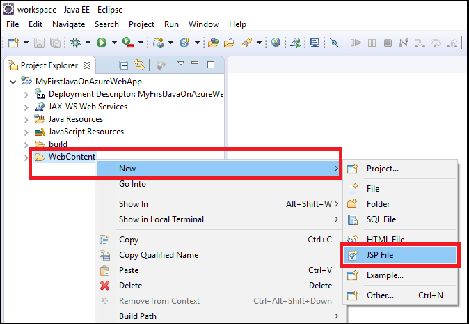
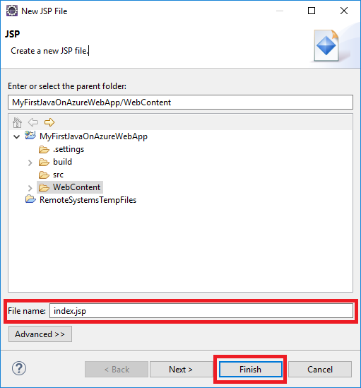
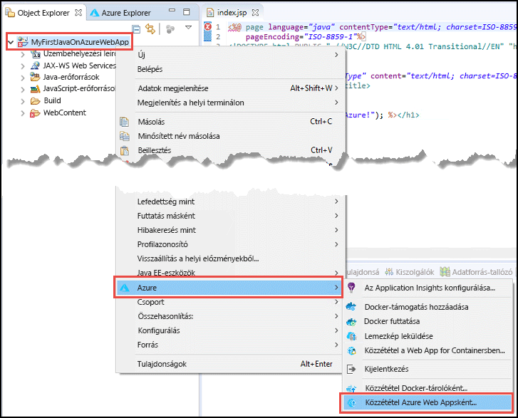
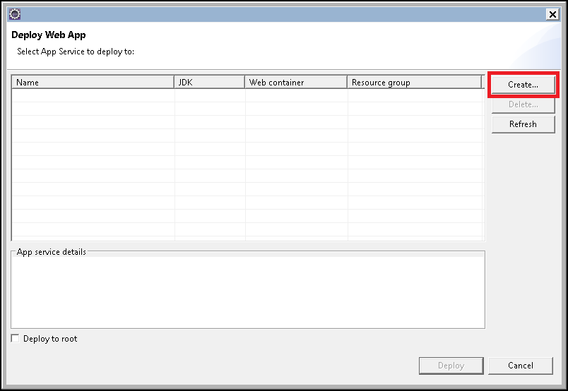
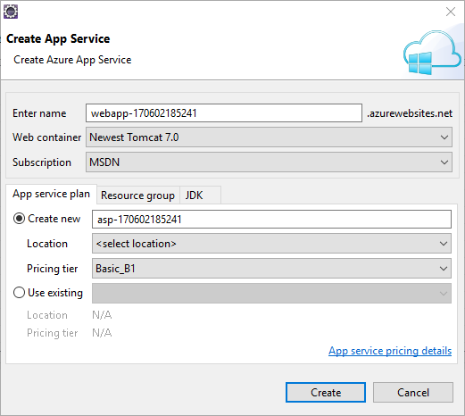
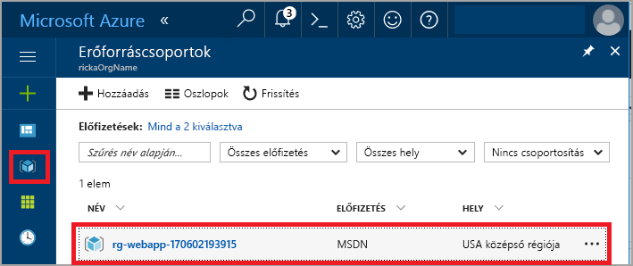

# <a name="create-your-first-java-web-app-in-azure"></a>Az első Java-webalkalmazás létrehozása az Azure-ban

Az [Azure Web Apps](app-service-web-overview.md) egy hatékonyan méretezhető, önjavító webes üzemeltetési szolgáltatás. Ez a gyorsútmutató bemutatja, hogyan helyezhet üzembe Java-webalkalmazásokat az App Service-ben a [Java EE-fejlesztőknek készült Eclipse IDE](http://www.eclipse.org/) használatával.

A gyors útmutató befejezését követően alkalmazása webböngészőben megtekintve az alábbi illusztrációra fog hasonlítani:


[!INCLUDE [quickstarts-free-trial-note](../../includes/quickstarts-free-trial-note.md)]

## <a name="prerequisites"></a>Előfeltételek

A gyorsútmutató elvégzéséhez a következők telepítése szükséges:

* Az ingyenes, <a href="http://www.eclipse.org/downloads/" target="_blank">Java EE-fejlesztőknek készült Eclipse IDE</a>. Ez a gyorsútmutató az Eclipse Neont használj.
* Az <a href="/java/azure/eclipse/azure-toolkit-for-eclipse-installation" target="_blank">Eclipse-hez készült Azure-eszközkészlet</a>.

## <a name="create-a-dynamic-web-project-in-eclipse"></a>Dinamikus webes projekt létrehozása az Eclipse-ben

Az Eclipse-ben válassza a **File (Fájl)** > **New (Új)** > **Dynamic Web Project** (Dinamikus webprojekt) lehetőséget.

A **New Dynamic Web Project** (Új dinamikus webprojekt) párbeszédpanelen adja a **MyFirstJavaOnAzureWebApp** nevet a projektnek, és válassza a **Finish** (Befejezés) lehetőséget.
   


### <a name="add-a-jsp-page"></a>JSP-oldal hozzáadása

Ha a Project Explorer (Projektböngésző) nem jelenik meg, állítsa azt vissza.


A Project Explorer (Projektböngésző) nézetben bontsa ki a **MyFirstJavaOnAzureWebApp** projektet.
Kattintson a jobb gombbal az **WebContent** elemre, majd válassza a **(New) Új** > **JSP File (JSP-fájl)** (JSP-fájl) lehetőséget.



A **New JSP File** (Új JSP-fájl) párbeszédpanelen:

* Nevezze el a fájlt az alábbi módon: **index.jsp**.
* Válassza a **Finish** (Befejezés) elemet.

  

Az index.jsp fájlban cserélje le a `<body></body>` elemet az alábbi jelöléssel:

```jsp
<body>
<h1><% out.println("Hello Azure!"); %></h1>
</body>
```

Mentse a módosításokat.

## <a name="publish-the-web-app-to-azure"></a>A webalkalmazás közzététele az Azure-ban

A Project Explorer (Projektböngésző) nézetben kattintson a jobb gombbal a projektre, majd válassza az **Azure** > **Publish as Azure Web App** (Közzététel Azure-webalkalmazásként) lehetőséget.



Az **Azure bejelentkezési** párbeszédpanelen tartsa meg az **Interactive** (Interaktív) lehetőséget, majd válassza a **Sign in** (Bejelentkezés) gombot.

Kövesse a bejelentkezési utasításokat.

### <a name="deploy-web-app-dialog-box"></a>Deploy Web App (Webalkalmazás üzembe helyezése) párbeszédpanel

Miután bejelentkezett Azure-fiókjába, megjelenik a **Deploy Web App** (Webalkalmazás üzembe helyezése) párbeszédpanel.

Kattintson a **Létrehozás** gombra.



### <a name="create-app-service-dialog-box"></a>A Create App Service (App Service létrehozása) párbeszédpanel

Megjelenik a **Create App Service** (App Service létrehozása) párbeszédpanel az alapértelmezett értékekkel. Az alábbi képen látható **170602185241** szám eltérő az Ön párbeszédpanelén.



A **Create App Service** (App Service létrehozása) párbeszédpanelen:

* Tartsa meg a webalkalmazáshoz létrehozott nevet. Ennek a névnek az Azure-on belül egyedinek kell lennie. Ez a név a webalkalmazáshoz tartozó URL-cím része. Ha például a webalkalmazás neve **MyJavaWebApp**, az URL-cím *myjavawebapp.azurewebsites.net*.
* Tartsa meg az alapértelmezett webes tárolót.
* Válasszon ki egy Azure-előfizetést.
* Az **App service plan** (App Service-csomag) lapon:

  * **Create new** (Új létrehozása): tartsa meg az alapértelmezettet, amely az App Service-csomag neve.
  * **Location** (Hely): válassza a **West Europe** (Nyugat-Európa) lehetőséget vagy egy Önhöz közeli helyet.
  * **Pricing tier** (Tarifacsomag): válassza az ingyenes lehetőséget. A szolgáltatások díját az [App Service díjszabás](https://azure.microsoft.com/pricing/details/app-service/?ref=microsoft.com&utm_source=microsoft.com&utm_medium=docs&utm_campaign=visualstudio) részben találja.

   

[!INCLUDE [app-service-plan](../../includes/app-service-plan.md)]

### <a name="resource-group-tab"></a>Resource group (Erőforráscsoport) lap

Válassza ki a **Resource group** (Erőforráscsoport) lapot. Tartsa meg az erőforráscsoporthoz tartozó alapértelmezetten létrehozott értéket.


[!INCLUDE [resource-group](../../includes/resource-group.md)]

Kattintson a **Létrehozás** gombra.

<!--
### The JDK tab

Select the **JDK** tab. Keep the default, and then select **Create**.


-->

Az Azure-eszközkészlet létrehozza a webalkalmazást, és megjelenít egy folyamatjelző panelt.


### <a name="deploy-web-app-dialog-box"></a>Deploy Web App (Webalkalmazás üzembe helyezése) párbeszédpanel

A **Deploy Web App** (Webalkalmazás üzembe helyezése) párbeszédpanelen válassza a **Deploy to root** (Üzembe helyezés a gyökérnél) beállítást. Ha egy App Service a *wingtiptoys.azurewebsites.net* helyen, és nem a gyökérnél végzi el az üzembe helyezést, a **MyFirstJavaOnAzureWebApp** nevű webalkalmazás a *wingtiptoys.azurewebsites.net/MyFirstJavaOnAzureWebApp* helyen lesz üzembe helyezve.


A párbeszédpanel megjeleníti az Azure-nál, a JDK-nál és a webes tárolónál kiválasztott beállításokat.

A webalkalmazás Azure-ban történő közzétételéhez válassza a **Deploy** (Üzembe helyezés) lehetőséget.

A közzététel befejezése után válassza a **Published** (Közzétéve) hivatkozást az **Azure Activity Log** (Azure tevékenységnapló) párbeszédpanelen.


Gratulálunk! Sikeresen végrehajtotta a webalkalmazás üzembe helyezését az Azure-ban. 


## <a name="update-the-web-app"></a>A webalkalmazás frissítése

Módosítsa a JSP-mintakódot egy eltérő üzenetre.

```jsp
<body>
<h1><% out.println("Hello again Azure!"); %></h1>
</body>
```

Mentse a módosításokat.

A Project Explorer (Projektböngésző) nézetben kattintson a jobb gombbal a projektre, majd válassza az **Azure** > **Publish as Azure Web App** (Közzététel Azure-webalkalmazásként) lehetőséget.

Megjelenik a **Deploy Web App** (Webalkalmazás üzembe helyezése) párbeszédpanel, és megjeleníti a korábban létrehozott App Service-t. 

> [!NOTE] 
> Minden egyes közzétételkor válassza a **Deploy to root** (Üzembe helyezés a gyökérnél) beállítást. 
> 

Válassza ki a webalkalmazást, majd a **Deploy** (Üzembe helyezés) lehetőséget, ami közzéteszi a módosításokat.

Amikor megjelenik a **Publishing** (Közzététel) hivatkozás, válassza azt ki a webalkalmazás tallózásához, és tekintse meg a módosításokat.

## <a name="manage-the-web-app"></a>A webalkalmazás kezelése

Ugorjon az <a href="https://portal.azure.com" target="_blank">Azure Portalra</a>, és tekintse meg a létrehozott webalkalmazást.

A bal oldali menüben válassza az **Erőforráscsoportok** elemet.



Válassza az erőforráscsoportot. Az oldal megjeleníti a gyorsútmutatóban létrehozott erőforrásokat.


Válassza a webalkalmazást (**webapp-170602193915** az előző képen).

Megjelenik az **Áttekintés** oldal. Ezen az oldalon megtekintheti az alkalmazás állapotát. Itt elvégezhet olyan alapszintű felügyeleti feladatokat, mint a tallózás, leállítás, elindítás, újraindítás és törlés. A panel bal oldalán lévő lapok a különböző megnyitható konfigurációs oldalakat jelenítik meg. 


[!INCLUDE [clean-up-section-portal-web-app](../../includes/clean-up-section-portal-web-app.md)]

## <a name="next-steps"></a>További lépések

> [!div class="nextstepaction"]
> [Egyéni tartomány leképezése](app-service-web-tutorial-custom-domain.md)
