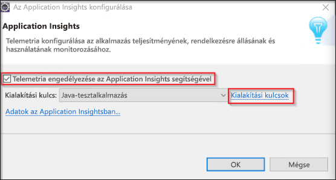
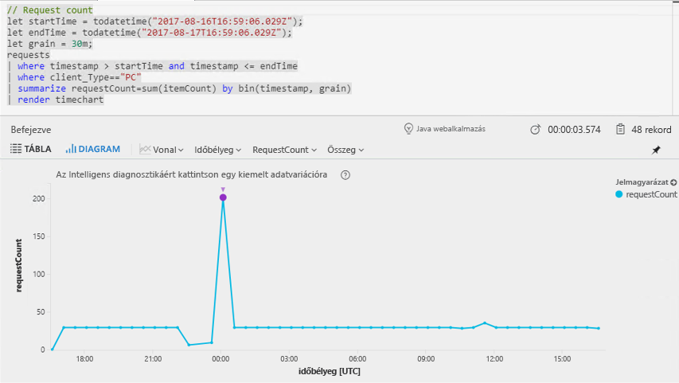
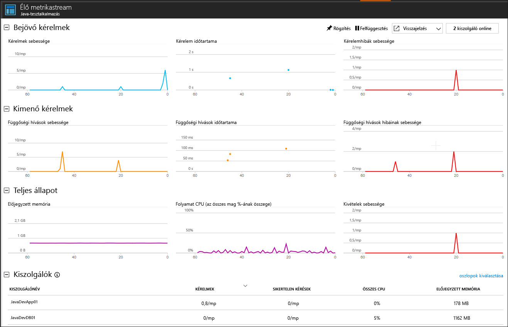

# <a name="start-monitoring-your-java-web-application"></a>A Java-webalkalmazás monitorozásának indítása

Az Azure Application Insights segítségével egyszerűen monitorozhatja webalkalmazása rendelkezésre állását, teljesítményét és használatát. Emellett egyszerűen azonosíthatja és diagnosztizálhatja az alkalmazás hibáit anélkül, hogy meg kellene várnia, amíg egy felhasználó jelenti azokat. Az Application Insights Java SDK-val a gyakori külsős csomagok, például a MongoDB, a MySQL és a Redis monitorozása is lehetségessé vált.

Ez a rövid útmutató végigvezeti az Application Insights SDK egy meglévő Java-alapú dinamikus webes projekthez való hozzáadásának folyamatán.

## <a name="prerequisites"></a>Előfeltételek

A gyorsútmutató elvégzéséhez:

- Telepítse a JRE 1.7-es vagy 1.8-as verzióját.
- Telepítse az [ingyenes, Java EE-fejlesztőknek készült Eclipse IDE-t](http://www.eclipse.org/downloads/). Ez a rövid útmutató az Eclipse Oxygent (4.7) használja.
- Szüksége lesz egy Azure-előfizetésre és egy meglévő Java-alapú dinamikus webes projektre.
 
Ha nem rendelkezik Java-alapú dinamikus webes projekttel, a létrehozásához követheti a [Java-webalkalmazások létrehozásához készült útmutató](https://docs.microsoft.com/azure/app-service-web/app-service-web-get-started-java) utasításait.

Ha nem rendelkezik Azure-előfizetéssel, első lépésként mindössze néhány perc alatt létrehozhat egy [ingyenes](https://azure.microsoft.com/free/) fiókot.

Ha a Spring keretrendszert részesíti előnyben, tekintse meg a [Spring Boot inicializáló alkalmazás konfigurálása az Application Insights használatához](https://docs.microsoft.com/java/azure/spring-framework/configure-spring-boot-java-applicationinsights) című útmutatót.

## <a name="log-in-to-the-azure-portal"></a>Bejelentkezés az Azure Portalra

Jelentkezzen be az [Azure portálra](https://portal.azure.com/).

## <a name="enable-application-insights"></a>Az Application Insights engedélyezése

Az Application Insights bármely, az internethez csatlakozó alkalmazásról képes telemetriaadatokat gyűjteni, függetlenül attól, hogy az a helyszínen vagy a felhőben fut-e. Az adatok megjelenítéséhez hajtsa végre az alábbi lépéseket.

1. Válassza az **Erőforrás létrehozása** > **Monitoring és felügyelet** > **Application Insights** elemet.

   

   Megjelenik egy konfigurációs mező. Az adatbeviteli mezők kitöltéséhez használja az alábbi táblát.

    | Beállítások        | Érték           | Leírás  |
   | ------------- |:-------------|:-----|
   | **Name (Név)**      | Globálisan egyedi érték | A figyelt alkalmazást azonosító név |
   | **Alkalmazás típusa** | Java-webalkalmazás | A figyelt alkalmazás típusa |
   | **Erőforráscsoport**     | myResourceGroup      | Az App Insights-adatokat futtató új erőforráscsoport neve |
   | **Hely** | USA keleti régiója | Válasszon egy Önhöz vagy az alkalmazást futtató gazdagéphez közeli helyet. |

2. Kattintson a **Create** (Létrehozás) gombra.

## <a name="install-app-insights-plugin"></a>Az App Insights beépülő modul telepítése

1. Indítsa el az **Eclipse** fejlesztőkörnyezetet, majd kattintson a **Súgó** gombra, és válassza az **Új szoftver telepítése** elemet.

   

2. Másolja a ```http://dl.microsoft.com/eclipse``` címet a „Használt környezet” mezőbe, jelölje be a **Javához készült Azure-eszközkészlet** beállítást, válassza a **Javához készült Application Insights-beépülőmodul** >  **elemet, és törölje** „Az összes frissítési hely felkeresése a szükséges szoftverek letöltéséhez” beállítás jelölését.

3. A telepítés végén a rendszer megkéri az **Eclipse újraindítására**.

## <a name="configure-app-insights-plugin"></a>Az App Insights beépülő moduljának konfigurálása

1. Indítsa el az **Eclipse** fejlesztőkörnyezetet, nyissa meg a **Projektet**, kattintson a jobb gombbal a projekt nevére a **Projektböngészőben**, majd válassza az **Azure** elemet, és kattintson a **Bejelentkezés** parancsra.

2. Válassza az **Interaktív** hitelesítési módot, majd kattintson a **Bejelentkezés** parancsra, és amikor a rendszer arra kéri, adja meg **Azure-beli hitelesítő adatait**, végül pedig válassza ki **Azure-előfizetését**.

3. Kattintson a jobb gombbal a projekt nevére a **Projektböngészőben**, majd válassza az **Azure** elemet, és kattintson **Az Application Insights konfigurálása** parancsra.

4. Jelölje be a **Telemetria engedélyezése az Application Insightsban** beállítást, majd válassza ki a Java-alkalmazáshoz kapcsolni kívánt App Insights-erőforrást és a társított **kialakítási kulcsot**.

   

> [!NOTE]
> A Javához készült Application Insights SDK képes élő metrikákat rögzíteni és megjeleníteni. Azonban az első alkalommal, amikor engedélyezi a telemetria gyűjtését, eltarthat néhány percig amíg az adatok megjelennek a portálon. Ha az alkalmazás egy alacsony forgalmú tesztalkalmazás, vegye figyelembe, hogy a legtöbb metrika rögzítése csak akkor történik, ha aktív kérések és műveletek vannak folyamatban.

## <a name="start-monitoring-in-the-azure-portal"></a>Monitorozás indítása az Azure Portalon

1. Most megnyithatja ismét az Application Insights **Áttekintés** lapját az Azure Portalon (ahol a kialakítási kulcsot is megjelenítette) a jelenleg futó alkalmazás részleteinek megtekintéséhez.

   

2. Kattintson az **Alkalmazástérkép** elemre az alkalmazás-összetevők függőségi viszonyait mutató vizuális elrendezés megjelenítéséhez. Minden egyes összetevőnél megjelennek a KPI-k, például a terhelés, a teljesítmény, a hibák és a riasztások.

   

3. Kattintson az **Alkalmazáselemzés** ikonra . Megnyílik az **Application Insights Analytics**, amely egy részletes lekérdezési nyelvet biztosít az Application Insights által gyűjtött adatok elemzéséhez. Esetünkben most egy lekérdezés jön létre, amely a kérések számát egy diagramon jeleníti meg. A további adatok elemzéséhez írhat saját lekérdezéseket is.

   

4. Lépjen vissza az **Áttekintés** lapra, és vizsgálja meg az **Állapotáttekintési időegyenest**.  Ezen az irányítópulton az alkalmazás állapotával kapcsolatos statisztikák jelennek meg, köztük a bejövő kérések száma, az egyes kérések időtartama, valamint az esetleges hibák.

   

   Ahhoz, hogy a **Lapmegtekintés betöltési ideje** diagramon megjelenjenek az **ügyféloldali telemetria** adatai, adja az alábbi szkriptet minden olyan oldalhoz, amelyet nyomon kíván követni:

   ```HTML
   <!-- 
   To collect end-user usage analytics about your application, 
   insert the following script into each page you want to track.
   Place this code immediately before the closing </head> tag,
   and before any other scripts. Your first data will appear 
   automatically in just a few seconds.
   -->
   <script type="text/javascript">
     var appInsights=window.appInsights||function(config){
     function i(config){t[config]=function(){var i=arguments;t.queue.push(function(){t[config].apply(t,i)})}}var t={config:config},u=document,e=window,o="script",s="AuthenticatedUserContext",h="start",c="stop",l="Track",a=l+"Event",v=l+"Page",y=u.createElement(o),r,f;y.src=config.url||"https://az416426.vo.msecnd.net/scripts/a/ai.0.js";u.getElementsByTagName(o)[0].parentNode.appendChild(y);try{t.cookie=u.cookie}catch(p){}for(t.queue=[],t.version="1.0",r=["Event","Exception","Metric","PageView","Trace","Dependency"];r.length;)i("track"+r.pop());return i("set"+s),i("clear"+s),i(h+a),i(c+a),i(h+v),i(c+v),i("flush"),config.disableExceptionTracking||(r="onerror",i("_"+r),f=e[r],e[r]=function(config,i,u,e,o){var s=f&&f(config,i,u,e,o);return s!==!0&&t["_"+r](config,i,u,e,o),s}),t
    }({
        instrumentationKey:"<instrumentation key>"
    });

    window.appInsights=appInsights;
    appInsights.trackPageView();
   </script>
    ```

5. Kattintson az **Élő stream** elemre. Itt találja a Java-webalkalmazás teljesítményével kapcsolatos élő metrikákat. Az **Élő metrikastream** a bejövő kérések számával, az adott kérések időtartamával, valamint az esetleges hibákkal kapcsolatos adatokat tartalmaz. Emellett a kritikus teljesítménymutatókat is monitorozhatja élőben, például a processzor- és memóriahasználatot.

   

A Java monitorozásával kapcsolatos további információkért tekintse át [az App Insights további Java-dokumentációját](.\app-insights-java-get-started.md).

## <a name="clean-up-resources"></a>Az erőforrások eltávolítása

Ha azt tervezi, hogy az ezt követő rövid útmutatókkal vagy az oktatóanyagokkal dolgozik tovább, akkor ne törölje az ebben a rövid útmutatóban létrehozott erőforrásokat. Ha nem folytatja a munkát, akkor a következő lépésekkel törölheti az Azure Portalon a rövid útmutatóhoz létrehozott összes erőforrást.

1. Az Azure Portal bal oldali menüjében kattintson az **Erőforráscsoportok** lehetőségre, majd kattintson a **myResourceGroup** elemre.
2. Az erőforráscsoport oldalán kattintson a **Törlés** elemre, írja be a **myResourceGroup** szöveget a szövegmezőbe, majd kattintson a **Törlés** gombra.

## <a name="next-steps"></a>További lépések

> [!div class="nextstepaction"]
> [Teljesítményproblémák észlelése és diagnosztizálása](https://docs.microsoft.com/azure/application-insights/app-insights-analytics)