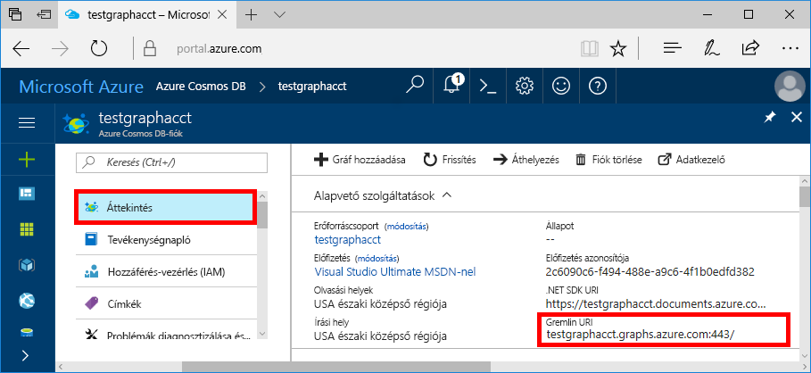
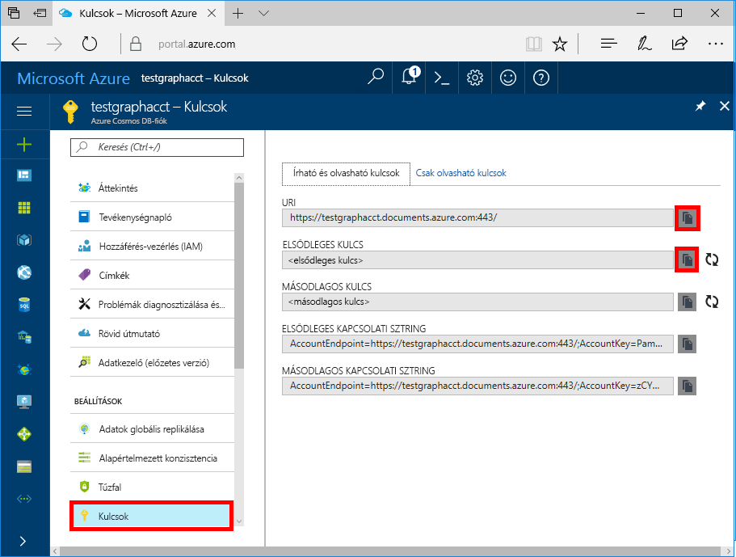

# <a name="azure-cosmos-db-build-a-nodejs-application-by-using-graph-api"></a>Azure Cosmos DB: Node.js-alkalmazás létrehozása a Graph API-val

Az Azure Cosmos DB a Microsoft globálisan elosztott többmodelles adatbázis-szolgáltatása. Segítségével gyorsan létrehozhat és lekérdezhet dokumentum, kulcs/érték és gráf típusú adatbázisokat, amelyek mindegyike felhasználja az Azure Cosmos DB középpontjában álló globális elosztási és horizontális skálázhatósági képességeket. 

Ez a rövid útmutató bemutatja, hogyan hozhat létre az Azure Portal segítségével Azure Cosmos DB [Graph API](graph-introduction.md)-fiókot, adatbázist és gráfot. Ezután a nyílt forráskódú [Gremlin Node.js](https://www.npmjs.com/package/gremlin)-illesztőprogram segítségével létrehozhat és futtathat egy konzolalkalmazást.

## <a name="prerequisites"></a>Előfeltételek

Mielőtt futtathatná ezt a mintát, rendelkeznie kell a következő előfeltételekkel:
* [Node.js](https://nodejs.org/en/)-verzió: 0.10.29-es vagy újabb
* [Git](http://git-scm.com/)

[!INCLUDE [quickstarts-free-trial-note](../../includes/quickstarts-free-trial-note.md)]

## <a name="create-a-database-account"></a>Adatbázisfiók létrehozása

[!INCLUDE [cosmos-db-create-dbaccount-graph](../../includes/cosmos-db-create-dbaccount-graph.md)]

## <a name="add-a-graph"></a>Gráf hozzáadása

[!INCLUDE [cosmos-db-create-graph](../../includes/cosmos-db-create-graph.md)]

## <a name="clone-the-sample-application"></a>A mintaalkalmazás klónozása

A következő lépésekben elvégezheti a Graph API-alkalmazás klónozását a GitHubról, beállíthatja a kapcsolati sztringet, és futtathatja az alkalmazást. Látni fogja, milyen egyszerű az adatokkal programozott módon dolgozni. 

1. Nyisson meg egy Git-terminálablakot, például a Git Bash eszközt, és a `cd` paranccsal váltson egy munkakönyvtárra.

2. Futtassa a következő parancsot a minta tárház klónozásához. 

    ```bash
    git clone https://github.com/Azure-Samples/azure-cosmos-db-graph-nodejs-getting-started.git
    ```

3. Nyissa meg a megoldásfájlt a Visual Studióban. 

## <a name="review-the-code"></a>A kód áttekintése

Tekintsük át, hogy mi történik az alkalmazásban. Nyissa meg az `app.js` fájlt, amelyben a következő kódsorokat találja. 

* Létrejön a Gremlin-ügyfél.

    ```nodejs
    const client = Gremlin.createClient(
        443, 
        config.endpoint, 
        { 
            "session": false, 
            "ssl": true, 
            "user": `/dbs/${config.database}/colls/${config.collection}`,
            "password": config.primaryKey
        });
    ```

  Minden konfiguráció a `config.js` fájlban van, amelynek a szerkesztését a [következő rész](#update-your-connection-string) írja le.

* A rendszer függvények sorozatát definiálja a különböző Gremlin-műveletek végrehajtásához. Ez az egyik közülük:

    ```nodejs
    function addVertex1(callback)
    {
        console.log('Running Add Vertex1'); 
        client.execute("g.addV('person').property('id', 'thomas').property('firstName', 'Thomas').property('age', 44).property('userid', 1)", { }, (err, results) => {
          if (err) callback(console.error(err));
          console.log("Result: %s\n", JSON.stringify(results));
          callback(null)
        });
    }
    ```

* Mindegyik függvény végrehajt egy `client.execute` metódust egy Gremlin lekérdezési karakterlánc paraméterrel. Itt egy példa a `g.V().count()` végrehajtására:

    ```nodejs
    console.log('Running Count'); 
    client.execute("g.V().count()", { }, (err, results) => {
        if (err) return console.error(err);
        console.log(JSON.stringify(results));
        console.log();
    });
    ```

* A fájl végén a rendszer minden metódust meghív az `async.waterfall()` metódus használatával. Így egymás után lesznek végrehajtva:

    ```nodejs
    try{
        async.waterfall([
            dropGraph,
            addVertex1,
            addVertex2,
            addEdge,
            countVertices
            ], finish);
    } catch(err) {
        console.log(err)
    }
    ```


## <a name="update-your-connection-string"></a>A kapcsolati karakterlánc frissítése

1. Nyissa meg a config.js fájlt. 

2. A config.js fájlban adja meg a `config.endpoint` kulcsot az Azure Portal **Áttekintés** lapjáról származó **Gremlin URI** értékkel. 

    `config.endpoint = "GRAPHENDPOINT";`

    

   Ha a **Gremlin URI** érték üres, létrehozhatja az értéket a portál **Kulcsok** oldaláról. Használja az **URI** értéket, távolítsa el a https:// előtagot, majd alakítsa a dokumentumokat gremlin.cosmosdb-gráfokká. Ha a gráfadatbázis-fiók 2017. december 20. jött létre, alakítsa gráfokká a dokumentumokat. 

   A Gremlin-végpont csak protokoll/portszám nélküli gazdagépnév lehet, például `mygraphdb.gremlin.cosmosdb.azure.com` (és nem `https://mygraphdb.gremlin.cosmosdb.azure.com` vagy `mygraphdb.gremlin.cosmosdb.azure.com:433`).

3. A config.js fájlban adja meg a config.primaryKey értéket az Azure Portal **Kulcsok** oldaláról származó **Elsődleges kulcs** értékkel. 

    `config.primaryKey = "PRIMARYKEY";`

   

4. A config.database és a config.collection értékéhez adja meg az adatbázis és a gráf (tároló) nevét. 

Az elkészült config.js fájl olyan lesz, ahogy az alábbi példában látható:

```nodejs
var config = {}

// Note that this must not have HTTPS or the port number
config.endpoint = "testgraphacct.gremlin.cosmosdb.azure.com";
config.primaryKey = "Pams6e7LEUS7LJ2Qk0fjZf3eGo65JdMWHmyn65i52w8ozPX2oxY3iP0yu05t9v1WymAHNcMwPIqNAEv3XDFsEg==";
config.database = "graphdb"
config.collection = "Persons"

module.exports = config;
```

## <a name="run-the-console-app"></a>A konzolalkalmazás futtatása

1. Nyisson meg egy terminálablakot, és a `cd` parancs használatával váltson a projektben lévő package.json fájl telepítési könyvtárára.

2. Futtassa az `npm install` parancsot a szükséges npm-modulok (köztük a `gremlin`) telepítéséhez.

3. Futtassa a `node app.js` parancsot egy terminálban a node-alkalmazás elindításához.

## <a name="browse-with-data-explorer"></a>Tallózás az Adatkezelővel

Most visszaléphet az Adatkezelőbe az Azure Portalon, és megtekintheti, lekérdezheti, módosíthatja, és használatba veheti az új gráfadatokat.

Az Adatkezelőben az új adatbázis a **Gráfok** ablaktáblán jelenik meg. Bontsa ki az adatbázist, majd a gyűjteményt, és kattintson a **Gráf** elemre.

A mintaalkalmazás által létrehozott adatok a **Gráf** lap következő panelén jelennek meg a **Szűrő alkalmazása** gomb kiválasztásakor.

A szűrő teszteléséhez hajtsa végre a `g.V()` függvényt a következővel: `.has('firstName', 'Thomas')`. Vegye figyelembe, hogy az érték megkülönbözteti a kis- és nagybetűket.

## <a name="review-slas-in-the-azure-portal"></a>Az SLA-k áttekintése az Azure Portalon

[!INCLUDE [cosmosdb-tutorial-review-slas](../../includes/cosmos-db-tutorial-review-slas.md)]

## <a name="clean-up-your-resources"></a>Az erőforrások törlése

Ha nem tervezi az alkalmazás további használatát, törölje a cikkben létrehozott összes erőforrást a következőképpen: 

1. Az Azure Portal bal oldali navigációs menüjében válassza az **Erőforráscsoportok** lehetőséget. Ezt követően jelölje ki a létrehozott erőforrás nevét. 

2. Az erőforráscsoport oldalán kattintson a **Törlés** parancsra. Írja be a törölni kívánt erőforrás nevét, majd válassza a **Törlés** elemet.

## <a name="next-steps"></a>További lépések

A cikkből megtudhatta, hogyan hozhat létre Azure Cosmos DB-fiókot, miként készíthet gráfokat az Adatkezelő használatával, és hogyan futtathat egy alkalmazást. Mostantól a Gremlin használatával összetettebb lekérdezéseket is létrehozhat, és hatékony gráfbejárási logikákat implementálhat. 

> [!div class="nextstepaction"]
> [Lekérdezés a Gremlin használatával](tutorial-query-graph.md)
