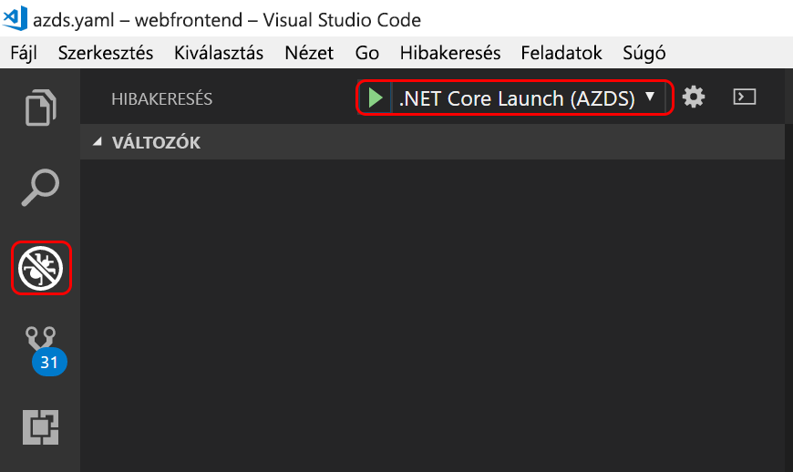

# <a name="get-started-on-azure-dev-spaces-with-net-core"></a>Bevezetés az Azure Dev Spaces .NET Core segítségével történő használatába

[!INCLUDE[](includes/learning-objectives.md)]

[!INCLUDE[](includes/see-troubleshooting.md)]

Most már készen áll a Kubernetes-alapú Dev Spaces-terek Azure-ban történő létrehozására.

[!INCLUDE[](includes/portal-aks-cluster.md)]

## <a name="install-the-azure-cli"></a>Telepítse az Azure CLI-t
Az Azure Dev Spaces használatához minimális helyi gépbeállítás szükséges. A Dev Spaces-tér konfigurációjának legnagyobb része a felhőben van tárolva, és megosztható más felhasználókkal. Első lépésként töltse le és futtassa az [Azure CLI](/cli/azure/install-azure-cli?view=azure-cli-latest) parancssori felületet. 

> [!IMPORTANT]
> Ha az Azure CLI már telepítve van, győződjön meg arról, hogy a 2.0.38-as vagy újabb verziót használja.

[!INCLUDE[](includes/sign-into-azure.md)]

[!INCLUDE[](includes/use-dev-spaces.md)]

[!INCLUDE[](includes/install-vscode-extension.md)]

Miközben a fürt létrehozására vár, elkezdheti fejleszteni a kódot.

## <a name="create-a-web-app-running-in-a-container"></a>Egy tárolóban futó webalkalmazás létrehozása

Ebben a szakaszban egy ASP.NET Core-alapú webalkalmazást hozhat létre és futtathat egy Kubernetes-tárolóban.

### <a name="create-an-aspnet-core-web-app"></a>ASP.NET Core-webalkalmazás létrehozása
Ha a [.NET Core](https://www.microsoft.com/net) telepítve van, gyorsan létrehozhat egy ASP.NET Core-webalkalmazást a `webfrontend` nevű mappában.
    
```cmd
dotnet new mvc --name webfrontend
```

Vagy **a mintakód a GitHubról való letöltéséhez** lépjen a https://github.com/Azure/dev-spaces helyre, és válassza a **Klónozás vagy letöltés** lehetőséget a GitHub-adattár a helyi környezetbe való letöltéséhez. A jelen útmutatóban használt kód a következő helyen található: `samples/dotnetcore/getting-started/webfrontend`.

[!INCLUDE[](includes/azds-prep.md)]

[!INCLUDE[](includes/build-run-k8s-cli.md)]

### <a name="update-a-content-file"></a>Tartalomfájlok frissítése
Az Azure Dev Spaces nem csupán a Kubernetesben futó kódok lekérésére szolgál – a segítségével gyorsan és iteratívan lehet megtekinteni a kódmódosítások életbe lépését a felhőben lévő Kubernetes-környezetben.

1. Keresse meg a `./Views/Home/Index.cshtml` fájlt, és szerkessze a HTML-kódot. Például módosíthatja a 70. sor korábbi szövegét (`<h2>Application uses</h2>`) egy új szövegre (`<h2>Hello k8s in Azure!</h2>`).
1. Mentse a fájlt. Néhány pillanat múlva egy, a terminálablakban megjelenő üzenet tájékoztatja, hogy a futó tárolóban lévő egyik fájl frissült.
1. Lépjen a böngészőre, és frissítse az oldalt. A weboldalnak meg kell jelenítenie a frissített HTML-tartalmat.

Mi történt? A tartalomfájlok (például HTML és CSS) módosításait nem szükséges egy .NET Core webalkalmazásban újrafordítani, így az aktív `azds up` parancs automatikusan szinkronizálja a módosított tartalomfájlokat az Azure-ban futó tárolóba, így azonnal megtekintheti a tartalmak módosításait.

### <a name="update-a-code-file"></a>Kódfájlok frissítése
A kódfájlok frissítése egy kicsit több munkát igényel, mert a .NET Core-alkalmazásnak újra létre kell hoznia és elő kell állítania az alkalmazás frissített bináris fájljait.

1. A terminálablakban nyomja le a `Ctrl+C` billentyűkombinációt (az `azds up` leállításához).
1. Nyissa meg a `Controllers/HomeController.cs` nevű kódfájlt, és szerkessze az Információ oldalon megjelenő üzenetet: `ViewData["Message"] = "Your application description page.";`
1. Mentse a fájlt.
1. Futtassa az `azds up` parancsot a terminálablakban. 

Ez a parancs újraépíti a tárolórendszerképet, és újra üzembe helyezi a Helm-diagramot. A módosított kód hatásainak a futó alkalmazásban való megtekintéséhez lépjen a webalkalmazás Információ menüjére.


Azonban a kódfejlesztésnek van egy még ennél is *gyorsabb módszere*, amelyet a következő szakaszban mutatunk be. 

## <a name="debug-a-container-in-kubernetes"></a>Tároló hibakeresése a Kubernetesben

[!INCLUDE[](includes/debug-intro.md)]

[!INCLUDE[](includes/init-debug-assets-vscode.md)]


### <a name="select-the-azds-debug-configuration"></a>Az AZDS hibakeresési konfiguráció kiválasztása
1. A hibakeresési nézet megnyitásához kattintson a **tevékenységsáv** Hibakeresés ikonjára a VS Code oldalán.
1. Válassza a **.NET Core indítása (AZDS)** lehetőséget mint aktív hibakeresési konfigurációt.



> [!Note]
> Ha nem lát Azure Dev Spaces-parancsokat a parancspalettán, győződjön meg róla, hogy a VS Code Azure Dev Spaceshez készült bővítménye telepítve van. Győződjön meg arról, hogy a VS Code-ban megnyitott munkaterület az azds.yaml fájlt tartalmazó mappa.


### <a name="debug-the-container-in-kubernetes"></a>A tároló hibakeresése a Kubernetesben
A kód a Kubernetesben való hibakereséséhez nyomja le az **F5** billentyűt.

Az `up` parancshoz hasonlóan a kód szinkronizálva lesz a Dev Spaces-térbe, továbbá létrejön és települ egy tároló a Kubernetesben. Ezúttal persze a hibakereső a távoli tárolóhoz van csatlakoztatva.

[!INCLUDE[](includes/tip-vscode-status-bar-url.md)]

Állítson be egy töréspontot egy kiszolgálóoldali kódfájlban, például a `Controllers/HomeController.cs` forrásfájl `Index()` függvényében. Az oldal a böngészőben való frissítésével a töréspont érintve lesz.

Ugyanúgy teljes körű hozzáférése van a hibakeresési információkhoz, mint ha helyileg futna a kód (pl. hívási verem, helyi változók, kivételek adatai stb.).

### <a name="edit-code-and-refresh"></a>Kód szerkesztése és frissítés
Miközben a hibakereső aktív, szerkessze a kódot. Például módosítsa az Információ lap üzenetét a `Controllers/HomeController.cs` fájlban. 

```csharp
public IActionResult About()
{
    ViewData["Message"] = "My custom message in the About page.";
    return View();
}
```

Mentse a fájlt, és a **Hibakeresési műveletek panelen** kattintson a **Frissítés** gombra. 


Ahelyett, hogy a kód minden szerkesztése alkalmával újra létrehozna és üzembe helyezne egy új tárolórendszerképet, ami általában sok időt vesz igénybe, az Azure Dev Spaces növekményesen újrafordítja a kódot a meglévő tárolón belül, hogy gyorsabb szerkesztési/hibakeresési ciklust biztosítson.

Frissítse a webalkalmazást a böngészőben, és lépjen az Információ oldalra. Az egyedi üzenetnek meg kell jelennie a felhasználói felületen.

**Most tehát rendelkezésére áll egy módszer, amellyel gyorsan iterálhatja a kódot, és közvetlenül a Kubernetesben végezheti a hibakeresést.** A következő részből megtudhatja, hogyan hozhat létre és hívhat meg egy második tárolót.

## <a name="next-steps"></a>További lépések

> [!div class="nextstepaction"]
> [A csapatban végzett fejlesztés bemutatása](team-development-netcore.md)