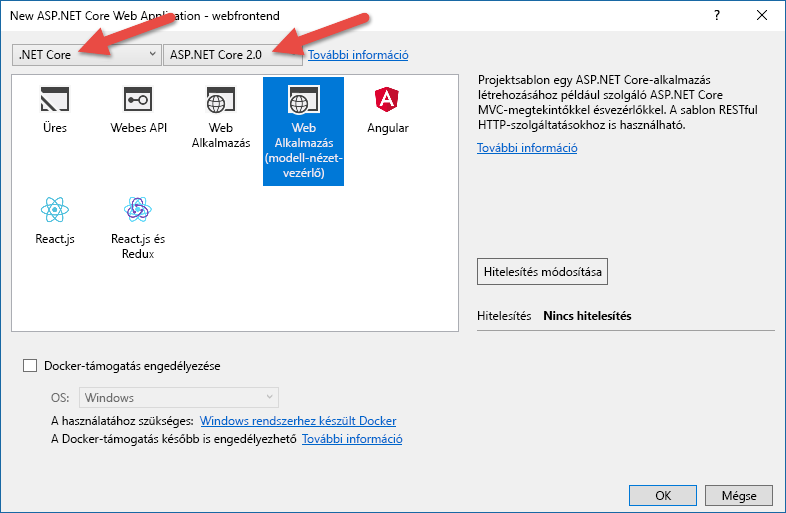

# Rövid útmutató: Kubernetes fejlesztői környezet létrehozása az Azure Dev Spaces segítségével (.NET Core és Visual Studio)

Ebből az útmutatóból a következőket tudhatja meg:

- Fejlesztésre optimalizált, Kubernetes-alapú környezet létrehozása az Azure-ban.
- Iteratív kódfejlesztés tárolókban a Visual Studio használatával.

[!INCLUDE]

[!INCLUDE]

## A Visual Studio eszközeinek beszerzése 
1. A [Visual Studio 2017](https://www.visualstudio.com/vs/) legújabb verziójának telepítése
1. Győződjön meg róla, hogy a Visual Studio telepítőjében a következő számítási feladat van kiválasztva:
    * ASP.NET és webfejlesztés
1. Telepítse az [Azure Dev Spaceshez készült Visual Studio-bővítményt](https://aka.ms/get-azds-visualstudio)

Most már készen áll egy ASP.NET-webalkalmazás létrehozására a Visual Studio használatával.

## ASP.NET-webapp létrehozása

Hozzon létre egy új projektet a Visual Studio 2017-ben. Jelenleg a projektnek egy **ASP.NET Core-webalkalmazásnak** kell lennie. Adja a projektnek a „**webfrontend**” nevet.

Válassza ki a **Webalkalmazás (Model-View-Controller)** sablont, és ellenőrizze, hogy a párbeszédpanel tetején a két legördülő listában a **.NET Core** és az **ASP.NET Core 2.0** van-e kijelölve. A projekt létrehozásához kattintson az **OK** gombra.

## Fejlesztői környezet létrehozása az Azure-ban

Az Azure Dev Spaces segítségével fejlesztésre optimalizált, Kubernetes-alapú környezetet hozhat létre, amelyet teljes egészében az Azure kezel. Nyissa meg az imént létrehozott projektet, és válassza ki az **Azure Dev Spaces** lehetőséget az indítási beállítások legördülő menüjéből, ahogy az az alábbi képen látható.

Az ezt követően megjelenő párbeszédpanelen ellenőrizze, hogy a megfelelő fiókkal van-e bejelentkezve, majd válasszon ki egy meglévő fürtöt.

A **Tér** legördülő menüt egyelőre hagyja a `default` alapértelmezett értéken. Erről a beállításról a későbbiekben kaphat további információt. Jelölje be a **Nyilvánosan hozzáférhető** jelölőnégyzetet, hogy a webalkalmazás nyilvános végpontról is elérhető legyen. Ez a beállítás nem szükséges, de hasznos lehet néhány fogalom bemutatásához az útmutató későbbi szakaszában. De ne aggódjon, mindkét esetben végezhet a webhelyen hibakeresést a Visual Studio segítségével.

A fürt kiválasztásához vagy létrehozásához kattintson az **OK** gombra.

Ha egy olyan fürtöt választ, amely nincs az Azure Dev Spaceshez konfigurálva, a rendszer egy üzenetben rákérdez, hogy szeretné-e konfigurálni.

Válassza az **OK** gombot. 

Egy háttérművelet fogja végrehajtani a konfigurálást. Ez eltarthat néhány percig. Ha meg szeretné nézni, hogy tart-e még a folyamat, vigye az egérmutatót az állapotsor bal alsó sarkában lévő **Háttérfolyamatok** ikon fölé, az alábbi ábrán látható módon.

> [!Note]
Amíg a fejlesztői környezet létrehozása sikeresen le nem zárul, nem tud hibakeresést végezni az alkalmazáson.

## A projekthez adott fájlok ellenőrzése
Amíg a fejlesztői környezet létrehozására vár, tekintse meg, milyen fájlokat rendelt a projekthez a rendszer, amikor fejlesztői környezet használatát választotta.

Először is láthatja, hogy a rendszer hozzáadott egy `charts` nevű mappát, amelyben előállított egy [Helm-diagramot](https://docs.helm.sh) az alkalmazásához. Ezek a fájlok szükségesek az alkalmazás üzembe helyezéséhez a fejlesztői környezetben.

A rendszer hozzáadott egy `Dockerfile` nevű fájlt is. Ez a fájl olyan információt tartalmaz, amely az alkalmazás szabványos Docker-formátumba való csomagolásához szükséges. Egy `HeaderPropagation.cs` fájl is létre lett hozva. Erre az oktatóanyag későbbi részében térünk ki. 

Végül látni fog egy `azds.yaml` nevű fájlt, amely a fejlesztői környezethez szükséges konfigurációs adatokat tartalmaz (pl. elérhető legyen-e az alkalmazás nyilvános végpontról).

## Tároló hibakeresése a Kubernetesben
Amint a fejlesztői környezet létrehozása sikeresen lezárul, végezhet hibakeresést az alkalmazáson. Állítson be egy töréspontot a kódban, például a `HomeController.cs` fájl 20. sorában, ahol a `Message` változó van beállítva. Nyomja le az **F5** billentyűt a hibakeresés indításához. 

A Visual Studio kommunikál a fejlesztői környezettel, hogy az hozza létre és helyezze üzembe az alkalmazást, majd nyisson meg egy böngészőt a futó webalkalmazással. Úgy tűnhet, hogy a tároló futtatása helyileg történik, de valójában az Azure fejlesztői környezetében fut. A localhost cím oka az, hogy az Azure Dev Spaces egy ideiglenes SSH-alagutat hoz létre az Azure-ban futó tárolóhoz.

Kattintson az oldal tetején lévő **Információ** hivatkozásra a töréspont aktiválásához. Ugyanúgy teljes körű hozzáférése van a hibakeresési információkhoz, mintha helyileg futna a kód (pl. hívási verem, helyi változók, kivételek adatai stb.).

## További lépések

> [!div class="nextstepaction"]
> [Több tároló használata és fejlesztés csapatban](get-started-netcore-visualstudio.md#call-another-container)