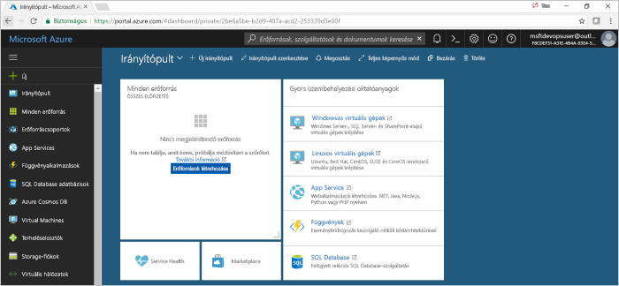
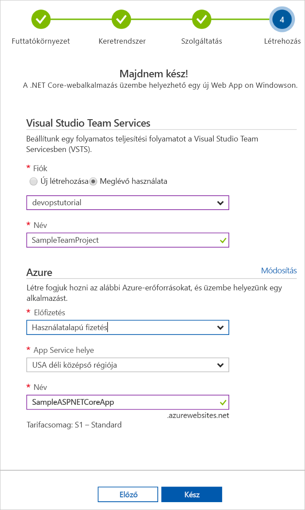
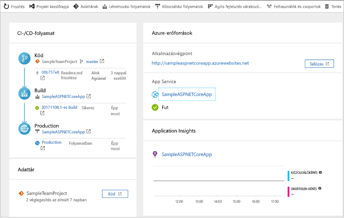
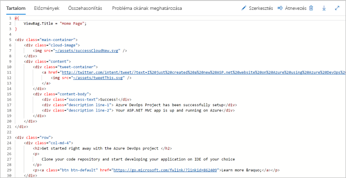

# CI/CD-folyamat létrehozása .NET-hez az Azure DevOps Projecttel

Az **Azure DevOps Project** segítségével konfigurálhatja a folyamatos integrációs (CI) és folyamatos kézbesítési (CD) folyamatot egy .NET Core- vagy ASP.NET-alkalmazáshoz.  Az Azure DevOps Project egyszerűsíti a VSTS-build és a kiadási folyamat kezdeti konfigurációját.

Ha nem rendelkezik Azure-előfizetéssel, létrehozhat egy ingyenes fiókot a [Visual Studio Dev Essentials](https://visualstudio.microsoft.com/dev-essentials/) segítségével.

## Jelentkezzen be az Azure Portalra

Az Azure DevOps Project létrehoz egy CI-/CD-folyamatot a VSTS-ben.  Létrehozhat egy **új VSTS-** fiókot, vagy használhat egy **meglévő fiókot** is.  Az Azure DevOps Project az **Azure-erőforrásokat** is létrehozza a választott **Azure-előfizetésben**.

1. Jelentkezzen be a [Microsoft Azure Portalra](https://portal.azure.com).

1. A bal oldali navigációs sávban válassza az **Erőforrás létrehozása** ikont, majd keresse meg a **DevOps-projektet**.  Válassza a **Létrehozás** elemet.

    

## Mintaalkalmazás és Azure-szolgáltatás kiválasztása

1. Válassza a **.NET** mintaalkalmazást.  A .NET-minták esetén a nyílt forráskódú ASP.NET- vagy a platformfüggetlen .NET Core-keretrendszer közül választhat.

    

1. Válassza a **.NET Core** alkalmazási keretrendszert.  Ez a minta egy ASP.NET Core MVC-alkalmazás. Ha elkészült, válassza a **Tovább** lehetőséget.

1. Az alapértelmezett üzembehelyezési cél a **Web App on Windows**.  A Web App on Linux vagy a Web App for Containers használata mellett is dönthet.  Az előző lépésekben kiválasztott alkalmazás-keretrendszer meghatározza az Azure-szolgáltatás üzembehelyezési céljának itt elérhető típusát.  Hagyja meg az alapértelmezett szolgáltatást, majd válassza a **Tovább** gombot.

## A VSTS és egy Azure-előfizetés konfigurálása 

1. Hozzon létre egy **új** ingyenes VSTS-fiókot, vagy válasszon ki egy **meglévőt**.  Válasszon egy **nevet** a VSTS-projektnek.  Válassza ki az **Azure-előfizetését**, a **helyet**, és adjon egy **nevet** az alkalmazásnak.  Ha elkészült, kattintson a **Kész** gombra.

    

1. Néhány percen belül betöltődik a **projekt irányítópultja** az Azure Portalon.  A rendszer beállít egy mintaalkalmazást a VSTS-fiókban található adattárban, végrehajtja a buildelést, és üzembe helyezi az alkalmazást az Azure-ban.  Ez az irányítópult biztosítja a **kódtár**, a **VSTS CI/CD-folyamat** és az **Azure-ban található alkalmazás** áttekinthetőségét.  Az irányítópult jobb oldalán válassza a **Tallózást** a futó alkalmazás megtekintéséhez.

     

## Kódmódosítások véglegesítése és a CI/CD végrehajtása

Az Azure DevOps Project létrehozott egy Git-adattárat a VSTS- vagy a GitHub-fiókban.  Az adattár megtekintéséhez és az alkalmazásban történő kódmódosítások végrehajtásához kövesse az alábbi lépéseket.

1. A DevOps-projekt irányítópultjának bal oldalán válassza a **főághoz** tartozó hivatkozást.  Ez a hivatkozás megnyitja az újonnan létrehozott Git-adattár nézetét.

1. Az adattárklón URL-címének megtekintéséhez válassza a **Klónozás** lehetőséget a böngésző jobb felső részén. A Git-adattárat klónozhatja például a kedvenc IDE-környezetébe.  A következő néhány lépésben a webböngésző segítségével közvetlenül a főágban hajthat végre és véglegesíthet kódmódosításokat.

1. A böngésző bal oldalán keresse meg a **Views/Home/index.cshtml** fájlt.

1. Válassza a **Szerkesztés** elemet, és módosítsa a h2 fejlécet.  Írja be például, hogy **Get started right away with the Azure DevOps Project** (Azonnali kezdés az Azure DevOps Projecttel), vagy hajtson végre néhány módosítást.

    

1. Válassza a **Véglegesítés** elemet, majd mentse a módosításokat.

1. A böngészőjében lépjen az **Azure DevOps-projekt irányítópultjára**.  Látni fogja, hogy folyamatban van egy build.  A végrehajtott módosítások automatikusan létrejönnek és települnek egy VSTS CI/CD-folyamaton keresztül.

## A VSTS CI-/CD-folyamat vizsgálata

Az Azure DevOps-projekt automatikusan konfigurálta a teljes VSTS CI-/CD-folyamatot a VSTS-fiókban.  Vizsgálja meg és szükség szerinti szabja testre a folyamatot.  A VSTS-build és a kiadási definíciók megismeréséhez kövesse az alábbi lépéseket.

1. Az Azure DevOps Project irányítópultjának **tetején** válassza a **Folyamatok létrehozását**.  Ez a hivatkozás megnyit egy böngészőlapot, és megnyitja az új projekt VSTS-builddefinícióját.

1. Válassza a **három pontot**.  Ez a művelet megnyitja a menüt, ahol több tevékenységet is végrehajthat, például várakozási sorba helyezhet egy új buildet, szüneteltethet egy buildet, vagy szerkesztheti a builddefiníciót.

1. Válassza a **Szerkesztés** elemet.

    

1. Ebben a nézetben **vizsgálja meg a különböző, a builddefinícióhoz tartozó feladatokat**.  A build különböző feladatokat hajt végre, például erőforrásokat olvas be a Git-adattárból, visszaállítja a függőségeket, és közzéteszi az üzembe helyezésekhez használt kimeneteket.

1. A builddefiníció tetején válassza a **builddefiníció nevét**.

1. Módosítsa a builddefiníció **nevét** egy közérthetőbb névre.  Válassza a **mentésre és várakozási sorba helyezésre** szolgáló elemet, majd a **Mentést**.

1. A builddefiníció neve alatt válassza az **Előzményeket**.  Ekkor megjelenik a build legutóbbi módosításainak naplója.  A VSTS nyomon követi a builddefiníció módosításait, és lehetővé teszi a verziók összehasonlítását.

1. Válassza az **Eseményindítókat**.  Az Azure DevOps-projekt automatikusan létrehozott egy CI-eseményindítót, és az adattárban történő minden egyes véglegesítés létrehoz egy új buildet.  Lehetősége van belefoglalni az ágakat, vagy kizárni őket a CI-folyamatból.

1. Válassza a **Megtartást**.  A forgatókönyv alapján megadhat szabályzatokat bizonyos számú build megtartására vagy eltávolítására.

1. Válassza ki a **Létrehozás és kiadást**, majd a **Kiadásokat**.  Az Azure DevOps Project létrehozott egy VSTS-kiadási definíciót, amely az Azure-ban történő üzembe helyezéseket kezeli.

1. A böngésző bal oldalán válassza a kiadási definíció melletti **három pontot**, majd a **Szerkesztést**.

1. A kiadási definíció tartalmaz egy **folyamatot**, amely meghatározza a kiadási folyamatot.  Az **Összetevők** alatt válassza az **Elvetést**.  Az előző lépésekben megvizsgált builddefiníció létrehozza az összetevőhöz használt kimenetet. 

1. Az **Elvetés** ikontól jobbra lévő területen válassza ki a **folyamatos üzembehelyezési eseményindítót**.  Ez a kiadási definíció egy olyan engedélyezett CD-eseményindítóval rendelkezik, amely minden alkalommal végrehajtja az üzembe helyezést, amikor elérhetővé válik egy új buildösszetevő.  Ha szeretné, letilthatja az eseményindítót, így az üzembe helyezéseket manuálisan kell majd végrehajtani. 

1. A böngésző bal oldalán válassza a **Feladatokat**.  A feladatok az üzembehelyezési folyamat által végrehajtott tevékenységek.  Ebben a példában létrejött egy feladat az **Azure App Service** üzembe helyezéséhez.

1. A böngésző jobb oldalán válassza a **Kiadások megtekintését**.  Ebben a nézetben a kiadások előzményei jelennek meg.

1. Válassza az egyik kiadás mellett a **három pontot**, majd a **Megnyitást**.  Ebben a nézetben több menüt is megtekinthet, például a kiadás összegzését, a társított munkaelemeket vagy a teszteket.

1. Válassza a **Véglegesítéseket**.  Ez a nézet az adott üzembe helyezéshez hozzárendelt kódvéglegesítéseket jeleníti meg. 

1. Válassza a **Naplókat**.  A naplók hasznos információkat tartalmaznak az üzembehelyezési folyamattal kapcsolatban.  Ezek az üzembe helyezések alatt és után is megtekinthetők.

## Az erőforrások eltávolítása

Ha már nincs rájuk szükség, törölheti az ebben a rövid útmutatóban létrehozott Azure App Service-t és a kapcsolódó erőforrásokat az Azure DevOps Project irányítópultján található **Törléssel**.

## További lépések

Ha arra vonatkozó információkra van szüksége, hogyan lehet módosítani a buildet és a kiadási definíciókat a csapat igényei szerint, tekintse át az alábbi oktatóanyagot:

> [!div class="nextstepaction"]
> [CD-folyamat testreszabása](https://docs.microsoft.com/vsts/pipelines/release/define-multistage-release-process?view=vsts)

## Videók

> [!VIDEO https://www.youtube.com/embed/itwqMf9aR0w]
