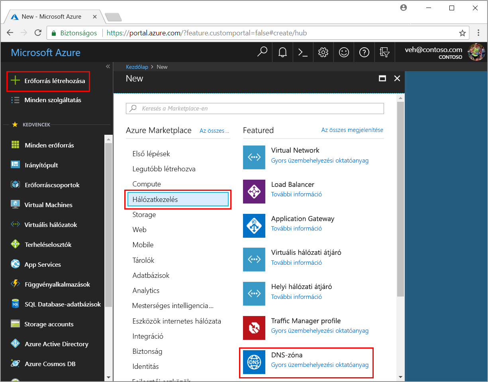

# <a name="quickstart-configure-azure-dns-for-name-resolution-using-the-azure-portal"></a>Rövid útmutató: Az Azure DNS konfigurálása névfeloldásra az Azure Portalon

 Az Azure DNS-t konfigurálhatja úgy, hogy feloldja a gazdagépneveket a nyilvános tartományban. Ha például megvásárolta a contoso.com tartománynevet egy tartományregisztrálótól, konfigurálhatja úgy az Azure DNS-t, hogy a contoso.com tartományt üzemeltesse, és a webkiszolgáló vagy webalkalmazás IP-címére oldja fel a www.contoso.com címet.

Ebben a rövid útmutatóban létrehoz egy teszttartományt, majd egy „www” nevű címrekordot, amely a 10.10.10.10 IP-címre lesz feloldva.

Fontos, hogy a rövid útmutatóban használt nevek és IP-címek csak példaként szolgálnak, és nem valós forgatókönyvet jelölnek. Adott esetben a valós forgatókönyvek is be lesznek mutatva.

<!---
You can also perform these steps using [Azure PowerShell](dns-getstarted-powershell.md) or the cross-platform [Azure CLI 2.0](dns-getstarted-cli.md).
--->

Az egyes tartományokhoz tartozó DNS-bejegyzések tárolása DNS-zónákban történik. A tartománya Azure DNS-ben való üzemeltetésének megkezdéséhez létre kell hoznia egy DNS-zónát az adott tartománynévhez. Ezután a tartomány összes DNS-bejegyzése (vagy rekordja) ebben a DNS-zónában jön létre. A következő lépések bemutatják, hogyan teheti ezt meg.

Ha nem rendelkezik Azure-előfizetéssel, mindössze néhány perc alatt létrehozhat egy [ingyenes fiókot](https://azure.microsoft.com/free/?WT.mc_id=A261C142F) a virtuális gép létrehozásának megkezdése előtt.

## <a name="create-a-dns-zone"></a>DNS-zóna létrehozása

1. Jelentkezzen be az Azure portálra.
2. A bal felső sarokban kattintson az **+ Erőforrás létrehozása**, majd a **Hálózatkezelés** elemre, végül a **DNS-zóna** lehetőségre a **DNS-zóna létrehozása** lap megnyitásához.

    

4. A **DNS-zóna létrehozása** lapon adja meg a következő értékeket, majd kattintson a **Létrehozás** elemre:


   | **Beállítás** | **Érték** | **Részletek** |
   |---|---|---|
   |**Name (Név)**|contoso.xyz|A DNS-zóna neve ebben a példában. A rövid útmutatóhoz bármilyen értéket használhat, ha az még nincs konfigurálva az Azure DNS-kiszolgálókon. Valós érték lehet például egy tartomány, amelyet egy tartományregisztrálótól vásárolt.|
   |**Előfizetés**|[Az Ön előfizetése]|Válassza ki azt az előfizetést, amelyben létre fogja hozni a DNS-zónát.|
   |**Erőforráscsoport**|**Új létrehozása:** dns-test|Hozzon létre egy erőforráscsoportot. Az erőforráscsoport nevének egyedinek kell lennie a kiválasztott előfizetésen belül. |
   |**Hely**|USA keleti régiója||

A zóna létrehozása eltarthat néhány percig.

## <a name="create-a-dns-record"></a>DNS-rekord létrehozása

Most hozzon létre egy új címrekordot („A” rekord). Az "A" rekordokkal lehet feloldani a gazdagépneveket egy IPv4-címre.

1. Az Azure Portal **Kedvencek** panelén kattintson az **Összes erőforrás** elemre. A Minden erőforrás lapon kattintson a **contoso.xyz** DNS-zónára. Ha a kiválasztott előfizetésben már több erőforrás szerepel, a DNS-zóna egyszerű eléréséhez beírhatja a **contoso.xyz** nevet a **Szűrés név alapján…** mezőbe.

1. A **DNS-zóna** lap tetején válassza a **+ Rekordhalmaz** elemet a **Rekordhalmaz hozzáadása** lap megnyitásához.

1. A **Rekordhalmaz hozzáadása** lapon adja meg az alábbi értékeket, majd kattintson az **OK** gombra. Ebben a példában egy „A” rekordot hoz létre.

   |**Beállítás** | **Érték** | **Részletek** |
   |---|---|---|
   |**Name (Név)**|www|A rekord neve. Ez lesz az IP-címmé feloldani kívánt gazdagép neve.|
   |**Típus**|A| A létrehozni kívánt DNS-rekord típusa. Az „A” rekord a leggyakoribb, de más rekordtípusok is léteznek, például a levelezési kiszolgálóknál az MX, az IPv6-címeknél az AAAA stb. |
   |**TTL**|1|A DNS-kérés élettartama. Megadja, hogy a DNS-kiszolgálók és az ügyfelek menyi ideig gyorsítótárazhatják a választ.|
   |**TTL mértékegysége**|hours|A TTL értékének időmértékegysége.|
   |**IP-cím**|10.10.10.10| Ez az érték az az IP-cím, amelyre a rendszer feloldja az „A” rekordot. Ez csak a rövid útmutatóhoz használt tesztérték. Valós helyzetben itt a webkiszolgáló nyilvános IP-címét adná meg.|


Mivel ebben a rövid útmutatóban nem vásárol valódi tartománynevet, nem kell beállítani névkiszolgálóként az Azure DNS-t a tartományregisztrálóval. A valós forgatókönyvekben azonban az a cél, hogy bármelyik internetes felhasználó fel tudja oldani a gazdagépneveket a webkiszolgálóhoz vagy az alkalmazáshoz való csatlakozáshoz. A valós forgatókönyvvel kapcsolatos további információkért tekintse meg a [tartomány az Azure DNS-be való delegálását](dns-delegate-domain-azure-dns.md) ismertető cikket.


## <a name="test-the-name-resolution"></a>A névfeloldás tesztelése

Most, hogy létrehozott egy „A” tesztrekordot tartalmazó tesztzónát, tesztelheti a névfeloldást az nslookup nevű eszközzel. 

1. Először fel kell jegyeznie az nslookup eszközzel használni kívánt Azure DNS-névkiszolgálókat. 

   A zóna névkiszolgálói a DNS-zóna **Áttekintés** lapján vannak felsorolva. Másolja ki az egyik névkiszolgáló nevét:

   

2. Ezután nyisson meg egy parancssort, és futtassa a következő parancsot:

   ```
   nslookup <host name> <name server>
   
   For example:

   nslookup www.contoso.xyz ns1-08.azure-dns.com
   ```

Az alábbi képernyőképhez hasonló eredményt kellene kapnia:


Ez ellenőrzi, hogy megfelelően működik-e a névfeloldás. A rendszer a 10.10.10.10 IP-címre oldja fel a www.contoso.xyz tartománynevet, ahogyan Ön beállította!

## <a name="clean-up-resources"></a>Az erőforrások eltávolítása

Ha már nincs rá szükség, törölje a **dns-test** erőforráscsoportot a rövid útmutatóban létrehozott erőforrások törléséhez. Ehhez kattintson a **dns-test** erőforráscsoportra, majd az **Erőforráscsoport törlése** lehetőségre.


## <a name="next-steps"></a>További lépések

> [!div class="nextstepaction"]
> [Webalkalmazások DNS-rekordjainak létrehozása egyéni tartományban](./dns-web-sites-custom-domain.md)