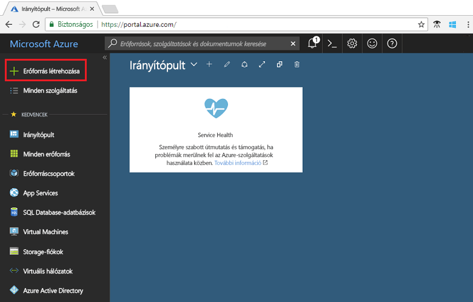
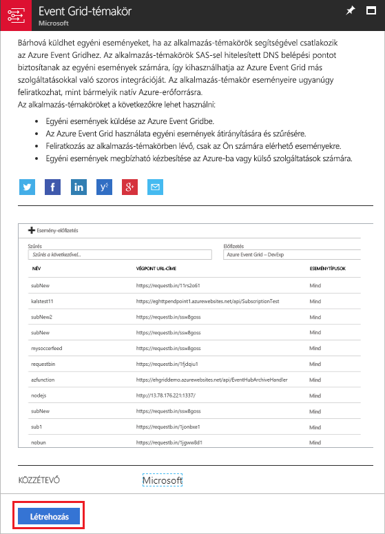
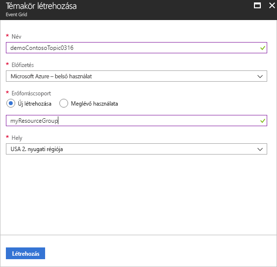
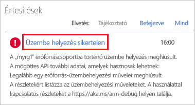
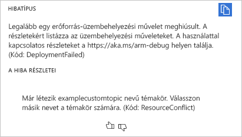

# <a name="create-and-route-custom-events-with-the-azure-portal-and-event-grid"></a>Egyéni események létrehozása és átirányítása az Azure Portallal és az Event Griddel

Az Azure Event Grid egy felhőalapú eseménykezelési szolgáltatás. Ebben a cikkben létrehozunk egy egyéni témakört az Azure Portallal, feliratkozunk a témakörre, majd kiváltjuk az eseményt az eredmény megtekintéséhez. Az eseményt elküldi az eseményadatokat naplózó Azure-függvénynek. A folyamat végén látni fogja, hogy a rendszer elküldte az eseményadatokat egy végpontnak, és naplózta őket.

[!INCLUDE [quickstarts-free-trial-note.md](../../includes/quickstarts-free-trial-note.md)]

## <a name="create-a-custom-topic"></a>Egyéni témakör létrehozása

Az Event Grid-témakörök egy felhasználó által meghatározott végpontot biztosítanak, amelyben közzéteheti az eseményeket. 

1. Jelentkezzen be az [Azure Portalra](https://portal.azure.com/).

1. Egyéni témakör létrehozásához válassza az **Erőforrás létrehozása** elemet. 

   

1. Keressen rá az *Event Grid-témakör* kifejezésre, és válassza ki az elérhető lehetőségek közül.

   

1. Kattintson a **Létrehozás** gombra.

   

1. Adjon egy egyedi nevet az egyéni témakörnek. A témakör nevének egyedinek kell lennie, mert a nevet egy DNS-bejegyzés képviseli. Ne a képen látható nevet használja. Ehelyett hozzon létre egy saját nevet. Válasszon egyet a [támogatott régiók](overview.md) közül. Adja meg az erőforráscsoport nevét. Kattintson a **Létrehozás** gombra.

   

1. Az egyéni témakör létrehozása után láthatja a sikeres műveletről szóló értesítést.

   

   Ha az üzembe helyezés nem sikerült, megtudhatja, mi okozta a hibát. Válassza az **Üzembe helyezés sikertelen** elemet.

   

   Válassza ki a hibaüzenetet.

   

   Az alábbi képen egy olyan üzembe helyezés látható, amely azért volt sikertelen, mert az egyéni témakör neve már használatban van. Ha ezt a hibát látja, próbáljon meg egy másik nevet használni az üzembe helyezéshez.

   

## <a name="create-an-azure-function"></a>Azure-függvény létrehozása

A témakörre való feliratkozás előtt hozzuk létre az eseményüzenet végpontját. Ebben a cikkben Azure-függvényekkel hozhat létre egy függvényalkalmazást a végponthoz.

1. Függvény létrehozásához válassza az **Erőforrás létrehozása** elemet.

   

1. Válassza a **Számítás** és a **Függvényalkalmazás** elemet.

   

1. Adjon egy egyedi nevet az Azure-függvénynek. Ne a képen látható nevet használja. Válassza ki az ebben a cikkben létrehozott erőforráscsoportot. Szolgáltatási csomagként válassza a **Használatalapú csomagot**. Használja a javasolt új tárfiókot. Az értékek megadása után válassza a **Létrehozás** elemet.

   

1. Az üzembe helyezés befejezése után válassza az **Erőforrás megnyitása** elemet.

   

1. A **Függvények** mellett válassza a **+** elemet.

   

1. Válassza az **Egyéni függvény** elemet az elérhető lehetőségek közül.

   

1. Görgessen lefelé, amíg meg nem találja az **Event Grid-triggert**. Válassza a **C#** elemet.

   

1. Fogadja el az alapértelmezett értékeket, és válassza a **Létrehozás** elemet.

   

A függvény készen áll az események fogadására.

## <a name="subscribe-to-a-topic"></a>Feliratkozás témakörre

A témakörre való feliratkozással lehet tudatni az Event Griddel, hogy mely eseményeket kívánja nyomon követni, és hová szeretné küldeni az eseményeket.

1. Az Azure-függvényben válassza az **Event Grid-előfizetés hozzáadása** elemet.

   

1. Adja meg az előfizetés értékeit. A témakör típusánál válassza az **Event Grid-témakörök** elemet. Az előfizetéshez és az erőforráscsoporthoz válassza ki azt az előfizetést és erőforráscsoportot, amelyben létrehozta az egyéni témakört. Válassza ki például az egyéni témakör nevét. Az előfizető végpontja előre ki van töltve a függvény URL-jével.

   

1. Az esemény elindítása előtt nyissa meg a függvény naplóit, hogy lássa az eseményadatokat az elküldéskor. Az Azure-függvény alján válassza a **Naplók** elemet.

   

Most aktiváljunk egy eseményt, és lássuk, hogyan küldi el az üzenetet az Event Grid a végpontnak. A cikkben leírt folyamat leegyszerűsítése érdekében a Cloud Shell használatával küldjön mintául szolgáló eseményadatokat az egyéni témakörbe. Egy alkalmazás vagy Azure-szolgáltatás általában eseményadatokat küld el.

[!INCLUDE [cloud-shell-try-it.md](../../includes/cloud-shell-try-it.md)]

## <a name="send-an-event-to-your-topic"></a>Esemény elküldése a témakörbe

Az Azure CLI vagy a PowerShell használatával küldjön teszteseményt az egyéni témakörbe.

Az első példa az Azure CLI-t használja. Ez lekéri a témakör URL-címét és kulcsát, valamint a mintául szolgáló eseményadatokat. A `<topic_name>` helyett használja a témakör nevét. A teljes esemény megjelenítéséhez használja az `echo "$body"` elemet. A JSON `data` eleme az esemény hasznos adata. Bármilyen, megfelelően formált JSON megadható ebben a mezőben. A speciális útválasztáshoz és szűréshez használhatja a tárgy mezőt is. A CURL egy olyan segédprogram, amely HTTP-kéréseket küld.

```azurecli-interactive
endpoint=$(az eventgrid topic show --name <topic_name> -g myResourceGroup --query "endpoint" --output tsv)
key=$(az eventgrid topic key list --name <topic_name> -g myResourceGroup --query "key1" --output tsv)

body=$(eval echo "'$(curl https://raw.githubusercontent.com/Azure/azure-docs-json-samples/master/event-grid/customevent.json)'")

curl -X POST -H "aeg-sas-key: $key" -d "$body" $endpoint
```

A második példa a PowerShell használatával végez hasonló lépéseket.

```azurepowershell-interactive
$endpoint = (Get-AzureRmEventGridTopic -ResourceGroupName gridResourceGroup -Name <topic-name>).Endpoint
$keys = Get-AzureRmEventGridTopicKey -ResourceGroupName gridResourceGroup -Name <topic-name>

$eventID = Get-Random 99999

#Date format should be SortableDateTimePattern (ISO 8601)
$eventDate = Get-Date -Format s

#Construct body using Hashtable
$htbody = @{
    id= $eventID
    eventType="recordInserted"
    subject="myapp/vehicles/motorcycles"
    eventTime= $eventDate   
    data= @{
        make="Ducati"
        model="Monster"
    }
    dataVersion="1.0"
}

#Use ConvertTo-Json to convert event body from Hashtable to JSON Object
#Append square brackets to the converted JSON payload since they are expected in the event's JSON payload syntax
$body = "["+(ConvertTo-Json $htbody)+"]"

Invoke-WebRequest -Uri $endpoint -Method POST -Body $body -Headers @{"aeg-sas-key" = $keys.Key1}
```

Ön kiváltotta az eseményt, az Event Grid pedig elküldte az üzenetet a feliratkozáskor konfigurált végpontnak. Az eseményadatokat a naplókban tekintheti meg.


## <a name="clean-up-resources"></a>Az erőforrások eltávolítása

Ha tovább kívánja használni az eseményt, akkor ne törölje a cikkben létrehozott erőforrásokat. Ellenkező esetben törölje a cikkben létrehozott erőforrásokat.

Válassza ki az erőforráscsoportot, majd válassza az **Erőforráscsoport törlése** elemet.

## <a name="next-steps"></a>További lépések

Most, hogy megismerte, hogyan hozhat létre egyéni témaköröket és esemény-előfizetéseket, bővebben is tájékozódhat arról, hogy miben nyújthat segítséget az Event Grid:

- [Bevezetés az Event Grid használatába](overview.md)
- [Azure Blob Storage-események átirányítása egyéni webes végpontra](../storage/blobs/storage-blob-event-quickstart.md?toc=%2fazure%2fevent-grid%2ftoc.json)
- [Virtuális gépek módosításainak monitorozása az Azure Event Grid és a Logic Apps segítségével](monitor-virtual-machine-changes-event-grid-logic-app.md)
- [Big Data típusú adatok streamelése adattárházba](event-grid-event-hubs-integration.md)
