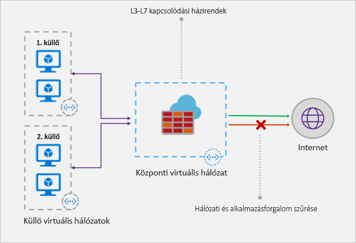

# Mi az Azure Firewall?

Az Azure Firewall egy felügyelt, felhőalapú hálózatbiztonsági szolgáltatás, amely Azure Virtual Network-erőforrásait védi. Ez egy szolgáltatásként nyújtott teljesen állapotalapú tűzfal, beépített magas rendelkezésre állással és korlátlan felhőalapú skálázhatósággal. 

[!INCLUDE [firewall-preview-notice](../../includes/firewall-preview-notice.md)]

Központilag hozhatja létre, érvényesítheti és naplózhatja az alkalmazás- és hálózatelérési szabályzatokat az előfizetésekre és a virtuális hálózatokra vonatkozóan. Az Azure Firewall statikus nyilvános IP-címet használ a virtuális hálózat erőforrásaihoz, így a külső tűzfalak azonosíthatják a virtuális hálózatból érkező forgalmat.  A szolgáltatás teljesen integrálva van az Azure Monitorral a naplózás és az elemzés érdekében.

## Szolgáltatások

Az Azure Firewall nyilvános előzetes verziója az alábbi szolgáltatásokat kínálja:

### Beépített magas rendelkezésre állás
A magas rendelkezésre állás be van építve a rendszerbe, így nincs szükség további terheléselosztókra, és semmit nem kell konfigurálnia.

### Korlátlan felhőalapú skálázhatóság 
Az Azure Firewall akármeddig felskálázható a változó hálózati forgalom kezeléséhez, így a költségvetést nem szükséges a csúcsforgalomhoz igazítania.

### FQDN-szűrés 
A kimenő HTTP/S-forgalom korlátozható teljes tartománynevek (FQDN) egy megadott listájára (helyettesítő karakterek is alkalmazhatók). Ehhez a szolgáltatáshoz nem szükséges SSL-lezárás.

### Hálózati forgalomra vonatkozó szűrési szabályok

Központilag hozhat létre *engedélyező* vagy *tiltó* hálózatszűrési szabályokat forrás és cél IP-cím, port és protokoll alapján. Az Azure Firewall teljes mértékben állapotalapú, így képes megkülönböztetni különböző típusú kapcsolatok érvényes csomagjait. A szabályok több előfizetésen és virtuális hálózaton érvényesíthetők és naplózhatók.

### Kimenő SNAT-támogatás

A rendszer a kimenő virtuális hálózati forgalomhoz tartozó minden IP-címet lefordít az Azure Firewall nyilvános IP-címére (forráshálózati címfordítás, SNAT). Azonosíthatja és engedélyezheti a virtuális hálózatból a távoli internetes célhelyekre irányuló forgalmat.

### Azure Monitor-naplózás

Minden esemény integrálva van az Azure Monitorral, így archiválhatja a naplókat egy tárfiókba, valamint eseményközpontokba streamelheti vagy a Log Analyticsbe küldheti az eseményeket.

## Ismert problémák

Az Azure Firewall nyilvános előzetes verziója az alábbi ismert hibákat tartalmazza:

|Probléma  |Leírás  |Kezelés  |
|---------|---------|---------|
|Együttműködés az NSG-kkel     |Ha egy hálózati biztonsági csoportot (NSG) alkalmaz a tűzfal alhálózatán, az akadályozhatja kimenő internetkapcsolatokat, még akkor is, ha a hálózati biztonsági csoport konfigurálva van a kimenő internet-hozzáférések engedélyezésére. A kimenő internetes kapcsolatok úgy vannak jelölve, mint amelyek egy virtuális hálózatról érkeznek és az internetre irányulnak. A hálózati biztonsági csoportokon a virtuális hálózatról virtuális hálózatra irányuló forgalom alapértelmezés szerint *engedélyezve* van, az internetre irányuló azonban nem.|Ennek ellensúlyozására adja hozzá a következő bemeneti szabályt a tűzfal alhálózatára alkalmazott hálózati biztonsági csoporthoz:  Forrás: VirtualNetwork Forrásportok: bármelyik   Cél: bármelyik Célportok: bármelyik   Protokoll: mindegyik Hozzáférés: engedélyezve|
|Ütközés az Azure Security Center (ASC) igény szerinti (JIT) szolgáltatásával|Ha a virtuális gépet a JIT használatával éri el, és az egy olyan alhálózaton található, amelynek a felhasználó által megadott útvonala alapértelmezett átjáróként az Azure Firewallra mutat, az ASC JIT szolgáltatása nem működik. Ez az aszimmetrikus útválasztás eredménye – a csomag a virtuális gép nyilvános IP-címen keresztül érkezik be (a JIT nyitotta meg a hozzáférést), a visszatérési útvonal azonban a tűzfalon keresztül vezet, amely eldobja a csomagot, mivel a tűzfalon nem lett munkamenet létrehozva.|A probléma megkerüléséhez helyezze a JIT használatával elért virtuális gépeket egy olyan külön alhálózatra, amelyen nincs felhasználó által megadott, a tűzfalra mutató útvonal.|
|A globális társviszony-létesítéssel rendelkező küllős topológia nem működik|A küllős modell, amelyben a központ és a tűzfal az egyik Azure-régióban van telepítve, a küllők pedig egy másikban, és ezek a központhoz virtuális társhálózatok közötti globális tárviszony-létesítés útján kapcsolódnak, nem támogatott.|További információt a [virtuális hálózatok társviszony-létesítésének létrehozását, módosítását és törlését](https://docs.microsoft.com/en-us/azure/virtual-network/virtual-network-manage-peering#requirements-and-constraints) ismertető cikkben talál.|
A nem TCP/UDP-protokollokra (például ICMP) vonatkozó hálózati szűrési szabályok nem működnek az internetre irányuló forgalom esetében|A nem TCP/UDP-protokollokra vonatkozó hálózati szűrési szabályok nem működnek a nyilvános IP-címre vonatkozó forráshálózati címfordítással. A nem TCP/UDP-protokollok a küllők alhálózatai és a virtuális hálózatok között támogatottak.|Az Azure Firewall a Standard Load Balancert használja, [amely jelenleg nem támogatja a forráshálózati címfordítást az IP-protokollokon](https://docs.microsoft.com/en-us/azure/load-balancer/load-balancer-standard-overview#limitations). Jelenleg vizsgáljuk a lehetőségeket, hogy ezt a forgatókönyvet valamelyik későbbi kiadás támogathassa majd.

## További lépések

- [Oktatóanyag: Azure Firewall üzembe helyezése és konfigurálása az Azure Portalon](tutorial-firewall-deploy-portal.md)
- [Azure Firewall üzembe helyezése sablon használatával](deploy-template.md)
- [Azure Firewall-tesztkörnyezet létrehozása](scripts/sample-create-firewall-test.md)

