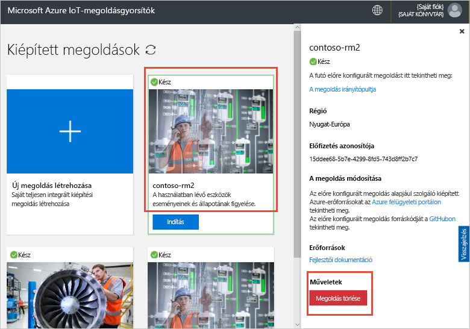

# Az MXChip IoT DevKit AZ3166 csatlakozni az IoT távoli figyelési megoldásgyorsító

[!INCLUDE [iot-suite-selector-connecting](../../includes/iot-suite-selector-connecting.md)]

Ebben az oktatóanyagban elsajátíthatja, hogyan futtathat egy mintaalkalmazást az érzékelő adatokat küldeni a megoldásgyorsító DevKit.

A [MXChip IoT DevKit](https://aka.ms/iot-devkit) egy teljes körű Arduino kompatibilis tábla a gazdag perifériák és érzékelők van. A használatával is fejleszthet [Azure IoT Workbench](https://marketplace.visualstudio.com/items?itemName=vsciot-vscode.vscode-iot-workbench) Visual Studio Code-ban. És az egyre növekvő együtt származik [projektek katalógus](https://microsoft.github.io/azure-iot-developer-kit/docs/projects/) segítséget nyújtanak prototípus Internet of Things (IoT) megoldás, amely a Microsoft Azure-szolgáltatások előnyeit.

## Mi szükséges

Olvassa el a [Getting Started Guide](https://docs.microsoft.com/azure/iot-hub/iot-hub-arduino-iot-devkit-az3166-get-started) és **fejezze be a következő szakaszok**:

* Készítse elő a hardvert
* Wi-Fi konfigurálása
* A fejlesztői készlet használatának megkezdése
* A fejlesztési környezet előkészítése

## Hozzon létre egy Azure IoT távoli figyelési megoldásgyorsító

Ebben az oktatóanyagban létrehozott AZ3166 eszköz adatokat küld a távoli figyelési megoldásgyorsító egy példányát. Ha, még nem még egy példányt az Azure-fiókjában, kövesse a [rövid](https://docs.microsoft.com/azure/iot-accelerators/quickstart-remote-monitoring-deploy) ehhez az útmutató.

A távoli figyelési megoldás az üzembe helyezést követően nyissa meg a megoldás irányítópultján.

## Hozzáad egy eszközt a távoli figyelési megoldás

1. Az irányítópulton, lépjen a **eszközök** szakaszt, és kattintson a **új eszköz**.
   

2. Az eszköz konfigurálása az alábbi információk segítségével, és kattintson a **alkalmaz**.
  * Eszköz típusa: **fizikai**
  * Eszközazonosító: **AZ3166**
  * Hitelesítés típusa: **szimmetrikus kulcs**
  * Hitelesítési kulcs: **kulcsok automatikus létrehozása**
  
  

3. Az új eszköz létrehozása után másolja a **kapcsolati karakterlánc – elsődleges kulcs**. Ez az, hogy az eszközt, hogy az Azure IoT Hub alatt létrehozott.
  
  

## Nyissa meg a távoli figyelési minta a VS Code-ban

1. Győződjön meg arról, hogy az IoT DevKit **nincs csatlakoztatva** a számítógépre. Először indítsa el a VS Code, és a fejlesztői készlet csatlakoztatása a számítógéphez.

1. Kattintson a `F1` nyissa meg a parancskatalógus, írja be és válassza ki a **IoT Workbench: Példák**. Válassza ki **IoT DevKit** , tábla.

1. Keresés **távoli figyelési** kattintson **nyílt minta**. Egy új VS Code-ablak azt a projektmappában nyílik.
  

## Az IoT Hub eszköz kapcsolati karakterlánc konfigurálása

1. Az IoT DevKit való váltás **konfigurációs mód**. Ehhez tegye a következőket:
   * Tartsa lenyomva a gomb **A**.
   * Leküldéses és kiadása a **alaphelyzetbe** gombra.

2. A képernyőn megjelenik a fejlesztői készlet azonosítója és a "Konfiguráció".
   
  

3. Kattintson a `F1` nyissa meg a parancskatalógus, írja be és válassza ki a **IoT Workbench: eszköz > konfigurációs beállítások**.

4. Illessze be a kapcsolati karakterláncot az imént másolt kattintson `Enter` konfigurálásához.

## Hozhat létre és töltse fel az eszköz kódot

1. Kattintson a `F1` nyissa meg a parancskatalógus, írja be és válassza ki a **IoT Workbench: eszköz > eszköz feltöltése**.
  

1. A VS Code majd elindítja a kódja lefordításának és a kódot a DevKit való feltöltését.
  

A fejlesztői készlet újraindul, és elindítja a kód futtatása.

## A projekt tesztelése

### A távoli figyelési megoldás küldött telemetriai adatok megtekintése

A mintaalkalmazás futtatásakor a DevKit Wi-Fi keresztül érzékelői adatokat küld a távoli figyelési megoldáshoz. Az eredmény megjelenítéséhez kövesse az alábbi lépéseket:

1. Nyissa meg a megoldás irányítópultján, és kattintson a **eszközök**.

1. Kattintson a lap jobb oldalán található, ahol megtekintheti az érzékelő állapot DevKit a valós idejű irányítópulton megnyílik az eszköz nevét (AZ3166).
  

### C2D üzenet küldése

Távoli figyelés megoldás lehetővé teszi, hogy az eszköz távoli metódus meghívása. A sxample kódot közzéteszi az is látható három módszert a **metódus** szakaszt, amikor az érzékelő van kiválasztva.

Ossza meg velünk próbálja ki az egyik módszerrel "LedColor" DevKit LED-ek színének módosítása.

1. Válassza ki a **AZ3166** az eszközök listáját, majd kattintson a a **feladatok**.

  

2. A feladatok konfigurálása az alábbi, és kattintson a **alkalmaz**.
  * Válassza a feladat: **Run metódus**
  * Metódus neve: **LedColor**
  * Feladat neve: **ChangeLedColor**
  
  

Néhány másodpercen belül a fejlesztői készlet módosítani kell a RGB LED (alább a gomb A) színét.

## Az erőforrások eltávolítása

Ha tovább kíván lépni a további oktatóanyagokra, ne kapcsolja ki a távoli monitorozási megoldásgyorsítót.

Ha már nincs szüksége a megoldásgyorsító, törölje azt a kiépített megoldások lapon kiválasztja, és kattintson a megoldás törlése:

## Problémák és visszajelzés

Ha problémákat tapasztal, tekintse meg [az IoT DevKit – gyakori kérdések](https://microsoft.github.io/azure-iot-developer-kit/docs/faq/) vagy fel velünk a kapcsolatot a következő csatornák használatával:

* [Gitter.im](http://gitter.im/Microsoft/azure-iot-developer-kit)
* [Stack Overflow](https://stackoverflow.com/questions/tagged/iot-devkit)

## További lépések

Most, hogy megtanulhatta, hogyan jelenítheti meg az érzékelő adatokat és a egy DevKit eszköz csatlakoztatása az Azure IoT távoli figyelési megoldásgyorsító, Íme a javasolt következő lépések:

* [Az Azure IoT a megoldásgyorsítók áttekintése](https://docs.microsoft.com/azure/iot-suite/)
* [A felhasználói felület testreszabása](../iot-accelerators/iot-accelerators-remote-monitoring-customize.md)
* [IoT DevKit csatlakoztatása az Azure IoT Central alkalmazáshoz](../iot-central/howto-connect-devkit.md)