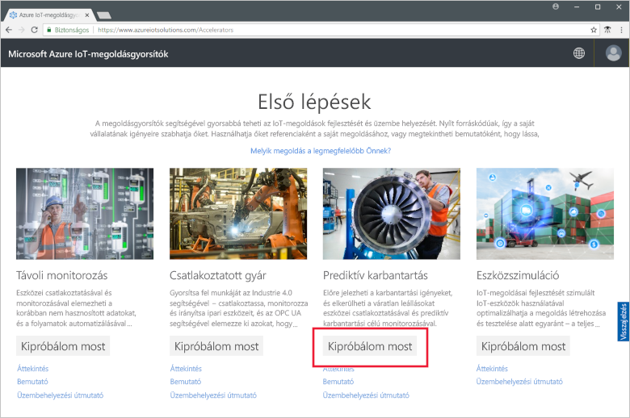
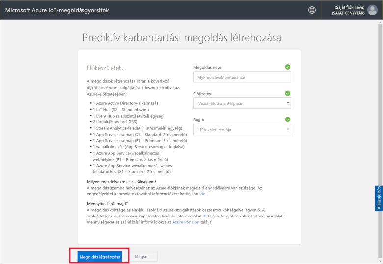
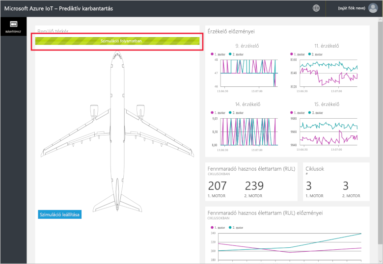
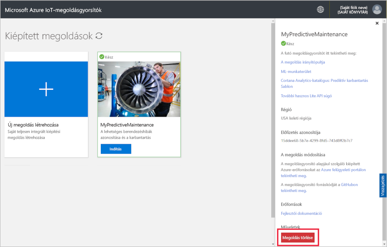

# Rövid útmutató: Felhőalapú megoldás üzembe helyezése prediktív karbantartási elemzés saját csatlakoztatott eszközökön való futtatásához

Ez a rövid útmutató bemutatja az Azure IoT-prediktív karbantartási megoldásgyorsító üzembe helyezését az IoT-eszközök felhőalapú prediktív karbantartási megoldásaként történő használatához. A megoldásgyorsító telepítését követően a megoldás **Dashboard** (Irányítópult) lapjának segítségével futtathat egy szimulációt repülőgépmotor-adatokkal.

A Fabrikam egy regionális légitársaság, amely a nagyszerű ügyfélélményre összpontosít versenyképes árakon. A járatok késésének egyik okai a karbantartási problémák, és a repülőmotorok karbantartása különösen nagy kihívást jelent. A Fabrikamnak minden áron el kell kerülnie a repülés közbeni motorhibákat, így rendszeresen megvizsgálja a motorokat, és tervszerűen ütemezi a karbantartást. A repülőgépek motorja azonban nem mindig ugyanolyan ütemben használódik el. Időnként feleslegesen végeznek karbantartást a motorokon. Még fontosabb, hogy olyan problémák merülnek fel, amelyek miatt a repülőgép nem szállhat fel a karbantartás elvégzéséig. Ezek a problémák különösen költségesek lehetnek, ha egy repülőgép olyan helyen van, ahol nincsenek megfelelő szerelők vagy pótalkatrészek.

A Fabrikam repülőmotorjai olyan érzékelőkkel vannak felszerelve, amelyek monitorozzák a motor állapotát repülés közben. A motor működési és meghibásodási adatainak többéves begyűjtése után a Fabrikam adatszakértői olyan modellt fejlesztettek, amely előrejelzi a repülőmotor fennmaradó hasznos élettartamát (RUL). A modell a négy motorérzékelőből érkező adatok és a meghibásodáshoz vezető motorkopás közötti összefüggést alkalmazza. A Fabrikam továbbra is rendszeres vizsgálatokat végez a biztonság érdekében, azonban mostantól a modellek használatával kiszámíthatja mindegyik motor RUL-értékét minden egyes repülőút után. A Fabrikam már képes előre megmondani a várható meghibásodási pontokat, ez alapján tervezni a karbantartást, így képes minimálisra csökkenteni a repülőgép földön töltött idejét és csökkenteni a működési költségeket, miközben az utasok és a személyzet biztonságát is garantálja.

## Előfeltételek

A rövid útmutató elvégzéséhez szüksége lesz egy Azure-előfizetésre.

Ha nem rendelkezik Azure-előfizetéssel, mindössze néhány perc alatt létrehozhat egy [ingyenes fiókot](https://azure.microsoft.com/free/?WT.mc_id=A261C142F) a virtuális gép létrehozásának megkezdése előtt.

## A megoldás üzembe helyezése

Amikor üzembe helyezi a megoldásgyorsítót az Azure-előfizetéshez, néhány konfigurációs beállítást meg kell adnia.

Jelentkezzen be az [azureiotsolutions.com](https://www.azureiotsolutions.com/Accelerators) webhelyen az Azure-fiók hitelesítő adataival.

Kattintson a **Kipróbálom most** elemre a **Prediktív karbantartás** csempén.

A **Prediktív karbantartási megoldás létrehozása** oldalon adjon meg egy **Megoldásnevet** a prediktív karbantartási megoldásgyorsítóhoz.

Válassza ki a megoldásgyorsító üzembe helyezéséhez használni kívánt **Előfizetést** és **Régiót**. Általában az Önhöz legközelebbi régiót érdemes választani. Mindehhez [globális rendszergazdának vagy felhasználónak](iot-accelerators-permissions.md) kell lennie az előfizetésben.

Kattintson a **Megoldás létrehozása** gombra az üzembe helyezés elkezdéséhez. A folyamat legalább öt percig tart:

## Bejelentkezés a megoldásba

Ha az üzembe helyezés befejeződött az Azure-előfizetésen, bejelentkezhet a prediktív karbantartási megoldásgyorsító irányítópultjára.

A **Kiépített megoldások** lapon kattintson az új prediktív karbantartási megoldásgyorsítóra. A megjelenő panelen megtekintheti a prediktív karbantartási megoldásgyorsítóra vonatkozó információkat. Válassza ki a **Megoldások irányítópultja** elemet a prediktív karbantartási megoldásgyorsító megjelenítéséhez:

Kattintson az **Elfogadás** gombra az engedélykérések elfogadásához. Ekkor a böngészőben megjelenik a prediktív karbantartási megoldásgyorsító irányítópultja:

Kattintson a **Start simulation** (Szimuláció indítása) elemre a szimuláció elindításához. Az irányítópulton az érzékelő előzményei, a RUL, a ciklusok és a RUL előzményei jelennek meg:

Ha az RUL 160-nál kisebb (amely egy bemutatási célra véletlenszerűen kiválasztott küszöbérték), a megoldás portálja egy figyelmeztető szimbólumot jelenít meg az RUL kijelzése mellett. A megoldásportál emellett a repülő motorját sárga színnel emeli ki. Látható, hogy az RUL értékek összesítve jellemzően csökkennek, de felfelé és lefelé is változnak. Ez a viselkedés a változó ciklushosszokból és modellpontosságból következik.

A teljes szimuláció 148 ciklusának elvégzése körülbelül 35 percet vesz igénybe. Először körülbelül 5 perc után éri el a 160 RUL-es küszöbértéket, és körülbelül 8 perc után éri el mindkét motor a küszöbértéket.

A szimuláció 148 cikluson halad végig a teljes adatkészleten, és megállapítja a RUL és a ciklus végső értékeit.

Bármikor leállíthatja a szimulációt, de a **Start Simulation** (Szimuláció indítása) gombra kattintva az adatkészlet elejétől indul újra a szimuláció.

## Az erőforrások eltávolítása

Ha tovább szeretne ismerkedni az eszközzel, hagyja üzembe helyezve a prediktív karbantartási megoldást.

Ha már nincs szüksége a megoldásgyorsítóra, törölje a [Kiépített megoldások](https://www.azureiotsolutions.com/Accelerators#dashboard) lapról:

## További lépések

Ebben a rövid útmutatóban telepítette a prediktív karbantartási megoldásgyorsítót, és futtatott egy szimulációt.

A megoldásgyorsítóról a cikkben találhat további információkat.

> [!div class="nextstepaction"]
> [A prediktív karbantartási megoldásgyorsító áttekintése](iot-accelerators-predictive-walkthrough.md)
