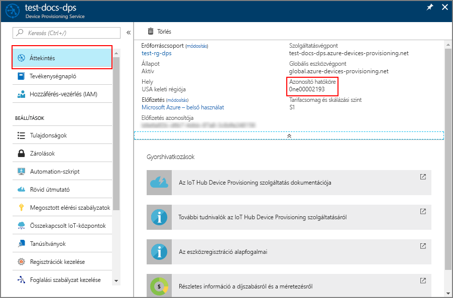
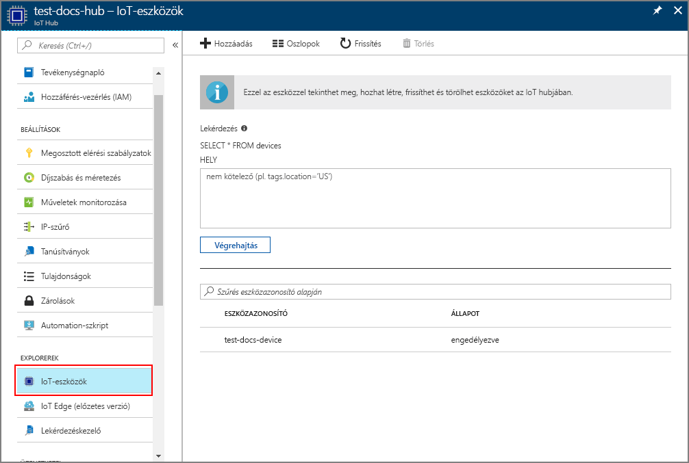

# <a name="create-and-provision-an-x509-simulated-device-using-c-device-sdk-for-iot-hub-device-provisioning-service"></a>Szimulált X.509-eszköz létrehozása és kiépítése az IoT Hub Device Provisioning Service-hez készült C eszközoldali SDK-val
[!INCLUDE [iot-dps-selector-quick-create-simulated-device-x509](../../includes/iot-dps-selector-quick-create-simulated-device-x509.md)]

Ezek a lépések bemutatják, hogyan hozhat létre szimulált X.509-eszközt egy Windows operációs rendszert futtató fejlesztői gépen, és hogyan használhat egy kódmintát, hogy ezt a szimulált eszközt összekösse az eszközkiépítési szolgáltatással és az IoT Hubbal. 

A folytatás előtt végezze el az [IoT Hub eszközkiépítési szolgáltatás beállítása az Azure Portallal](./quick-setup-auto-provision.md) szakasz lépéseit.

[!INCLUDE [IoT DPS basic](../../includes/iot-dps-basic.md)]

<a id="setupdevbox"></a>

## <a name="prepare-the-development-environment"></a>A fejlesztési környezet előkészítése 

1. Győződjön meg arról, hogy a Visual Studio 2015 vagy a [Visual Studio 2017](https://www.visualstudio.com/vs/) telepítve van a gépen. A Visual Studio telepítésekor engedélyezni kell az [„Asztali fejlesztés C++ használatával”](https://www.visualstudio.com/vs/support/selecting-workloads-visual-studio-2017/) számítási feladatot.

2. Töltse le és telepítse a [CMake buildelési rendszert](https://cmake.org/download/). Fontos, hogy a Visual Studio az „Asztali fejlesztés C++ használatával” számítási feladattal együtt telepítve legyen a gépen a `cmake` telepítése **előtt**. 

3. Győződjön meg arról, hogy a(z) `git` telepítve van a gépen, és a parancsablakból elérhető környezeti változókhoz van adva. A [Software Freedom Conservancy's Git ügyfél eszközeiben](https://git-scm.com/download/) találja a telepíteni kívánt `git` eszközök legújabb verzióját, amely tartalmazza a **Git Bash** eszközt, azt a parancssori alkalmazást, amellyel kommunikálhat a helyi Git-adattárral. 

4. Nyisson meg egy parancssort vagy a Git Basht. Klónozza a GitHub-adattárat az eszközszimuláció kódmintájához:
    
    ```cmd
    git clone https://github.com/Azure/azure-iot-sdk-c.git --recursive
    ```

5. Hozzon létre egy mappát a GitHub-adattár helyi másolatában a CMake buildelési folyamathoz. 

    ```cmd
    cd azure-iot-sdk-c
    mkdir cmake
    cd cmake
    ```

6. Futtassa az alábbi parancsot az üzembe helyezési ügyfél Visual Studio-megoldásának létrehozásához.

    ```cmd
    cmake -Duse_prov_client:BOOL=ON ..
    ```
    
    Ha a `cmake` nem találja a C++ fordítóprogramot, a fenti parancs futtatása esetlegesen fordítási hibákat adhat vissza. Ilyen esetekben futtassa a parancsot a [Visual Studio parancssorából](https://docs.microsoft.com/dotnet/framework/tools/developer-command-prompt-for-vs). 


<a id="portalenroll"></a>

## <a name="create-a-device-enrollment-entry-in-the-device-provisioning-service"></a>Eszközök beléptetése bejegyzés létrehozása az eszközkiépítési szolgáltatásban

1. Nyissa meg a *cmake* mappában létrehozott `azure_iot_sdks.sln` nevű megoldást, és építse fel azt a Visual Studióban.

2. Kattintson a jobb gombbal a **dice\_device\_enrollment** projektre a **Provision\_Tools** mappában, és válassza a **Set as Startup Project** (Beállítás kezdőprojektként) lehetőséget. Futtassa a megoldást. A kimeneti ablakba írja be a következőt az egyéni regisztrációhoz, amikor a rendszer erre kéri: **i**. A kimeneti ablakban megjelenik egy helyileg létrehozott X.509-tanúsítvány a szimulált eszközhöz. Másolja a vágólapra a kimenetet a *-----BEGIN CERTIFICATE-----* sortól az első *-----END CERTIFICATE-----* sorig, és ügyeljen arra, hogy a kijelölésben ez a két sor is benne legyen. Ne feledje, hogy csak az első tanúsítványra van szüksége a kimeneti ablakból.
 
3. Hozzon létre egy **_X509testcert.pem_** nevű fájlt a Windows rendszerű gépén, nyissa meg egy tetszőleges szövegszerkesztőben, és másolja bele a vágólapra kimásolt szöveget. Mentse a fájlt. 

4. Jelentkezzen be az Azure Portalra, a bal oldali menüben kattintson az **Összes erőforrás** gombra, és nyissa meg az eszközkiépítési szolgáltatását.

4. Nyissa meg a szolgáltatás **Regisztrációk kezelése** paneljét. Válassza az **Egyéni regisztrációk** fület, és kattintson a felül lévő **Hozzáadás** gombra. 

5. A **Beléptetési listabejegyzés hozzáadása** területen adja meg a következő információkat:
    - Válassza az **X.509** elemet az identitás igazolási *Mechanizmusaként*.
    - A *Tanúsítvány .pem- vagy .cer-fájl* területen válassza ki az előző lépésben létrehozott **_X509testcert.pem_** tanúsítványfájlt a *Fájlkezelő* vezérlővel.
    - Ha kívánja, megadhatja az alábbi információkat is:
        - Válassza ki a kiépítési szolgáltatáshoz kapcsolódó egyik IoT hubot.
        - Adjon meg egy egyedi eszközazonosítót. Ne használjon bizalmas adatokat az eszköz elnevezésekor. 
        - Frissítse az **Eszköz kezdeti ikerállapotát** az eszköz kívánt kezdeti konfigurációjával.
    - Ha végzett, kattintson a **Mentés** gombra. 

      

   Sikeres beléptetés esetén az X.509-eszköz **riot-device-cert** azonosítóval megjelenik a *Regisztrációs azonosító* oszlopban az *Egyéni beléptetések* lapon. 


<a id="firstbootsequence"></a>

## <a name="simulate-first-boot-sequence-for-the-device"></a>Első rendszerindítás szimulálása az eszközhöz

1. Az Azure Portalon válassza ki az eszközkiépítési szolgáltatás **Áttekintés** panelét, és jegyezze fel az **_Azonosító hatóköre_** értéket.

     

2. A gépen a Visual Studióban válassza ki a **prov\_dev\_client\_sample** nevű mintaprojektet a **Kiépítés\_Minták** mappában, és nyissa meg a **prov\_dev\_client\_sample.c** nevű fájlt.

3. Rendelje az _ID Scope_ (Azonosító hatóköre) értéket a(z) `id_scope` változóhoz. 

    ```c
    static const char* id_scope = "[ID Scope]";
    ```

4. Ugyanebben a fájlban, a **main()** függvényben ellenőrizze, hogy a **SECURE_DEVICE_TYPE** értéke X.509-e.

    ```c
    SECURE_DEVICE_TYPE hsm_type;
    hsm_type = SECURE_DEVICE_TYPE_X509;
    ```

   Tegye megjegyzésbe vagy törölje az esetlegesen itt szereplő `hsm_type = SECURE_DEVICE_TYPE_TPM;` utasítást. 

5. Kattintson a jobb gombbal a **prov\_dev\_client\_sample** projektre, és válassza a **Beállítás kezdőprojektként** lehetőséget. Futtassa a mintát. Figyelje meg az eszköz rendszerindítását szimuláló és az eszközkiépítési szolgáltatáshoz az IoT Hub információk lekérése érdekében kapcsolódó üzeneteket. Keresse meg azt az üzenetet, amelyik a hub sikeres regisztrációját jelzi: *Regisztrációs adatok a következő szolgáltatásból: yourhuburl!* Zárja be az ablakot, amikor a rendszer erre kéri.

6. A portálon lépjen a kiépítési szolgáltatáshoz csatolt IoT hubhoz, és nyissa meg az **IoT-eszközök** panelt. Ha sikeresen kiépíti a szimulált X.509-eszközt a hubon, az eszköz azonosítója megjelenik az **IoT-eszközök** panelen, a hozzá tartozó *ÁLLAPOT* pedig **engedélyezett** lesz. Ha már a minta eszközalkalmazás futtatása előtt megnyitotta a panelt, akkor lehet, hogy rá kell kattintania a fenti **Frissítés** gombra. 

     

    Ha módosította az *Eszköz kezdeti ikerállapota* alapértelmezett értékét az eszköz beléptetési bejegyzésében, az lekérheti és felhasználhatja a kívánt ikerállapotot a központból. További információ: [Eszközök ikerállapotának megismerése és használata az IoT hubon](../iot-hub/iot-hub-devguide-device-twins.md).


> [!IMPORTANT]
> Végrehajthatja X.509-eszközök *csoportos regisztrációját* is a következő változtatásokkal a rövid útmutató lépéseiben:
>    1. Konfigurálja a Windows-gépet az alapértelmezett **SChannel** helyett az **OpenSSL** kódtár használatára. Ehhez kövesse a [Windows fejlesztési környezetének kialakításával](https://github.com/Azure/azure-iot-sdk-c/blob/master/doc/devbox_setup.md#windows) kapcsolatos útmutató **WebSockets** szakaszában foglaltakat. Vegye figyelembe, hogy a Linux-gépek alapértelmezés szerint az OpenSSL kódtárat használják. 
>    2. A fenti [Eszközregisztrációs bejegyzés létrehozása az eszközkiépítési szolgáltatásban](#portalenroll) szakasz 2. lépésében adja meg a **g** karakterláncot a csoportos regisztrációhoz.
>    3. [Ugyanennek a szakasznak](#portalenroll) a 4. és 5. lépésében válassza a **Regisztrációs csoportok** lehetőséget, és adja meg a szükséges információkat a csoportbejegyzéshez.  
>

## <a name="clean-up-resources"></a>Az erőforrások eltávolítása

Ha azt tervezi, hogy folytatja az eszközügyfél minta használatát és megismerését, akkor ne törölje a rövid útmutatóban létrehozott erőforrásokat. Ha nem folytatja a munkát, akkor a következő lépésekkel törölheti a rövid útmutatóhoz létrehozott összes erőforrást.

1. Zárja be az eszközügyfél minta kimeneti ablakát a gépen.
1. Az Azure Portal bal oldali menüjében kattintson az **Összes erőforrás** lehetőségre, majd válassza ki az eszközkiépítési szolgáltatást. Nyissa meg a szolgáltatás **Regisztrációk kezelése** paneljét, majd kattintson az **Egyéni regisztrációk** lapra. Válassza ki a rövid útmutatóban regisztrált eszköz *REGISZTRÁCIÓS AZONOSÍTÓJÁT*, majd kattintson a felül található **Törlés** gombra. 
1. Az Azure Portal bal oldali menüjében kattintson az **Összes erőforrás** lehetőségre, majd válassza ki az IoT Hubot. Nyissa meg a hub **IoT-eszközök** paneljét, válassza ki a rövid útmutatóban regisztrált eszköz *ESZKÖZAZONOSÍTÓJÁT*, majd kattintson a felül található **Törlés** gombra.

## <a name="next-steps"></a>További lépések

Ebben a rövid útmutatóban egy szimulált X.509-eszközt hozott létre a Windows rendszerű gépén, amelyet aztán kiépített az IoT Hubon a portál Azure IoT Hub Device Provisioning Service szolgáltatásával. Ha szeretné megismerni az X.509-eszköz programozott regisztrációjának folyamatát, lépjen tovább az X.509-eszközök programozott regisztrációjának rövid útmutatójára. 

> [!div class="nextstepaction"]
> [Azure rövid útmutató – X.509-eszközök regisztrációja az Azure IoT Hub Device Provisioning Service-be](quick-enroll-device-x509-java.md)
