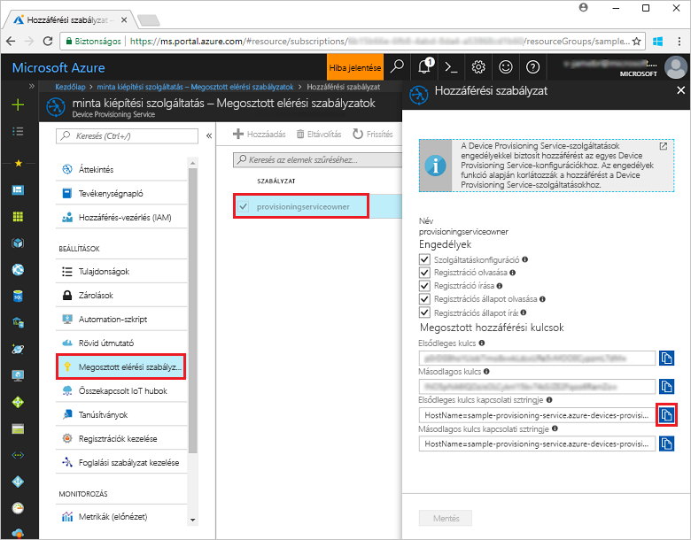
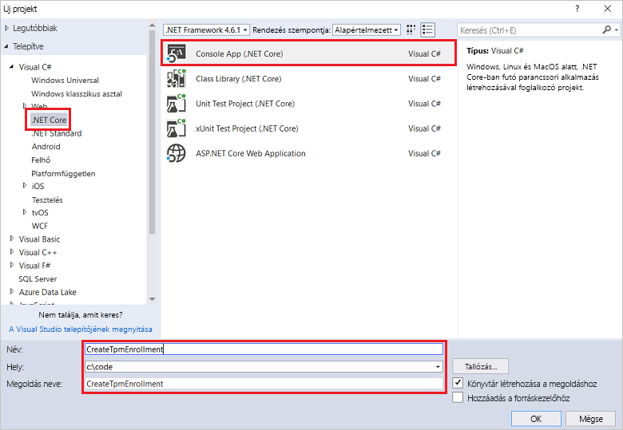
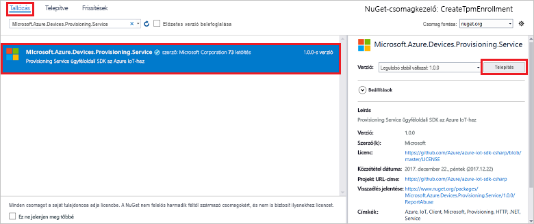
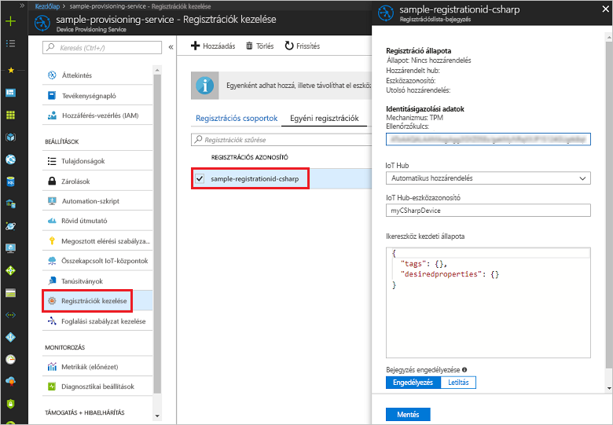

# <a name="enroll-tpm-device-to-iot-hub-device-provisioning-service-using-c-service-sdk"></a>TPM-eszköz regisztrálása az IoT Hub Device Provisioning Service-be a C# szolgáltatásoldali SDK-val

[!INCLUDE [iot-dps-selector-quick-enroll-device-tpm](../../includes/iot-dps-selector-quick-enroll-device-tpm.md)]


Ezek a lépések bemutatják, hogyan hozhat létre egyéni regisztrációt TPM-eszközhöz programozott módon az Azure IoT Hub Device Provisioning Service-be a [C# szolgáltatási SDK](https://github.com/Azure/azure-iot-sdk-csharp), valamint egy C# .NET Core-mintaalkalmazás használatával. Emellett egy szimulált TPM-eszközt is regisztrálhat a kiépítési szolgáltatásba ezzel az egyéni regisztrációs bejegyzéssel. Bár a lépések Windows és Linux rendszerű gépeken egyaránt alkalmazhatók, ez a cikk egy Windows rendszerű fejlesztési számítógépet használ.

## <a name="prepare-the-development-environment"></a>A fejlesztési környezet előkészítése

1. Győződjön meg arról, hogy a [Visual Studio 2017](https://www.visualstudio.com/vs/) telepítve van a számítógépre. 
2. Győződjön meg arról, hogy a [.NET Core SDK](https://www.microsoft.com/net/download/windows) telepítve van a gépén. 
3. A folytatás előtt végezze el az [IoT Hub Device Provisioning Service az Azure Portallal való beállítását ismertető](./quick-setup-auto-provision.md) szakasz lépéseit.
4. (Nem kötelező) Ha a rövid útmutató végén szeretne regisztrálni egy szimulált eszközt, kövesse a [Szimulált TPM-eszköz létrehozása és regisztrálása C# eszközoldali SDK-val](quick-create-simulated-device-tpm-csharp.md) című rész lépéseit addig a pontig, ahol megkapja az ellenőrzőkulcsot az eszközhöz. Jegyezze fel az ellenőrzőkulcsot, a regisztrációs azonosítót és az eszközazonosítót (az utóbbi nem kötelező), mert az útmutató későbbi részében szüksége lesz rájuk. **Ne kövesse az egyéni regisztráció Azure Portallal való létrehozásának lépéseit.**

## <a name="get-the-connection-string-for-your-provisioning-service"></a>A kiépítési szolgáltatás kapcsolati sztringjének lekérése

A rövid útmutatóban lévő mintához szüksége lesz a kiépítési szolgáltatás kapcsolati sztringjére.
1. Jelentkezzen be az Azure Portalra, a bal oldali menüben kattintson az **Összes erőforrás** gombra, és nyissa meg az eszközkiépítési szolgáltatást. 
2. Kattintson a **Megosztott elérési szabályzatok** elemre, majd a használni kívánt hozzáférési szabályzatra a tulajdonságainak megnyitásához. A **Hozzáférési szabályzat** ablakban másolja és jegyezze fel az elsődleges kulcs kapcsolati sztringjét. 

    

## <a name="create-the-individual-enrollment-sample"></a>Az egyéni regisztrációs minta létrehozása 

A jelen szakaszban szereplő lépések bemutatják, hogyan lehet létrehozni egy .NET Core-konzolalkalmazást, amely hozzáad egy TPM-eszközre vonatkozó egyéni regisztrációt a kiépítési szolgáltatáshoz. Néhány módosítással ezeket a lépéseket követve létrehozhat egy [Windows IoT Core](https://developer.microsoft.com/en-us/windows/iot)-konzolalkalmazást is az egyéni regisztráció hozzáadásához. További információk az IoT Core használatával való fejlesztésről: [Windows IoT Core – fejlesztői dokumentáció](https://docs.microsoft.com/windows/iot-core/).
1. A Visual Studióban adjon hozzá egy Visual C# .NET Core konzolalkalmazás-projektet az új megoldáshoz a **Console App (.NET Core)** (Konzolalkalmazás (.NET Core)) projektsablonnal. A Microsoft .NET-keretrendszer 4.5.1-es vagy újabb verzióját használja. Adja a projektnek **CreateTpmEnrollment** nevet.

    

2. A Solution Explorerben (Megoldáskezelőben) kattintson a jobb gombbal a **CreateTpmEnrollment** projektre, majd kattintson a **Manage NuGet Packages** (NuGet-csomagok kezelése) parancsra.
3. A **NuGet Package Manager** (NuGet-csomagkezelő) ablakban válassza a **Browse** (Tallózás) lehetőséget, keresse meg a **Microsoft.Azure.Devices.Client** csomagot, válassza az **Install** (Telepítés) lehetőséget a **Microsoft.Azure.Devices.Provisioning.Service** csomag telepítéséhez, és fogadja el a használati feltételeket. Ez az eljárás letölti és telepíti az [Azure IoT Provisioning Service Client SDK](https://www.nuget.org/packages/Microsoft.Azure.Devices.Provisioning.Service/) (Azure IoT kiépítési szolgáltatás ügyféloldali SDK-ja) NuGet-csomagot és annak függőségeit, valamint hozzáad egy rá mutató hivatkozást is.

    

4. Adja hozzá a következő `using` utasításokat a többi `using` utasítás után a **Program.cs** fájl elejéhez:
   
   ```csharp
   using System.Threading.Tasks;
   using Microsoft.Azure.Devices.Provisioning.Service;
   ```
    
5. Adja hozzá a **Program** osztályhoz a következő mezőket:  
   - A **ProvisioningConnectionString** helyőrző értéket cserélje le annak a kiépítési szolgáltatásnak a kapcsolati sztringjére, amelyhez létre szeretné hozni a regisztrációt.
   - A regisztrációs azonosító, az ellenőrzőkulcs, az eszközazonosító és a regisztrációs állapot igény szerint módosítható. 
   - Ha ezt a rövid útmutatót a [Szimulált TPM-eszköz létrehozása és regisztrálása C# eszközoldali SDK-val](quick-create-simulated-device-tpm-csharp.md) rövid útmutatóval használja együtt a szimulált eszköz regisztrálásához, cserélje le az ellenőrzőkulcs és regisztrációs azonosító értékét az abban a rövid útmutatóban lejegyzett értékre. Az eszközazonosítót lecserélheti a rövid útmutatóban javasolt értékre, illetve használhatja a saját értékét vagy az ebben a mintában lévő alapértelmezett értéket.
        
   ```csharp
   private static string ProvisioningConnectionString = "{Your provisioning service connection string}";
   private const string RegistrationId = "sample-registrationid-csharp";
   private const string TpmEndorsementKey =
       "AToAAQALAAMAsgAgg3GXZ0SEs/gakMyNRqXXJP1S124GUgtk8qHaGzMUaaoABgCAAEMAEAgAAAAAAAEAxsj2gUS" +
       "cTk1UjuioeTlfGYZrrimExB+bScH75adUMRIi2UOMxG1kw4y+9RW/IVoMl4e620VxZad0ARX2gUqVjYO7KPVt3d" +
       "yKhZS3dkcvfBisBhP1XH9B33VqHG9SHnbnQXdBUaCgKAfxome8UmBKfe+naTsE5fkvjb/do3/dD6l4sGBwFCnKR" +
       "dln4XpM03zLpoHFao8zOwt8l/uP3qUIxmCYv9A7m69Ms+5/pCkTu/rK4mRDsfhZ0QLfbzVI6zQFOKF/rwsfBtFe" +
       "WlWtcuJMKlXdD8TXWElTzgh7JS4qhFzreL0c1mI0GCj+Aws0usZh7dLIVPnlgZcBhgy1SSDQMQ==";
       
   // Optional parameters
   private const string OptionalDeviceId = "myCSharpDevice";
   private const ProvisioningStatus OptionalProvisioningStatus = ProvisioningStatus.Enabled;
   ```
    
6. Adja hozzá a **Program** osztályhoz a következő metódust.  Ez a kód egyéni regisztrációt hoz létre, majd meghívja a **CreateOrUpdateIndividualEnrollmentAsync** metódust a **ProvisioningServiceClient** objektumon, hogy hozzáadja az egyéni regisztrációt a kiépítési szolgáltatáshoz.
   
   ```csharp
   public static async Task RunSample()
   {
       Console.WriteLine("Starting sample...");

       using (ProvisioningServiceClient provisioningServiceClient =
               ProvisioningServiceClient.CreateFromConnectionString(ProvisioningConnectionString))
       {
           #region Create a new individualEnrollment config
           Console.WriteLine("\nCreating a new individualEnrollment...");
           Attestation attestation = new TpmAttestation(TpmEndorsementKey);
           IndividualEnrollment individualEnrollment =
                   new IndividualEnrollment(
                           RegistrationId,
                           attestation);

           // The following parameters are optional. Remove them if you don't need them.
           individualEnrollment.DeviceId = OptionalDeviceId;
           individualEnrollment.ProvisioningStatus = OptionalProvisioningStatus;
           #endregion

           #region Create the individualEnrollment
           Console.WriteLine("\nAdding new individualEnrollment...");
           IndividualEnrollment individualEnrollmentResult =
               await provisioningServiceClient.CreateOrUpdateIndividualEnrollmentAsync(individualEnrollment).ConfigureAwait(false);
           Console.WriteLine("\nIndividualEnrollment created with success.");
           Console.WriteLine(individualEnrollmentResult);
           #endregion
        
       }
   }
   ```
       
7. Végül cserélje le a **Main** metódus törzsét az alábbi sorokra:
   
   ```csharp
   RunSample().GetAwaiter().GetResult();
   Console.WriteLine("\nHit <Enter> to exit ...");
   Console.ReadLine();
   ```
        
8. Hozza létre a megoldást.

## <a name="run-the-individual-enrollment-sample"></a>Az egyéni regisztrációs minta futtatása
  
1. Futtassa a mintát a Visual Studióban a TPM-eszköz egyéni regisztrációjának létrehozásához.
 
2. Sikeres létrehozás esetén a parancsablak az új egyéni regisztráció tulajdonságait jeleníti meg.

    

3. Annak ellenőrzéséhez, hogy létrejött-e az egyéni regisztráció, az Azure Portal Device Provisioning Service összefoglalási panelén válassza a **Regisztrációk kezelése** lehetőséget, majd az **Egyéni regisztrációk** lapot. Meg kell jelennie egy új regisztrációs bejegyzésnek, amely megfelel a mintában használt regisztrációs azonosítónak is. Kattintson a bejegyzésre az ellenőrzőkulcs és a bejegyzés többi tulajdonságának megtekintéséhez.

    
 
4. (Nem kötelező) Ha követte a [Szimulált TPM-eszköz létrehozása és regisztrálása C# eszközoldali SDK-val](quick-create-simulated-device-tpm-csharp.md) rövid útmutató lépéseit, a rövid útmutató további lépéseivel regisztrálhatja a szimulált eszközét. Hagyja ki azon lépéseket, amelyek az egyéni regisztrációk Azure Portallal való létrehozására vonatkoznak.

## <a name="clean-up-resources"></a>Az erőforrások eltávolítása
Ha azt tervezi, hogy részletesebben is áttekinti a C#-szolgáltatásmintát, akkor ne törölje az ebben a rövid útmutatóban létrehozott erőforrásokat. Ha nem folytatja a munkát, akkor a következő lépésekkel törölheti a rövid útmutatóhoz létrehozott összes erőforrást.

1. Zárja be a C#-minta kimeneti ablakát a gépen.
2. Lépjen a Device Provisioning Service-re az Azure Portalon, kattintson a **Regisztrációk kezelése** lehetőségre, majd válassza az **Egyéni regisztrációk** lapot. Válassza ki a rövid útmutató segítségével létrehozott regisztrációs bejegyzés *Regisztrációs azonosítóját*, majd kattintson a panel tetején lévő **Törlés** gombra. 
3. Ha követte a [Szimulált TPM-eszköz létrehozása és regisztrációja C# eszközoldali SDK-val](quick-create-simulated-device-tpm-csharp.md) rövid útmutató lépéseit egy szimulált TPM-eszköz létrehozásához: 

    1. Zárja be a TPM-szimulátor ablakát és a szimulált eszköz mintakódkimeneti ablakát.
    2. Az Azure Portalon lépjen ahhoz az IoT Hubhoz, ahol regisztrálta az eszközt. A bal oldali menüben a **Tallózók** területen kattintson az **IoT-eszközök** elemre, jelölje be az eszköze melletti jelölőnégyzetet, majd kattintson az ablak tetején található **Törlés** gombra.
 
## <a name="next-steps"></a>További lépések
Ebben a rövid útmutatóban egyéni regisztrációs bejegyzést hozott létre programozott módon egy TPM-eszközhöz, és igény szerint létrehozott egy szimulált TPM-eszközt a gépén, majd kiépítette azt az IoT Hubon az Azure IoT Hub Device Provisioning Service-szel. Ha mélyebben szeretné megismerni az eszközkiépítést, folytassa az Azure Portalon az eszközkiépítési szolgáltatás beállításának oktatóanyagával. 
 
> [!div class="nextstepaction"]
> [Azure IoT Hub eszközkiépítési szolgáltatás oktatóanyagai](./tutorial-set-up-cloud.md)

