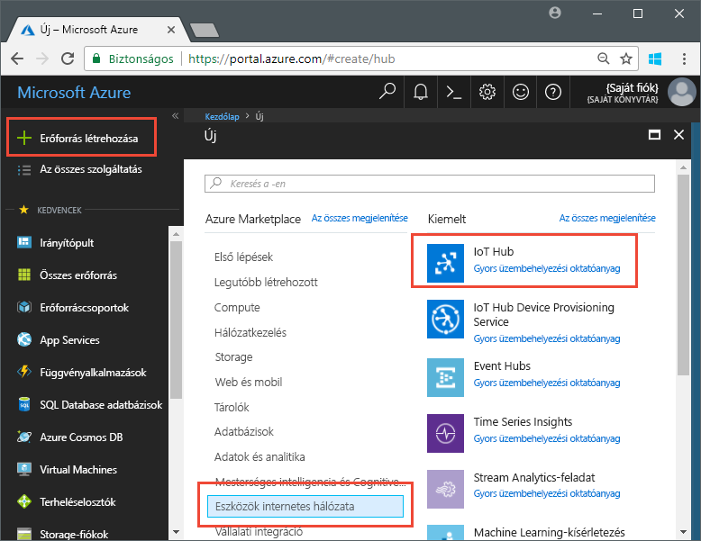
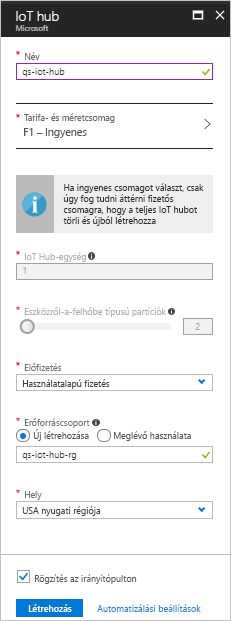

# <a name="send-telemetry-from-a-device-to-an-iot-hub-swift"></a>Telemetria küldése egy eszközről IoT Hubra (Swift)

Az IoT Hub olyan Azure-szolgáltatás, amely lehetővé teszi nagy mennyiségű telemetria betöltését egy IoT-eszközről a felhőbe tárolás vagy feldolgozás céljából. Ebben a cikkben telemetriát küld egy szimulált eszközalkalmazástól az IoT Hubra. Ezután megtekintheti az adatokat egy háttéralkalmazásból. 

Ez a cikk előre megírt Swift-alkalmazást használ a telemetria küldésére, és egy CLI-segédprogramot a telemetria beolvasására az IoT Hubról. 

[!INCLUDE [cloud-shell-try-it.md](../../includes/cloud-shell-try-it.md)]

Ha nem rendelkezik Azure-előfizetéssel, mindössze néhány perc alatt létrehozhat egy [ingyenes fiókot](https://azure.microsoft.com/free/?WT.mc_id=A261C142F) a virtuális gép létrehozásának megkezdése előtt.

## <a name="prerequisites"></a>Előfeltételek

- A mintakód letöltése az [Azure-minták](https://github.com/Azure-Samples/azure-iot-samples-ios/archive/master.zip) oldalról 
- Az iOS SDK legújabb verzióját futtató [XCode](https://developer.apple.com/xcode/) legújabb verziója. A rövid útmutató tesztelése az XCode 9.3-as és az iOS 11.3-as verziójával történt.
- A [CocoaPods](https://guides.cocoapods.org/using/getting-started.html) legújabb verziója.
- Az iothub-explorer CLI-segédprogram, amely telemetriát olvas az IoT Hubról. A telepítéshez először telepítse a [Node.js](https://nodejs.org) 4.x.x vagy újabb verzióját, majd futtassa az alábbi parancsot: 

   ```sh
   sudo npm install -g iothub-explorer
   ```

## <a name="create-an-iot-hub"></a>IoT Hub létrehozása

Első lépésként az Azure Portal használatával hozzon létre IoT Hubot az előfizetésében. Az IoT Hub lehetővé teszi nagy mennyiségű telemetria betöltését számos eszközről a felhőbe. A Hub ezután engedélyt ad egy vagy több, a felhőben futó háttérszolgáltatásnak a telemetria olvasására és feldolgozására.

1. Jelentkezzen be az [Azure Portalra](http://portal.azure.com).

1. Válassza az **Erőforrás létrehozása** > **Eszközök internetes hálózata** > **IoT Hub** elemet. 

   

1. Az IoT Hub létrehozásához használja az alábbi táblázatban látható értékeket:

    | Beállítás | Érték |
    | ------- | ----- |
    | Name (Név) | A Hub egyedi neve |
    | Tarifacsomag és méret | F1 – Ingyenes |
    | IoT Hub-egységek | 1 |
    | Eszközről a felhőbe típusú partíciók | 2 partíció |
    | Előfizetés | Az Azure-előfizetése. |
    | Erőforráscsoport | Hozzon létre újat. Adja meg az erőforráscsoport nevét. |
    | Hely | A legközelebbi hely. |
    | Rögzítés az irányítópulton | Igen |

1. Kattintson a **Create** (Létrehozás) gombra.  

   

1. Jegyezze fel az IoT Hub és az erőforráscsoport nevét. A rövid útmutató későbbi szakaszában fogja használni ezeket az értékeket.

## <a name="register-a-device"></a>Eszköz regisztrálása

Az eszköznek regisztrálva kell lennie az IoT Hubbal, hogy csatlakozhasson hozzá. Ebben a rövid útmutatóban az Azure CLI használatával regisztrál egy szimulált eszközt.

1. Adja hozzá az IoT Hub CLI-bővítményt, és hozza létre az eszközidentitást. A `{YourIoTHubName}` elemet cserélje le az IoT Hub nevére:

   ```azurecli-interactive
   az extension add --name azure-cli-iot-ext
   az iot hub device-identity create --hub-name {YourIoTHubName} --device-id myiOSdevice
   ```

    Ha úgy dönt, hogy eszközének egy másik nevet választ, a mintaalkalmazások futtatása előtt frissítse az eszköznevet bennük.

1. Futtassa az alábbi parancsot az imént regisztrált eszköz _kapcsolati karakterláncának_ lekéréséhez:

   ```azurecli-interactive
   az iot hub device-identity show-connection-string --hub-name {YourIoTHubName} --device-id myiOSdevice --output table
   ```

   Jegyezze fel az eszköz kapcsolati karakterláncát, amely a következőképpen néz ki: `Hostname=...=`. Ezt az értéket a cikk későbbi részében fogja használni.

1. Szüksége van egy _szolgáltatáskapcsolati karakterláncra_ is azért, hogy a háttéralkalmazások csatlakozhassanak az IoT Hubhoz és az eszközről a felhőbe irányuló üzeneteket kérhessenek le. Az alábbi parancs lekéri az IoT Hub szolgáltatáskapcsolati karakterláncát:

   ```azurecli-interactive
   az iot hub show-connection-string --hub-name {YourIoTHubName} --output table
   ```

   Jegyezze fel a szolgáltatás-kapcsolati karakterláncot, amely a következőképpen néz ki: `Hostname=...=`. Ezt az értéket a cikk későbbi részében fogja használni.

## <a name="send-simulated-telemetry"></a>Szimulált telemetria küldése

A mintaalkalmazás az olyan iOS-eszközön fut, amely az IoT Hubon található eszközspecifikus végponthoz csatlakozik, és hőmérséklettel és páratartalommal kapcsolatos szimulált telemetriát küld. 

### <a name="install-cocoapods"></a>A CocoaPods telepítése

A CocoaPods a külső gyártótól származó kódtárakat használó iOS-projektek függőségeit kezeli.

Egy terminálablakban lépjen az Azure-IoT-Samples-iOS mappához, amelyet az előfeltételek részben töltött le. Ezután lépjen a mintaprojekthez:

```sh
cd quickstart/sample-device
```

Győződjön meg arról, hogy az XCode be van zárva, majd futtassa az alábbi parancsot a **podfile** fájlban szereplő CocoaPods telepítéséhez:

```sh
pod install
```

A projekthez szükséges podok telepítésén kívül a telepítési parancs egy XCode-munkaterületfájlt is létrehozott, amely már konfigurálva van a podok függőségekhez való használatára. 

### <a name="run-the-sample-application"></a>A mintaalkalmazás futtatása 

1. Nyissa meg a minta munkaterületet az XCode-ban.

   ```sh
   open "MQTT Client Sample.xcworkspace"
   ```

2. Bontsa ki az **MQTT-ügyfélminta** projektet majd bontsa ki az azonos nevű mappát is.  
3. Nyissa meg **ViewController.swift** fájlt az XCode-ban való szerkesztéshez. 
4. Keresse meg a **connectionString** változót, és frissítse az értéket az eszköz korábban lejegyzett kapcsolati karakterláncával.
5. Mentse a módosításokat. 
6. Futtassa a projektet az eszközemulátorban a **Létrehozás és futtatás** gombbal vagy a **command + r** billentyűkombinációval. 

   

7. Amikor az emulátor megnyílt, válassza a mintaalkalmazás **Indítás** lehetőségét.

A következő képernyőképen az a példakimenet látható, amikor az alkalmazás szimulált telemetriát küld az IoT Hubhoz:

   

## <a name="read-the-telemetry-from-your-hub"></a>Telemetria olvasása a Hubról

Az XCode-emulátorban futtatott mintaalkalmazás megjeleníti az eszközről küldött üzenetek adatait. Az IoT Hub segítségével is megtekintheti az adatokat a kapott formában. Az `iothub-explorer` CLI-segédprogram a szolgáltatásoldali **Események** végponthoz csatlakozik az IoT Hubon. 

Nyisson meg egy új terminálablakot. A {your hub service connection string} elemet cserélje le a cikk elején lekért szolgáltatáskapcsolati karakterláncra, majd futtassa az alábbi parancsot:

```sh
iothub-explorer monitor-events myiOSdevice --login "{your hub service connection string}"
```

Az alábbi képernyőképen a terminálablakban megjelenő telemetriatípus látható:


Ha az iothub-explorer parancs futtatásakor hiba lép fel, ellenőrizze, hogy az IoT Hub *szolgáltatáskapcsolati karakterláncát* használja, nem pedig az IoT-eszköz *eszközkapcsolati karakterláncát*. Mindkét kapcsolati karakterlánc a **Hostname={iothubname}** értékkel kezdődik, de a szolgáltatáskapcsolati karakterlánc a **SharedAccessKeyName** tulajdonságot, az eszközkapcsolati karakterlánc pedig a **DeviceID** tulajdonságot tartalmazza. 

## <a name="clean-up-resources"></a>Az erőforrások eltávolítása

Ha azt tervezi, hogy az IoT-tesztelést egyéb cikkekben leírtak szerint folytatja, ne távolítsa el az erőforráscsoportot és az IoT Hubot – később újból használhatja ezeket.

Ha már nincs szüksége az IoT Hubra, az erőforráscsoporttal együtt törölje a Portalon. Ehhez válassza ki az IoT Hubot tartalmazó erőforráscsoportot, majd kattintson a **Törlés** gombra.

## <a name="next-steps"></a>További lépések

Ebben a cikkben beállított egy IoT Hubot, regisztrált egy eszközt, szimulált telemetriát küldött a Hubra egy iOS-eszközről, és beolvasta a telemetriát a Hubról. 

Ha többet szeretne megtudni az iOS-eszközök IoT Hubbal való használatáról, tekintse meg az [üzenetküldés felhőből az eszközre iOS rendszerrel (Swift)](iot-hub-ios-swift-c2d.md) témakörrel foglalkozó cikket.

<!-- Links -->
[lnk-process-d2c-tutorial]: iot-hub-csharp-csharp-process-d2c.md
[lnk-device-management]: iot-hub-node-node-device-management-get-started.md
[lnk-iot-edge]: ../iot-edge/tutorial-simulate-device-linux.md
[lnk-connect-device]: https://azure.microsoft.com/develop/iot/
