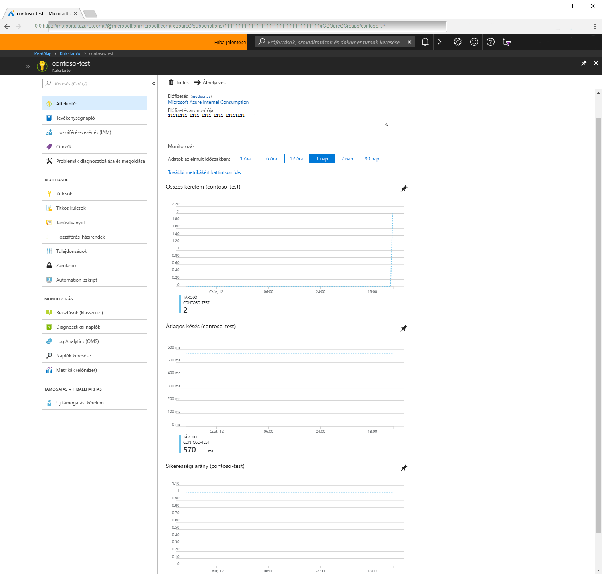

# Mi az Azure Key Vault?

Az Azure Key Vault egy felhőszolgáltatás, amely biztonságos titkoskulcs-tárolóként működik.

Olyan jelszavakkal, kapcsolati karakterláncokkal és egyéb információkkal rendelkezik, amelyek nélkülözhetetlenek az alkalmazások működéséhez. Azt szeretné, ha ezek az információk elérhetők, de biztonságosak is lennének. Ebben nyújt segítséget az Azure Key Vault. Az Azure Key Vault segít a titkos alkalmazáskulcsok biztonságos kezelésében és tárolásában.

A Key Vault lehetővé teszi több biztonságos tároló létrehozását, amelyeket kulcstartóknak nevezünk. Ezeket a tárolókat hardveres biztonsági modulok (HSM-ek) védik. A tárolók a titkos alkalmazáskulcsok tárolásának központosításával csökkentik a biztonsági információk véletlen elvesztésének kockázatát. A kulcstartók a bennük tárolt tartalomhoz való hozzáférést vezérlik és naplózzák is. Az Azure Key Vault kezelni tudja a Transport Layer Security- (TLS-) tanúsítványok kérelmezését és megújítását, biztosítva a tanúsítvány életciklusának megbízható kezelési szolgáltatásához szükséges funkciókat.

 Az Azure Key Vault célja az alkalmazások kulcsainak és titkos kulcsainak támogatása. A Key Vaultot nem a felhasználói jelszavak tárolására tervezték.

## Miért érdemes az Azure Key Vaultot használni?

### Titkos alkalmazáskulcsok központosítása

A titkos alkalmazáskulcsok tárolásának központosítása az Azure Key Vaultban lehetővé teszi azok elosztásának irányítását. Ez nagymértékben csökkenti a veszélyét annak, hogy titkos kulcsok véletlenül kiszivárogjanak. A Key Vault használatával az alkalmazásfejlesztőknek többé nem kell az alkalmazásban tárolniuk a biztonsági információkat. Ezzel a megoldással ezeket az információkat nem kell beépíteni a kódba. Tegyük fel például, hogy egy alkalmazásnak egy adatbázishoz kell csatlakoznia. A kapcsolati karakterlánc biztonságosan tárolható a Key Vaultban az alkalmazás kódja helyett.

Az alkalmazások URI-k használatával biztonságosan elérhetik a szükséges információkat, amelyek lehetővé teszik egy titkos kulcs bizonyos verziójának lekérését, miután az alkalmazás kulcsa vagy titkos kulcsa el lett tárolva az Azure Key Vaultban. Ez anélkül történik meg, hogy egyéni kódot kellene írnia a titkos információk megvédéséhez.

### A titkos kulcsok biztonságos tárolása

A kulcsok számára az Azure biztosít védelmet az ipari szabványoknak megfelelő algoritmusok, kulcshosszok és hardveres biztonsági modulok (HSM-ek) segítségével. A használt HSM-eket a FIPS 140-2 2. szintje szerint ellenőrizték.

A kulcstartóhoz való hozzáférés előtt a hívónak (felhasználónak vagy alkalmazásnak) megfelelő hitelesítésre és engedélyezésre van szüksége. A hitelesítés a hívó azonosítását szolgálja, az engedélyezés pedig meghatározza, milyen műveletek elvégzésére jogosult.

A hitelesítés az Azure Active Directory használatával történik. Az engedélyezés szerepköralapú hozzáférés-vezérléssel (RBAC) vagy Key Vault hozzáférési szabályzattal történhet. Az RBAC a tárolók kezeléséhez használható, a kulcstartó hozzáférési szabályzatát pedig a tárolóban található adatokhoz való hozzáféréskor használja a rendszer.

Az Azure Key Vault-kulcstartók szoftveresen vagy hardveresen lehetnek HSM-védettek. Az olyan esetekben, ahol nagyobb biztonságra van szükség, hardveres biztonsági modulokkal importálhat vagy hozhat létre a HSM határait mindig betartó kulcsokat. A Microsoft Thales hardveres biztonsági modult használ. A Thales-eszközökkel vihet át kulcsokat a HSM-ből az Azure Key Vaultba.

Végül pedig az Azure Key Vault kialakításából adódóan a Microsoft nem tekintheti meg és nem fejtheti vissza a kulcsokat.

### A hozzáférés és használat monitorozása

Miután létrehozott néhány kulcstartót, monitorozhatja, hogyan és mikor férnek hozzá a kulcsokhoz és a titkos kulcsokhoz. Ezt megteheti a Key Vault naplózásának engedélyezésével. Az Azure Key Vaultot beállíthatja az alábbiak elvégzésére:

- Archiválás tárfiókba
- Streamelés eseményközpontba
- Naplók küldése a Log Analyticsnek

Engedélyekkel rendelkezik a naplók felett, és meg is védheti őket a hozzáférés korlátozásával, illetve törölheti azokat a naplókat, amelyekre már nincs szüksége.

### A titkos alkalmazáskulcsok egyszerűsített adminisztrációja

Értékes adatok tárolásakor el kell végeznie néhány lépést. A biztonsági információknak védettnek kell lenniük, követniük kell egy életciklust, és magas rendelkezésre állásúnak kell lenniük. Az Azure Key Vault ezt egyszerűsíti, a következőképpen:

- Szükségtelenné teszi a HSM-ek ismeretét házon belül.
- Rendkívül gyorsan igazodik a vállalata használati igényeiben jelentkező növekedésekhez.
- A kulcstartója tartalmát egy régión belül és egy másodlagos régióba replikálja. Ez magas rendelkezésre állást biztosít, és szükségtelenné teszi a feladatátvétel elindításához szükséges rendszergazdai műveleteket.
- Szabványos Azure adminisztrációs lehetőségeket biztosít a Portal, az Azure CLI és a PowerShell segítségével.
- Automatizálja a nyilvános hitelesítésszolgáltatóktól vásárolt tanúsítványokon elvégzett bizonyos műveleteket, például a regisztrálást és a megújítást.

Továbbá az Azure Key Vault-kulcstartók lehetővé teszik a titkos alkalmazáskulcsok elkülönítését. Az alkalmazások csak ahhoz a tárolóhoz férhetnek hozzá, amelyhez engedéllyel rendelkeznek, és korlátozhatók, hogy csak bizonyos műveleteket végezhessenek el. Alkalmazásonként egy Azure Key Vault-kulcstárolót hozhat létre, és a benne tárolt titkos kulcsok használatát csak egy adott alkalmazásra és fejlesztői csapatra korlátozhatja.

### Integráció más Azure-szolgáltatásokkal

Az Azure-ban található biztonságos tárolóként a Key Vaultot a forgatókönyvek, például az [Azure Disk Encryption](../security/azure-security-disk-encryption.md), illetve az SQL Server, az Azure SQL és az [Azure-webalkalmazások]( https://docs.microsoft.com/azure/app-service/web-sites-purchase-ssl-web-site) [mindig titkosított]( https://docs.microsoft.com/sql/relational-databases/security/encryption/always-encrypted-database-engine) funkcióinak egyszerűsítésére használják. A Key Vault integrálható tárfiókokkal, eseményközpontokkal és a Log Analytics-szel.

## További lépések

- [Rövid útmutató: Azure Key Vault-kulcstartó létrehozása a parancssori felülettel](quick-create-cli.md)
- [Azure-webalkalmazások konfigurálása a Key Vault titkos kulcsainak olvasásához](tutorial-web-application-keyvault.md)