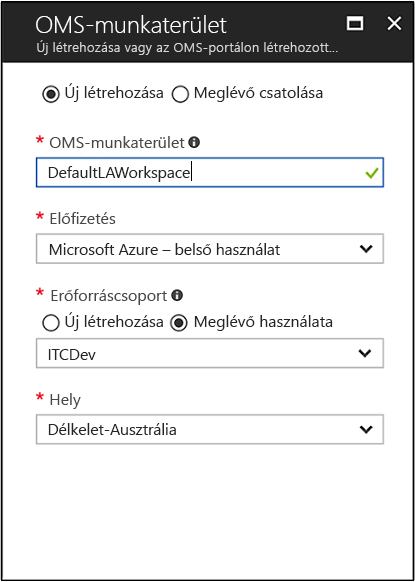
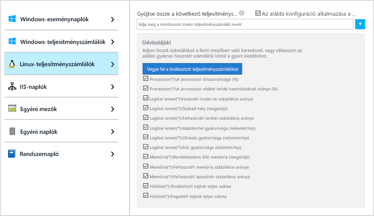
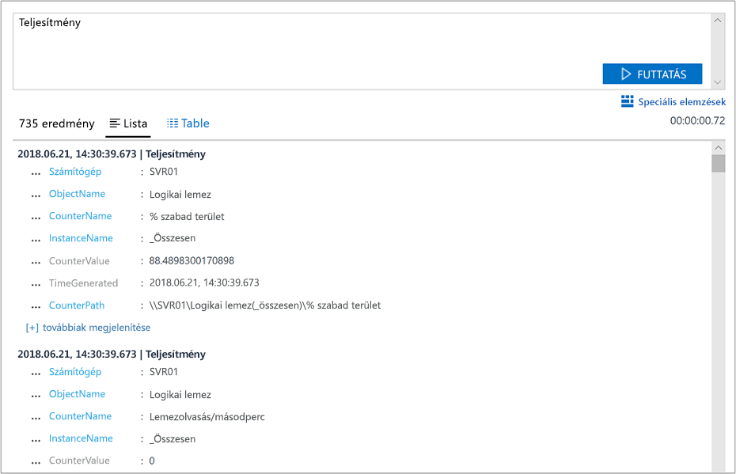

# Adatgyűjtés Azure-beli virtuális gépekről
Az [Azure Log Analytics](log-analytics-overview.md) képes rá, hogy közvetlenül gyűjtsön adatokat az Ön környezetében található Azure-beli virtuális gépekről és egyéb erőforrásokról egy adattárba, részletes elemzés és összehasonlítás céljából.  Ez a rövid útmutató azt ismerteti, hogyan konfigurálhatja néhány egyszerű lépésben az Azure-beli Linux vagy Windows rendszerű virtuális gépekről történő adatgyűjtést.  
 
A rövid útmutató feltételezi, hogy rendelkezik egy meglévő Azure-beli virtuális géppel. Ha nem, akkor virtuális gépekre vonatkozó rövid útmutatók alapján létrehozhat egy [Windows virtuális gépet](../virtual-machines/windows/quick-create-portal.md) vagy egy [Linux virtuális gépet](../virtual-machines/linux/quick-create-cli.md).

## Bejelentkezés az Azure Portalra
Jelentkezzen be az Azure Portalra a [https://portal.azure.com](https://portal.azure.com) címen. 

## Munkaterület létrehozása
1. Az Azure Portalon kattintson a **Minden szolgáltatás** lehetőségre. Az erőforrások listájába írja be a **Log Analytics** kifejezést. Ahogy elkezd gépelni, a lista a beírtak alapján szűri a lehetőségeket. Válassza a **Log Analytics** elemet.

       

2. Kattintson a **Létrehozás** parancsra, majd válassza ki a következő elemek beállításait:

  * Adja meg az új **OMS-munkaterület** nevét, például: *DefaultLAWorkspace*. 
  * A legördülő listából válassza ki azt az **előfizetést**, amelyikhez kapcsolódni szeretne, ha az alapértelmezett kiválasztás nem megfelelő.
  * Az **Erőforráscsoport** beállításnál válasszon ki egy meglévő erőforráscsoportot, amely egy vagy több Azure-beli virtuális gépet tartalmaz.  
  * Válassza ki a **Helyet** a virtuális gépek üzembehelyezési céljaként.  További információkért tekintse meg [a Log Analytics által támogatott régiókat](https://azure.microsoft.com/regions/services/).
  * Ha 2018. április 2. után létrehozott új előfizetésben hoz létre munkaterületet, az automatikusan a *GB-alapú* díjcsomagot használja, és a tarifacsomag kiválasztásának lehetősége nem érhető el.  Ha az április 2. előtt létrehozott meglévő előfizetéshez hoz létre munkaterületet, vagy pedig egy meglévő EA-regisztrációhoz kötött előfizetéshez, válassza ki a kívánt tarifacsomagot.  További információt az elérhető csomagokról [a Log Analytics részletes díjszabásában](https://azure.microsoft.com/pricing/details/log-analytics/) találhat.
  
         

3. Miután az **OMS-munkaterület** panelen megadta a szükséges adatokat, kattintson az **OK** gombra.  

Az **Értesítések** menüpontot kiválasztva nyomon követheti, hogyan ellenőrzi a rendszer az adatokat, és hogyan hozza létre a munkaterületet. 

## A Log Analytics virtuálisgép-bővítményének engedélyezése
Az Azure-ban már üzembe helyezett Windows és Linux rendszerű virtuális gépekhez a Log Analytics-ügynököt a virtuálisgép-bővítménnyel kell telepíteni.  A bővítmény használata leegyszerűsíti a telepítés folyamatát és automatikusan konfigurálja az ügynököt, hogy elküldje az adatokat a megadott Log Analytics-munkaterületre. Az ügynök automatikusan frissül, hogy mindig a legújabb funkciókkal és javításokkal bővüljön.

>[!NOTE]
>A Linuxhoz készült OMS-ügynököt nem lehet úgy konfigurálni, hogy egynél több Log Analytics-munkaterületre is jelentsen. 

1. Az Azure Portal bal felső sarkában kattintson a **Minden szolgáltatás** lehetőségre. Az erőforrások listájába írja be a **Log Analytics** kifejezést. Ahogy elkezd gépelni, a lista a beírtak alapján szűri a lehetőségeket. Válassza a **Log Analytics** elemet.
2. A Log Analytics-munkaterületek listájában válassza ki a korábban létrehozott *DefaultLAWorkspace* elemet.
3. A bal oldali menüben a Munkaterület adatforrásai lehetőségnél válassza a **Virtuális gépek** elemet.  
4. Válassza ki a **Virtuális gépek** listájából azt a gépet, amelyre telepíteni szeretné az ügynököt. Figyelje meg, hogy a virtuális gép **OMS-kapcsolat állapota** értékénél a **Nincs kapcsolat** látható.
5. A virtuális gép részletei között válassza a **Csatlakozás** lehetőséget. A rendszer automatikusan telepíti és konfigurálja az ügynököt a Log Analytics-munkaterületen. Ez a folyamat eltarthat néhány percig, ez idő alatt az **Állapot** **Kapcsolódás** lesz.
6. Az ügynök telepítése után az **OMS-kapcsolat állapota** frissül, és **Ez a munkaterület** lesz.

## Esemény- és teljesítményadatok gyűjtése
A Log Analytics képes események gyűjtésére a Windows eseménynaplókból vagy Linux rendszernaplóból, illetve a hosszabb távú elemzésekhez és jelentéskészítéshez megadott teljesítményszámlálókból, és valamilyen művelettel reagálni arra, ha észleli egy adott feltétel meglétét.  A következő lépésekkel konfigurálhatja az események gyűjtését a Windows vagy Linux rendszernaplókból, illetve (kezdetnek) egyes gyakran használt teljesítményszámlálókból.  

### Adatgyűjtés Windows rendszerű virtuális gépekről
1. Válassza ki a **Speciális beállítások** elemet.

    

3. Válassza az **Adatok**, majd a **Windows Eseménynaplók** lehetőséget.  
4. Eseménynaplókat a nevük begépelésével adhat hozzá.  Írja be a **Rendszer** szót, majd kattintson a plusz jelre **+**.  
5. A táblázatban jelölje be a **Hiba** és **Figyelmeztetés** súlyossági szintet.   
6. A konfiguráció mentéséhez kattintson az oldal tetején található **Mentés** parancsra.
7. Válassza a **Windowsos teljesítményadatok** lehetőséget a teljesítményszámláló-adatok egy windowsos gépen történő gyűjtésének engedélyezéséhez. 
8. Amikor először konfigurálja egy új Log Analytics-munkaterület Windows-teljesítményszámlálóit, akkor gyorsan létrehozhat több gyakran használt számlálót. Ezek mindegyike mellett egy jelölőnégyzet található.

    .

    Kattintson **A kijelölt teljesítményszámlálók felvétele** elemre.  A rendszer hozzáadja a kiválasztott számlálókat, és mindegyikhez beállít egy tíz másodperces mintagyűjtési időszakot.
  
9. A konfiguráció mentéséhez kattintson az oldal tetején található **Mentés** parancsra.

### Adatgyűjtés Linux rendszerű virtuális gépekről

1. Válassza a **Syslog** elemet.  
2. Eseménynaplókat a nevük begépelésével adhat hozzá.  Írja be a **Syslog** kifejezést, majd kattintson a pluszjelre **+**.  
3. A táblában törölje a **Tájékoztatás**, az **Értesítés** és a **Hibakeresés** súlyossági szint jelölését. 
4. A konfiguráció mentéséhez kattintson az oldal tetején található **Mentés** parancsra.
5. Válassza a **Linuxos teljesítményadatok** elemet a teljesítményszámláló-adatok gyűjtésének Linux rendszerű gépen történő engedélyezéséhez. 
6. Amikor először konfigurálja egy új Log Analytics-munkaterület Linux-teljesítményszámlálóit, akkor több gyakran használt számlálót is gyorsan létrehozhat. Ezek mindegyike mellett egy jelölőnégyzet található.

    .

    Kattintson **A kijelölt teljesítményszámlálók felvétele** elemre.  A rendszer hozzáadja a kiválasztott számlálókat, és mindegyikhez beállít egy tíz másodperces mintagyűjtési időszakot.  

7. A konfiguráció mentéséhez kattintson az oldal tetején található **Mentés** parancsra.

## Összegyűjtött adatok megtekintése
Most, hogy engedélyezte az adatgyűjtést, futtasson le egy egyszerű naplóbeli keresést, hogy megtekinthessen néhány, a cél virtuális gépekről származó adatot.  

1. Az Azure Portalon lépjen a Log Analytics felületre, és válassza ki a korábban létrehozott munkaterületet.
2. Válassza a **Naplóbeli keresés** csempét, és a Naplóbeli keresés panel lekérdezési mezőjében adja meg a `Perf` típust, majd nyomja le az Enter billentyűt, vagy kattintson a lekérdezési mezőtől jobbra található Keresés gombra.

     

A következő képen látható lekérdezés 735 teljesítményrekordot adott vissza.  Ön ennél sokkal kevesebb találatot fog kapni. 

## Az erőforrások eltávolítása
Ha már nincs rá szükség, törölje a Log Analytics-munkaterületet. Ehhez válassza ki a korábban létrehozott Log Analytics-munkaterületet, és az erőforrás oldalán kattintson a **Törlés** gombra.

## További lépések
Most, hogy már gyűjti a működési és teljesítményadatokat a Windows vagy Linux rendszerű virtuális gépeiről, könnyen nekiláthat az *ingyenesen* gyűjtött adatok felfedezésének és elemzésének, és reagálhat a kapott eredményekre.  

Az adatok megtekintésének és elemzésének ismertetéséhez lépjen tovább az útmutatóhoz.   

> [!div class="nextstepaction"]
> [Adatok megtekintése és elemzése a Log Analyticsben](log-analytics-tutorial-viewdata.md)
