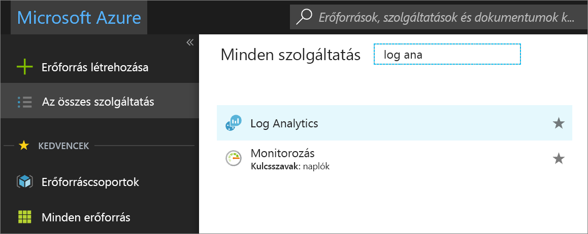

# A Naplóelemzési munkaterület létrehozása az Azure-portálon
Az Azure-portálon állíthatja be a Naplóelemzési munkaterület, amely olyan saját adattárház, az adatforrások és a megoldások egyedi Naplóelemzési környezet.  Ebben a cikkben ismertetett lépések szükségesek, ha azt tervezi, a következő forrásokból származó adatok gyűjtése a:

* Az előfizetés az Azure-erőforrások
* A helyszíni System Center Operations Manager által felügyelt számítógépek
* A System Center Configuration Manager eszközgyűjtemények 
* Diagnosztikai vagy naplóadatok az Azure Storage-ból

Egyéb források, például az Azure virtuális gépek és a Windows vagy Linux rendszerű számítógépek a környezetben az alábbi témakörökben található:

*  [Azure virtuális gépek kapcsolatos adatok gyűjtése](log-analytics-quick-collect-azurevm.md) 
*  [Linux rendszerű számítógépekkel kapcsolatos adatok gyűjtése](log-analytics-quick-collect-linux-computer.md)
*  [Windows-számítógépekkel kapcsolatos adatok gyűjtése](log-analytics-quick-collect-windows-computer.md)

Ha nem rendelkezik Azure-előfizetéssel, mindössze néhány perc alatt létrehozhat egy [ingyenes fiókot](https://azure.microsoft.com/free/?WT.mc_id=A261C142F) a virtuális gép létrehozásának megkezdése előtt.

## Bejelentkezés az Azure Portalra
Jelentkezzen be az Azure Portalra a [https://portal.azure.com](https://portal.azure.com) címen. 

## Munkaterület létrehozása
1. Az Azure Portalon kattintson a **Minden szolgáltatás** lehetőségre. Az erőforrások listájába írja be a **Log Analytics** kifejezést. Ahogy elkezd gépelni, a lista a beírtak alapján szűri a lehetőségeket. Válassza a **Log Analytics** elemet.       
2. Kattintson a **Létrehozás** parancsra, majd válassza ki a következő elemek beállításait:

  * Adja meg az új **OMS-munkaterület** nevét, például: *DefaultLAWorkspace*. 
  * A legördülő listából válassza ki azt az **előfizetést**, amelyikhez kapcsolódni szeretne, ha az alapértelmezett kiválasztás nem megfelelő.
  * A **erőforráscsoport**, meglévő erőforrás használandó kiválasztott csoport már telepítő, vagy hozzon létre egy újat.  
  * Válasszon ki egy használható **hely**.  További információkért tekintse meg [a Log Analytics által támogatott régiókat](https://azure.microsoft.com/regions/services/).
  * Ha 2018. április 2. után létrehozott új előfizetésben hoz létre munkaterületet, az automatikusan a *GB-alapú* díjcsomagot használja, és a tarifacsomag kiválasztásának lehetősége nem érhető el.  Ha az április 2. előtt létrehozott meglévő előfizetéshez hoz létre munkaterületet, vagy pedig egy meglévő EA-regisztrációhoz kötött előfizetéshez, válassza ki a kívánt tarifacsomagot.  További információt az elérhető csomagokról [a Log Analytics részletes díjszabásában](https://azure.microsoft.com/pricing/details/log-analytics/) találhat.

           

3. Miután az **OMS-munkaterület** panelen megadta a szükséges adatokat, kattintson az **OK** gombra.  

Az **Értesítések** menüpontot kiválasztva nyomon követheti, hogyan ellenőrzi a rendszer az adatokat, és hogyan hozza létre a munkaterületet. 

## További lépések
Most, hogy a munkaterület érhető el, konfigurálja a figyelési telemetriai adatok gyűjteménye, napló indítunk el az adatok elemzéséhez, és adja hozzá a további adatok és elemzési insights-kezelési megoldás. 

* Adatok gyűjtése az Azure Diagnostics vagy az Azure storage Azure-erőforrások engedélyezéséről [gyűjtése Azure szolgáltatás naplók és a metrikák Naplóelemzési használható](log-analytics-azure-storage.md).  
* [Vegye fel a System Center Operations Manager adatforrásként](log-analytics-om-agents.md) adatokat gyűjteni az Operations Manager felügyeleti csoportjának ügynök és a Naplóelemzési munkaterület tárház tárolja. 
* Csatlakozás [Configuration Manager](log-analytics-sccm.md) számítógépek, amelyek tagjai a hierarchiában lévő gyűjtemények importálása.  
* Tekintse át a [megoldások](/log-analytics-add-solutions.md) érhető el, és hogyan lehet hozzáadni vagy eltávolítani egy megoldást a munkaterületről.

