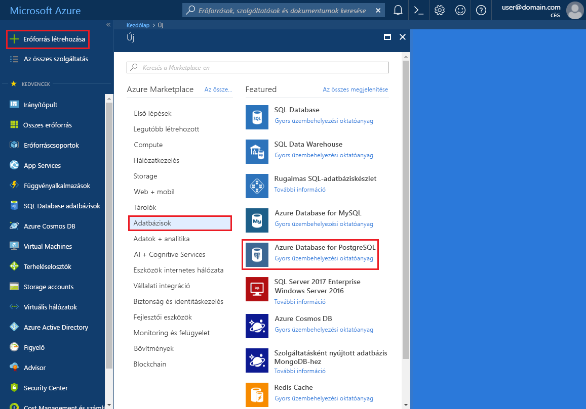
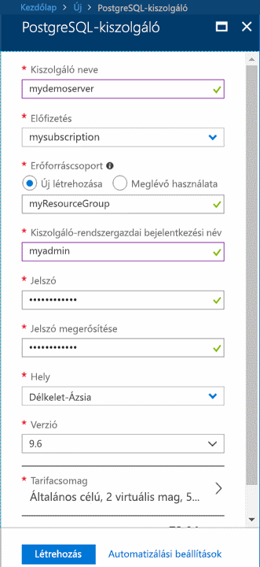
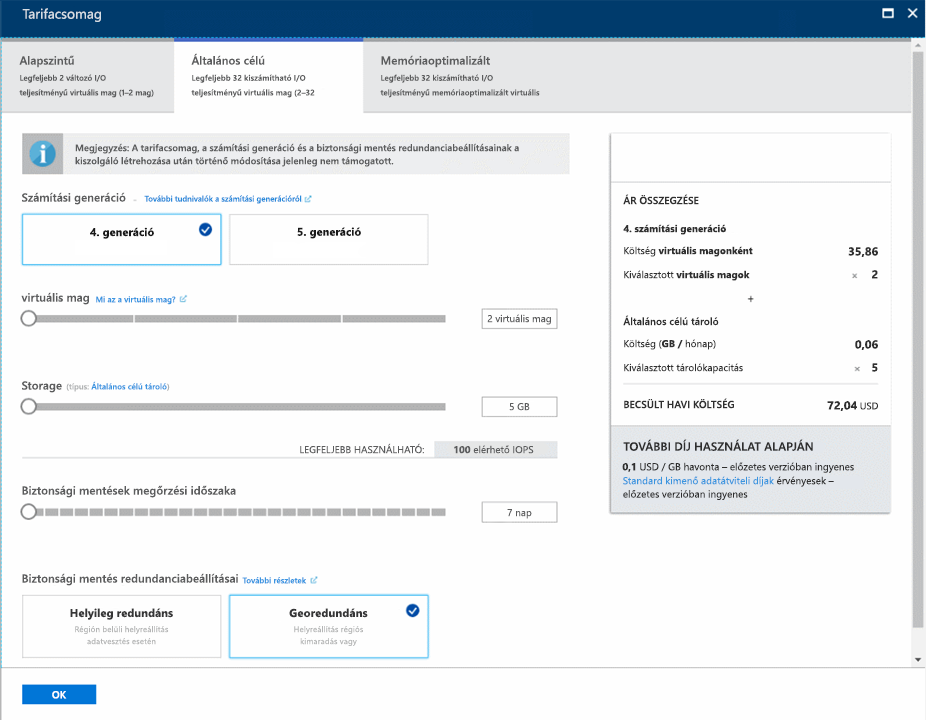
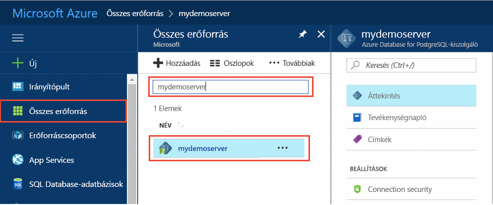
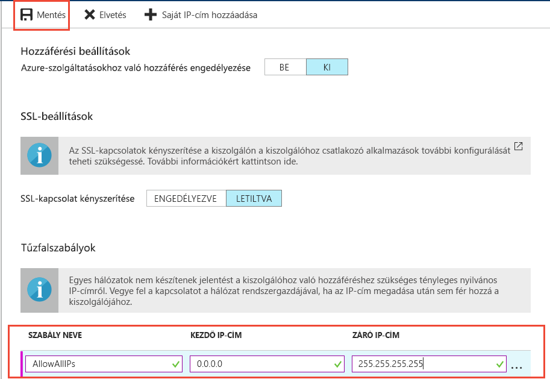

# <a name="quickstart-create-an-azure-database-for-postgresql-server-in-the-azure-portal"></a>Rövid útmutató: Azure Database for PostgreSQL-kiszolgáló létrehozása az Azure Portalon

Az Azure Database for PostgreSQL egy felügyelt szolgáltatás, amely lehetővé teszi magas rendelkezésre állású PostgreSQL-adatbázisok futtatását, felügyeletét és skálázását a felhőben. Ez a rövid útmutató bemutatja, hogyan hozhat létre nagyjából öt perc alatt egy Azure Database for PostgreSQL-kiszolgálót az Azure Portalon.

Ha nem rendelkezik Azure-előfizetéssel, mindössze néhány perc alatt létrehozhat egy [ingyenes Azure-fiókot](https://azure.microsoft.com/free/) a virtuális gép létrehozásának megkezdése előtt.

## <a name="sign-in-to-the-azure-portal"></a>Jelentkezzen be az Azure Portalra
Nyissa meg a webböngészőjét, és lépjen a [portálra](https://portal.azure.com/). Adja meg a hitelesítő adatait a Portalra való bejelentkezéshez. Az alapértelmezett nézet a szolgáltatási irányítópult.

## <a name="create-an-azure-database-for-postgresql-server"></a>Azure-adatbázis létrehozása PostgreSQL-kiszolgálóhoz

Az Azure Database for PostgreSQL-kiszolgáló a [számítási és tárolási erőforrások](./concepts-pricing-tiers.md) konfigurált készletével együtt jön létre. A kiszolgáló egy [Azure-erőforráscsoporton](../azure-resource-manager/resource-group-overview.md) belül jön létre.

Azure Database for PostgreSQL-kiszolgáló létrehozásához kövesse az alábbi lépéseket:
1. A portál bal felső sarkában válassza az **Erőforrás létrehozása** (+) gombot.

2. Válassza az **Adatbázisok** > **Azure Database for PostgreSQL** lehetőséget.

    

3. Adja meg az alábbi adatokat az új kiszolgálóűrlapon:

    

    Beállítás|Ajánlott érték|Leírás
    ---|---|---
    Kiszolgálónév |*mydemoserver*|Egy egyedi név, amely az Azure Database for PostgreSQL-kiszolgálót azonosítja. A rendszer hozzáfűzi a *postgres.database.azure.com* tartománynevet a megadott kiszolgálónévhez. A kiszolgáló neve csak kisbetűket, számokat és a kötőjel (-) karaktert tartalmazhatja. Legalább 3, és legfeljebb 63 karakterből állhat.
    Előfizetés|Az Ön előfizetésének neve|A kiszolgálóhoz használni kívánt Azure-előfizetés. Ha több előfizetéssel rendelkezik, válassza ki azt az előfizetést, amely részeként fizet az erőforrásért.
    Erőforráscsoport|*myresourcegroup*| Egy új erőforráscsoport neve vagy egy meglévő az előfizetéséből.
    Forrás kiválasztása | *Üres* | Válassza az *Üres* lehetőséget egy teljesen új kiszolgáló létrehozásához. (Ha egy meglévő Azure Database for PostgreSQL-kiszolgáló georedundáns biztonsági mentéséből hoz létre kiszolgálót, válassza a *Biztonsági mentés* lehetőséget).
    Kiszolgáló-rendszergazdai bejelentkezés |*myadmin*| A kiszolgálóhoz való csatlakozáshoz használt bejelentkezési fiókja. A rendszergazdai bejelentkezési név nem lehet **azure_superuser**, **azure_pg_admin**, **admin**, **administrator**, **root**, **guest** és **public**. Nem kezdődhet a következővel: **pg_**.
    Jelszó |Az Ön jelszava| Egy új jelszó a kiszolgálói rendszergazdai fiók számára. A jelszó 8–128 karakterből állhat. A jelszónak tartalmaznia kell karaktereket a következő kategóriák közül legalább háromból: angol nagybetűs karakterek, angol kisbetűs karakterek, számjegyek (0–9) és nem alfanumerikus karakterek (!, $, #, % stb.).
    Hely|A felhasználókhoz legközelebb eső régió| A felhasználókhoz legközelebb eső hely.
    Verzió|A legújabb verzió| A legújabb PostgreSQL-verzió, hacsak nincsenek más konkrét követelmények.
    Tarifacsomag | **Általános célú**, **4. generációs**, **2 virtuális mag**, **5 GB**, **7 nap**, **Georedundáns** | Az új kiszolgáló számítási, tárolási és biztonsági mentési konfigurációi. Válassza a **Tarifacsomag** lehetőséget, majd az **Általános célú** lapot. A **Számítási generáció**, **Virtuális mag**, **Tárolás** és **Biztonsági mentések megőrzési időszaka** beállítások alapértelmezett értékei a következők: *4. generációs*, *2 virtuális mag*, *5 GB* és *7 nap*. A csúszkákat nem szükséges módosítania. A kiszolgáló georedundáns tárhelyre való biztonsági mentésének engedélyezéséhez válassza a **Biztonsági másolat redundanciabeállításai** területen a **Georedundáns** lehetőséget. A tarifacsomag beállításának mentéséhez válassza az **OK** gombot. A következő képernyőkép ezeket a beállításokat tartalmazza.

    > [!IMPORTANT]
    > A kiszolgáló itt megadott rendszergazdai bejelentkezési nevét és jelszavát kell majd használnia a rövid útmutató későbbi szakaszaiban a kiszolgálóra és az adatbázisaira való bejelentkezéshez. Jegyezze meg vagy jegyezze fel ezt az információt későbbi használatra.

    

4. A kiszolgáló üzembe helyezéséhez válassza a **Létrehozás** lehetőséget. A művelet eltarthat néhány percig.

5. Az eszköztáron válassza az **Értesítések** ikont (csengő) az üzembehelyezési folyamat megfigyeléséhez. Az üzembe helyezés után kiválaszthatja a **Rögzítés az irányítópulton** lehetőséget, amellyel létrehoz egy csempét a kiszolgálóhoz az Azure Portal irányítópultján. A csempe a kiszolgáló **Áttekintés** oldalának közvetlen megnyitására szolgál. Az **Erőforrás megnyitása** lehetőség kiválasztásával megnyitja a kiszolgáló **Áttekintés** oldalát.

    
   
   Alapértelmezés szerint a **postgres** adatbázis a kiszolgáló alatt jön létre. A [postgres](https://www.postgresql.org/docs/9.6/static/app-initdb.html) adatbázis egy alapértelmezett adatbázis, amelyet a felhasználók, segédprogramok és külső féltől származó alkalmazások általi használatra szántak. (A másik alapértelmezett adatbázis az **azure_maintenance**. Az a feladata, hogy elkülönítse a felügyelt szolgáltatások folyamatait a felhasználói műveletektől. Ehhez az adatbázishoz nem lehet hozzáférni.)

## <a name="configure-a-server-level-firewall-rule"></a>Kiszolgálószintű tűzfalszabály konfigurálása

Az Azure Database for PostgreSQL kiszolgálószinten hoz létre egy tűzfalat. Ez megakadályozza, hogy külső alkalmazások és eszközök csatlakozzanak a kiszolgálóhoz vagy a kiszolgálón lévő adatbázisokhoz, kivéve, ha olyan szabályt hoz létre, amely adott IP-címek számára megnyitja a tűzfalat. 

1. Az üzembe helyezés végeztével keresse meg a kiszolgálót. Ha szükséges, használja a keresési funkciót. Például a bal oldali menüben válassza a **Minden erőforrás** elemet. Ezután írja be a kiszolgáló nevét (például: **mydemoserver**) az újonnan létrehozott kiszolgáló megkereséséhez. Válassza ki a keresési eredmények listájában a kiszolgálónevet. Megnyílik a kiszolgáló **Áttekintés** oldala, amely további konfigurációs lehetőségeket biztosít.
 
    

2. A kiszolgáló lapján válassza a **Kapcsolatbiztonság** elemet.

3. A **Tűzfalszabályok** szakasz **Szabály neve** oszlopában válassza az üres mezőt egy új tűzfalszabály létrehozásának megkezdéséhez. 

    Ebben a rövid útmutatóban engedélyezünk minden bemenő IP-címet a kiszolgálón. Adjuk meg az egyes oszlopok szövegmezőiben a következő értékeket:

    Szabály neve | Kezdő IP-cím | Záró IP-cím 
    ---|---|---
    AllowAllIps | 0.0.0.0 | 255.255.255.255

     
     
      > [!NOTE]
      > Éles példányok esetében úgy állítsa be a tűzfalszabályokat, hogy bejövő kérelmeket csak ismert IP-címektől fogadjanak.  Az itt megadott beállítások csupán példák.
      >

4. A **Kapcsolatbiztonság** lap felső eszköztárában kattintson a **Mentés** gombra. A folytatás előtt várjon, amíg meg nem jelenik a kapcsolatbiztonsági frissítés sikeres befejezését jelző értesítés.

    > [!NOTE]
    > A PostgreSQL-kiszolgálóhoz készült Azure-adatbázis kapcsolatai az 5432-es porton keresztül kommunikálnak. Ha vállalati hálózaton belülről próbál csatlakozni, lehetséges, hogy a hálózati tűzfal nem engedélyezi a kimenő forgalmat az 5432-es porton keresztül. Ebben az esetben addig nem tud csatlakozni a kiszolgálóhoz, amíg az informatikai részleg meg nem nyitja az 5432-es portot.
    >

## <a name="get-the-connection-information"></a>Kapcsolatadatok lekérése

Az Azure Database for PostgreSQL-kiszolgáló létrehozásakor egy **postgres** nevű alapértelmezett adatbázis jön létre. Az adatbázis-kiszolgálóhoz való csatlakozáshoz a teljes kiszolgálónévre és a rendszergazdai bejelentkezési hitelesítő adatokra van szüksége. Ezeket a rövid útmutatóban korábban már feljegyezhette. Ha nem jegyezte fel, a kiszolgáló nevét és bejelentkezési adatait megtalálja a kiszolgáló **Áttekintés** lapján a portálon.

Nyissa meg kiszolgáló **Áttekintés** lapját. Jegyezze fel a **kiszolgálónevet** és a **kiszolgáló-rendszergazdai bejelentkezési nevet**. Vigye az egérmutatót az egyes mezők fölé. Ekkor a szövegtől jobbra megjelenik a másolási szimbólum. Az értékek másolásához kattintson a másolási szimbólumra.

 

## <a name="connect-to-the-postgresql-database-by-using-psql-in-cloud-shell"></a>Csatlakozás a PostgreSQL-adatbázishoz a psql használatával a Cloud Shellben

Számos különféle alkalmazással csatlakozhat a PostgreSQL-kiszolgálóhoz készült Azure-adatbázishoz. Először használjuk a psql parancssori segédprogramot a kiszolgálóhoz való csatlakozás bemutatásához. Az itt leírtak szerint használhatja a webböngészőt és az Azure Cloud Shellt, és nem szükséges további szoftvert telepítenie. Ha a gépén helyileg telepítve van a psql segédprogram, onnan is csatlakozhat.

1. A felső navigációs panelen válassza a terminál szimbólumot a Cloud Shell megnyitásához.

   

2. A Cloud Shell megnyílik a böngészőben, és lehetővé teszi Bash felületi parancsok beírását.

   

3. A Cloud Shell promptnál csatlakozzon az Azure Database for PostgreSQL-kiszolgálón lévő adatbázishoz a psql parancssor beírásával.

    A következő formátum használatával csatlakozhat Azure Database for PostgreSQL-kiszolgálóhoz a [psql](https://www.postgresql.org/docs/9.6/static/app-psql.html) segédprogrammal:
    ```bash
    psql --host=<yourserver> --port=<port> --username=<server admin login> --dbname=<database name>
    ```

    Például a következő parancs egy példakiszolgálóhoz csatlakozik:

    ```bash
    psql --host=mydemoserver.postgres.database.azure.com --port=5432 --username=myadmin@mydemoserver --dbname=postgres
    ```

    psql paraméter |Érték|Leírás
    ---|---|---
    --host | Kiszolgálónév | Az a kiszolgálónév, amelyet korábban az Azure Database for PostgreSQL-kiszolgáló létrehozásakor használt. Az itt látható példakiszolgáló a **mydemoserver.postgres.database.azure.com.** Használja a teljes tartománynevet (**\*.postgres.database.azure.com**), ahogyan az a példában látható. Ha nem emlékszik a kiszolgáló nevére, a kapcsolati adatok lekéréséhez kövesse az előző szakasz lépéseit. 
    --port | 5432 | Az Azure Database for PostgreSQL-kiszolgálóhoz való csatlakozáskor használt port. 
    --username | Kiszolgáló-rendszergazdai bejelentkezési név |A kiszolgáló-rendszergazdai bejelentkezési felhasználónév, amelyet korábban az Azure Database for PostgreSQL-kiszolgáló létrehozásakor adott meg. Ha nem emlékszik a felhasználónévre, a kapcsolati adatok lekéréséhez kövesse az előző szakasz lépéseit. A formátum *username@servername*.
    --dbname | *postgres* | A rendszer által az első csatlakozáshoz létrehozott, alapértelmezett adatbázisnév. Később létrehozhatja a saját adatbázisát.

    Miután a saját paraméterértékeivel futtatta a psql parancsot, a rendszer felkéri, hogy adja meg a kiszolgáló-rendszergazdai jelszót. Ez ugyanaz az a jelszó, amelyet a kiszolgáló létrehozásakor adott meg. 

    psql paraméter |Ajánlott érték|Leírás
    ---|---|---
    jelszó | Az Ön rendszergazdai jelszava | A beírt jelszókarakterek nem jelennek meg a Bash promptban. Miután beírta az összes karaktert, nyomja le az Enter billentyűt a hitelesítéshez és a csatlakozáshoz.

    A csatlakozás után a psql segédprogram egy postgres promptot jelenít meg, ahová az SQL-parancsokat beírhatja. A rendszer a kezdeti kapcsolati kimenetben egy figyelmeztetést jeleníthet meg, mivel a Cloud Shell psql-jének verziója eltérhet az Azure Database for PostgreSQL-kiszolgáló verziójától. 
    
    Példa psql kimenetre:
    ```bash
    psql (9.5.7, server 9.6.2)
    WARNING: psql major version 9.5, server major version 9.6.
        Some psql features might not work.
    SSL connection (protocol: TLSv1.2, cipher: ECDHE-RSA-AES256-SHA384, bits: 256, compression: off)
    Type "help" for help.
   
    postgres=> 
    ```

    > [!TIP]
    > Ha a tűzfal nincs konfigurálva a Cloud Shell IP-címének engedélyezésére, a következő hiba jelenik meg:
    > 
    > "psql: FATAL:  no pg_hba.conf entry for host "0.0.0.0", user "myadmin", database "postgres", SSL on FATAL: SSL connection is required. Adja meg az SSL-beállításokat, és próbálkozzon újra.
    > 
    > A hiba elhárításához győződjön meg róla, hogy a kiszolgáló konfigurációja megegyezik a cikk „Kiszolgálószintű tűzfalszabály konfigurálása” részében található lépésekkel.

4. Hozzon létre egy mypgsqldb nevű üres adatbázist. Ehhez írja be a következő parancsot a parancssorba:
    ```bash
    CREATE DATABASE mypgsqldb;
    ```
    A parancs teljesítése néhány percet vehet igénybe. 

5. Amikor a rendszer kéri, hajtsa végre a következő parancsot, hogy az újonnan létrehozott **mypgsqldb** adatbázishoz kapcsolódhasson:
    ```bash
    \c mypgsqldb
    ```

6. A psql-ből való kilépéshez írja be a `\q` parancsot, majd nyomja le az Enter billentyűt. Miután végzett, bezárhatja a Cloud Shellt.

Ezzel csatlakozott az Azure Database for PostgreSQL-kiszolgálóhoz a Cloud Shell psql-jén keresztül, és létrehozott egy üres felhasználói adatbázist. Folytassa a következő szakasszal, amelyből megtudhatja, hogyan csatlakozhat egy másik ismert eszköz, a pgAdmin segítségével.

## <a name="connect-to-the-postgresql-server-using-pgadmin"></a>Csatlakozás a PostgreSQL-kiszolgálóhoz a pgAdmin segítségével

A pgAdmin egy nyílt forráskódú eszköz, amely a PostgreSQL-lel együtt használható. A pgAdmin alkalmazást a [pgAdmin webhelyről](http://www.pgadmin.org/) telepítheti. Elképzelhető, hogy az Ön által használt pgAdmin-verzió eltér a jelen gyors útmutatóban használttól. Ha további információra van szüksége, tekintse meg a pgAdmin dokumentációját.

1. Nyissa meg a pgAdmin alkalmazást az ügyfélszámítógépen.

2. Az eszköztáron kattintson az **Objektum** elemre, vigye az egérmutatót a **Létrehozás** fölé, majd válassza a **Kiszolgáló** lehetőséget.

3. A **Létrehozás – Kiszolgáló** párbeszédpanel **Általános** lapján adjon meg egy egyedi rövid nevet a kiszolgáló számára, például **mydemoserver**.

    

4. A **Létrehozás – Kiszolgáló** párbeszédpanel **Kapcsolat** lapján töltse ki a beállítások tábláját.

   

    pgAdmin-paraméter |Érték|Leírás
    ---|---|---
    Gazdagépnév/-cím | Kiszolgálónév | Az a kiszolgálónév, amelyet korábban az Azure Database for PostgreSQL-kiszolgáló létrehozásakor használt. A példakiszolgáló a **mydemoserver.postgres.database.azure.com.** Használja a teljes tartománynevet (**\*.postgres.database.azure.com**), ahogyan az a példában látható. Ha nem emlékszik a kiszolgáló nevére, a kapcsolati adatok lekéréséhez kövesse az előző szakasz lépéseit. 
    Port | 5432 | Az Azure Database for PostgreSQL-kiszolgálóhoz való csatlakozáskor használt port. 
    Karbantartási adatbázis | *postgres* | A rendszer által létrehozott alapértelmezett adatbázisnév.
    Felhasználónév | Kiszolgáló-rendszergazdai bejelentkezési név | A kiszolgáló-rendszergazdai bejelentkezési felhasználónév, amelyet korábban az Azure Database for PostgreSQL-kiszolgáló létrehozásakor adott meg. Ha nem emlékszik a felhasználónévre, a kapcsolati adatok lekéréséhez kövesse az előző szakasz lépéseit. A formátum *username@servername*.
    Jelszó | Az Ön rendszergazdai jelszava | A rövid útmutatóban a korábbiakban a kiszolgáló létrehozásakor választott jelszó.
    Szerepkör | Hagyja üresen | Itt nem kell megadni szerepkörnevet. Hagyja üresen ezt a mezőt.
    SSL-mód | *Kötelező* | Az SSL-módot a pgAdmin SSL lapján állíthatja be. Az SSL-kényszerítés alapértelmezés szerint minden újonnan létrehozott Azure Database for PostgreSQL-kiszolgálón be van kapcsolva. Az SSL-kényszerítés kikapcsolása: [SSL-kényszerítés](./concepts-ssl-connection-security.md).
    
5. Kattintson a **Mentés** gombra.

6. A bal oldali **Böngésző** panelen bontsa ki a **Kiszolgálók** csomópontot. Válassza ki például a **mydemoserver** kiszolgálót. Kattintson rá a csatlakozáshoz.

7. Bontsa ki a kiszolgáló-csomópontot, majd bontsa ki az abban található **Adatbázisok** csomópontot is. A listában szerepelnie kell a meglévő *postgres* adatbázisnak, valamint minden más létrehozott adatbázisnak. Az Azure Database for PostgreSQL segítségével kiszolgálónként több adatbázist is létrehozhat.

8. Kattintson a jobb gombbal az **Adatbázisok** elemre, majd válassza a **Létrehozás** menü **Adatbázis** elemét.

9. Írjon be egy tetszőleges adatbázisnevet az **Adatbázis** mezőbe (például **mypgsqldb2**).

10. A listából válassza ki az adatbázis **tulajdonosát**. Válassza ki a kiszolgáló-rendszergazdai bejelentkezési nevet (a példánkban ez a **my admin**).

   

11. Egy új, üres adatbázis létrehozásához válassza a **Mentés** lehetőséget.

12. A **Böngésző** panelen megtekintheti az Ön által létrehozott adatbázist az adatbázisok listájában a kiszolgáló nevét viselő területen.


## <a name="clean-up-resources"></a>Az erőforrások eltávolítása
Kétféleképpen távolíthatja el a rövid útmutatóban létrehozott erőforrásokat. Törölheti az [Azure-erőforráscsoportot](../azure-resource-manager/resource-group-overview.md), amely tartalmazza az erőforráscsoportban lévő összes erőforrást. Ha a többi erőforrást érintetlenül szeretné hagyni, csak a kiszolgálói erőforrást törölje.

> [!TIP]
> Az ebben a gyűjteményben található többi rövid útmutató erre a rövid útmutatóra épül. Ha azt tervezi, hogy folytatja ezen rövid útmutatók használatát, akkor ne törölje az ebben a rövid útmutatóban létrehozott erőforrásokat. Ha nem folytatja a munkát, akkor a következő lépésekkel törölheti a rövid útmutató segítségével létrehozott erőforrásokat a portálon.

Ha az újonnan létrehozott kiszolgálót is magában foglaló teljes erőforráscsoportot törölni szeretné:
1. Keresse meg az erőforráscsoportot a portálon. A bal oldali menüben válassza az **Erőforráscsoportok** lehetőséget. Válassza ki az erőforráscsoport nevét (ebben a példában **myresourcegroup**).

2. Az erőforráscsoport oldalán kattintson a **Törlés** parancsra. Írja be a törölni kívánt erőforrás nevét (ebben a példában **myresourcegroup**) a szövegmezőbe a törlés megerősítéséhez. Válassza a **Törlés** elemet.

Csak az újonnan létrehozott kiszolgáló törlése:
1. Keresse meg a kiszolgálót a portálon, ha nincs megnyitva. A bal oldali menüben válassza a **Minden erőforrás** elemet. Ezután keressen rá az Ön által létrehozott kiszolgálóra.

2. Az **Áttekintés** oldalon válassza a **Törlés** elemet.

    

3. Erősítse meg a törölni kívánt kiszolgáló nevét, és tekintse meg az érintett adatbázisokat. Írja be a kiszolgáló nevét (ebben a példában **mydemoserver**) a szövegmezőbe. Válassza a **Törlés** elemet.

## <a name="next-steps"></a>További lépések
> [!div class="nextstepaction"]
> [Adatbázis migrálása exportálással és importálással](./howto-migrate-using-export-and-import.md)
