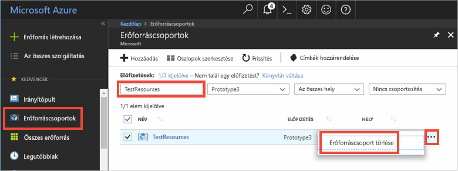

# <a name="quickstart-how-to-use-azure-redis-cache-with-java"></a>Rövid útmutató: Az Azure Redis Cache használata Javával


Az Azure Redis Cache hozzáférést biztosít egy dedikált Redis Cache gyorsítótárhoz, amelyet a Microsoft felügyel. A gyorsítótár a Microsoft Azure összes alkalmazásából elérhető.

Ez a cikk segítséget nyújt az első lépések megtételében az Azure Redis Cache Java [Jedis](https://github.com/xetorthio/jedis) Redis Cache-ügyfelével való használatakor.


A rövid útmutató lépései bármilyen szövegszerkesztővel elvégezhetők. A [Visual Studio Code](https://code.visualstudio.com/) például jó választás lehet, és Windows, macOS és Linux platformokon is használható.

[!INCLUDE [quickstarts-free-trial-note](../../includes/quickstarts-free-trial-note.md)]


## <a name="prerequisites"></a>Előfeltételek

[Apache Maven](http://maven.apache.org/)


## <a name="create-an-azure-redis-cache"></a>Azure Redis Cache létrehozása

[!INCLUDE [redis-cache-create](../../includes/redis-cache-create.md)]

[!INCLUDE [redis-cache-access-keys](../../includes/redis-cache-access-keys.md)]

Adjon hozzá környezeti változókat a **GAZDAGÉP NEVE** és **Elsődleges** hozzáférési kulcs megadásához. A kód ezen változóit fogja használni ahelyett, hogy közvetlenül a kódban tárolná a bizalmas információkat.

```
set REDISCACHEHOSTNAME=contosoCache.redis.cache.windows.net
set REDISCACHEKEY=XXXXXXXXXXXXXXXXXXXXXXXXXXXXXXXXXXXXXXXXXXXX
```

## <a name="create-a-new-java-app"></a>Új Java-alkalmazás létrehozása

A Maven használatával hozzon létre egy új gyorsindító alkalmazást:

```
mvn archetype:generate -DarchetypeGroupId=org.apache.maven.archetypes -DarchetypeArtifactId=maven-archetype-quickstart -DarchetypeVersion=1.3 -DgroupId=example.demo -DartifactId=redistest -Dversion=1.0
```

Váltson át az új *redistest* projektkönyvtárra.

Nyissa meg a *pom.xml* fájlt, és adjon hozzá egy függőséget a [Jedis](https://github.com/xetorthio/jedis) paraméterhez:

```xml
    <dependency>
        <groupId>redis.clients</groupId>
        <artifactId>jedis</artifactId>
        <version>2.9.0</version>
        <type>jar</type>
        <scope>compile</scope>
    </dependency>
```

Mentse a *pom.xml* fájlt.

Nyissa meg az *App.java* fájlt, és cserélje le a kódot a következőre:

```java
package example.demo;

import redis.clients.jedis.Jedis;
import redis.clients.jedis.JedisShardInfo;

/**
 * Redis test
 *
 */
public class App 
{
    public static void main( String[] args )
    {

        boolean useSsl = true;
        String cacheHostname = System.getenv("REDISCACHEHOSTNAME");
        String cachekey = System.getenv("REDISCACHEKEY");

        // Connect to the Redis cache over the SSL port using the key.
        JedisShardInfo shardInfo = new JedisShardInfo(cacheHostname, 6380, useSsl);
        shardInfo.setPassword(cachekey); /* Use your access key. */
        Jedis jedis = new Jedis(shardInfo);      

        // Perform cache operations using the cache connection object...

        // Simple PING command        
        System.out.println( "\nCache Command  : Ping" );
        System.out.println( "Cache Response : " + jedis.ping());

        // Simple get and put of integral data types into the cache
        System.out.println( "\nCache Command  : GET Message" );
        System.out.println( "Cache Response : " + jedis.get("Message"));

        System.out.println( "\nCache Command  : SET Message" );
        System.out.println( "Cache Response : " + jedis.set("Message", "Hello! The cache is working from Java!"));

        // Demostrate "SET Message" executed as expected...
        System.out.println( "\nCache Command  : GET Message" );
        System.out.println( "Cache Response : " + jedis.get("Message"));

        // Get the client list, useful to see if connection list is growing...
        System.out.println( "\nCache Command  : CLIENT LIST" );
        System.out.println( "Cache Response : " + jedis.clientList());

        jedis.close();
    }
}
```

Ez a kód bemutatja, hogyan csatlakozhat egy Azure Redis Cache-példányhoz a gyorsítótár gazdagépének nevével és a legfontosabb környezeti változókkal. A kód emellett tárolja és lekéri gyorsítótár egyik sztringértékét. A rendszer a `PING` és a `CLIENT LIST` parancsot is végrehajtja. 

Mentse az *App.java* fájlt.

## <a name="build-and-run-the-app"></a>Az alkalmazás létrehozása és futtatása

Hajtsa végre a következő Maven-parancsot az alkalmazás buildeléséhez és elindításához:

```
mvn exec:java -D exec.mainClass=example.demo.App
```

Az alábbi példában a `Message` kulcsot láthatja. A kulcsnak korábban gyorsítótárazott értéke volt, amely az Azure Portalon, a Redis Console használatával lett beállítva. Az alkalmazás frissítette ezt a gyorsítótárazott értéket. Az alkalmazás továbbá végrehajtotta a `PING` és a `CLIENT LIST` parancsot.


## <a name="clean-up-resources"></a>Az erőforrások eltávolítása

Ha azt tervezi, hogy a következő oktatóanyaggal folytatja, megtarthatja és újból felhasználhatja az ebben a rövid útmutatóban létrehozott erőforrásokat.

Ha azonban befejezte az oktatóanyag mintaalkalmazásának használatát, a díjak elkerülése érdekében törölheti az ebben a rövid útmutatóban létrehozott Azure-erőforrásokat. 

> [!IMPORTANT]
> Az erőforráscsoport törlése nem vonható vissza; az erőforráscsoport és a benne foglalt erőforrások véglegesen törlődnek. Figyeljen arra, hogy ne töröljön véletlenül erőforráscsoportot vagy erőforrásokat. Ha a jelen minta üzemeltetését végző erőforrásokat egy meglévő, megtartani kívánt erőforrásokat tartalmazó erőforráscsoportban hozta létre, az erőforrásokat az erőforráscsoport törlése helyett külön-külön törölheti a megfelelő panelekről.
>

Jelentkezzen be az [Azure portálra](https://portal.azure.com), és kattintson az **Erőforráscsoportok** elemre.

A **Szűrés név alapján...** mezőbe írja be az erőforráscsoport nevét. A jelen cikk utasításai egy *TestResources* nevű erőforráscsoportot használtak. Az eredménylistában kattintson a **…** ikonra az erőforráscsoport mellett, majd kattintson az **Erőforráscsoport törlése** elemre.



A rendszer az erőforráscsoport törlésének megerősítését fogja kérni. A megerősítéshez írja be az erőforráscsoport nevét, és kattintson a **Törlés** gombra.

A rendszer néhány pillanaton belül törli az erőforráscsoportot és a benne foglalt erőforrásokat.


## <a name="next-steps"></a>További lépések

Ebből a rövid útmutatóból megtudhatta, hogyan használhatja az Azure Redis Cache-t egy Java-alkalmazásból. Folytassa a következő rövid útmutatóval a Redis Cache ASP.NET-webalkalmazással történő használatához.

> [!div class="nextstepaction"]
> [Egy Azure Redis Cache-t használó ASP.NET-webalkalmazás létrehozása](./cache-web-app-howto.md)


