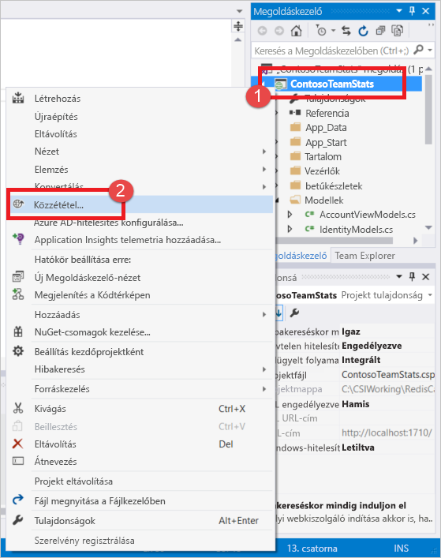
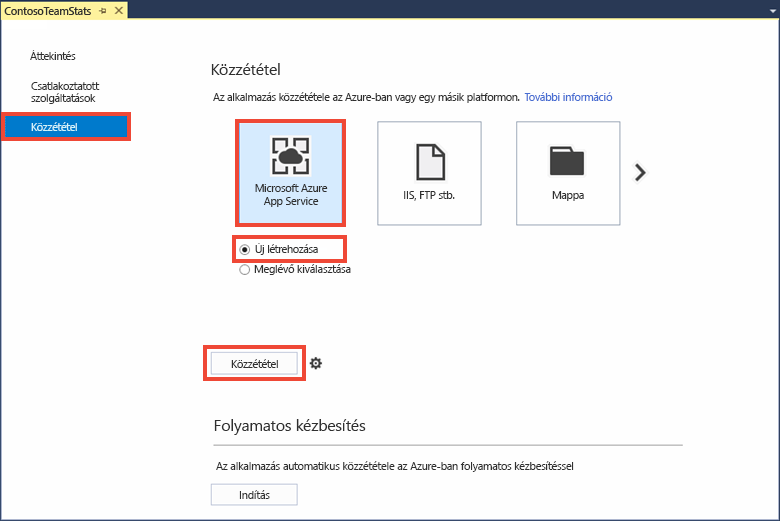
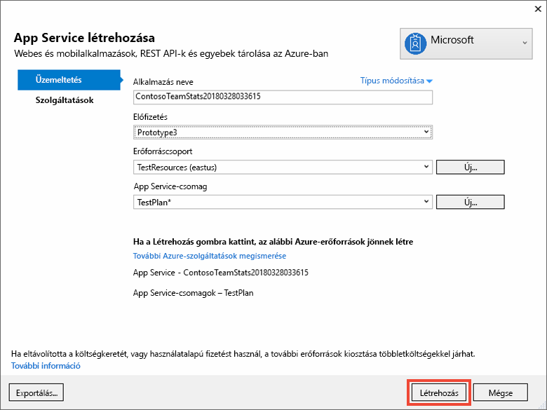
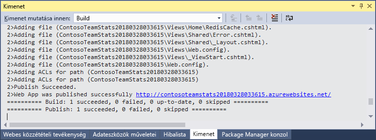
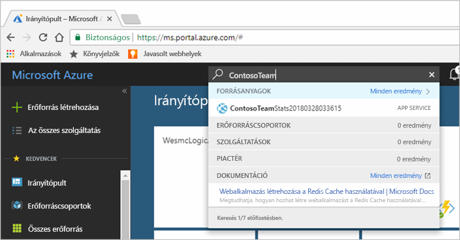
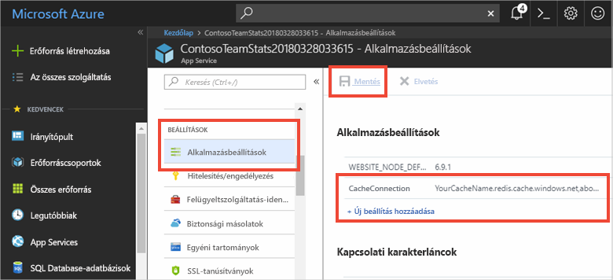

# <a name="quickstart-create-an-aspnet-web-app"></a>Rövid útmutató: ASP.NET-webapp létrehozása 

## <a name="introduction"></a>Bevezetés

Ez a rövid útmutató bemutatja, hogyan hozhat létre és helyezhet üzembe egy ASP.NET-webalkalmazást az Azure App Service szolgáltatásban a Visual Studio 2017 használatával. A mintaalkalmazás az Azure Redis Cache-hez csatlakozik a gyorsítótár adatainak tárolásához és beolvasásához. A rövid útmutató elvégzése után egy olyan futó, Azure-ban üzemeltetett webalkalmazással fog rendelkezni, amely adatokat olvas be és ír az Azure Redis Cache-be.


[!INCLUDE [quickstarts-free-trial-note](../../includes/quickstarts-free-trial-note.md)]

## <a name="prerequisites"></a>Előfeltételek

A rövid útmutató elvégzéséhez telepítenie kell a [Visual Studio 2017](https://www.visualstudio.com/downloads/) szoftvert a következő környezetekkel:
* ASP.NET és webfejlesztés
* Azure-fejlesztés

## <a name="create-the-visual-studio-project"></a>A Visual Studio-projekt létrehozása

1. Nyissa meg a Visual Studio alkalmazást, majd válassza a **File** (Fájl)  > **New** (Új)  >  **Project** (Projekt) elemet.

2. A **New Project** (Új projekt) párbeszédpanelen hajtsa végre az alábbi lépéseket:

    

    a. Bontsa ki a **Visual C#** csomópontot a **Templates** (Sablonok) listában.

    b. Válassza a **Cloud** (Felhő) lehetőséget.

    c. Válassza az **ASP.NET Web Application** (ASP.NET-es webalkalmazás) lehetőséget.

    d. Győződjön meg arról, hogy a **.NET Framework 4.5.2** (.NET-keretrendszer 4.5.2) vagy egy újabb verzió van kiválasztva.

    e. A **Name** (Név) mezőben nevezze el a projektet. Ebben a példában a **ContosoTeamStats** nevet használtunk.

    f. Kattintson az **OK** gombra.
   
3. A projekt típusaként válassza az **MVC** lehetőséget.

4. Ügyeljen arra, hogy az **Authentication** (Hitelesítés) beállításai között a **No Authentication** (Nincs hitelesítés) legyen megadva. A Visual Studio verziójától függően az **Authentication** (Hitelesítés) alapértelmezett beállítása lehet más. A beállítás módosításához kattintson a **Change Authentication** (Hitelesítés módosítása) gombra, és válassza a **No Authentication** (Nincs hitelesítés) lehetőséget.

5. A projekt létrehozásához válassza az **OK** lehetőséget.

## <a name="create-a-cache"></a>Gyorsítótár létrehozása

A következő lépésben létrehozza az alkalmazás gyorsítótárát.

[!INCLUDE [redis-cache-create](../../includes/redis-cache-create.md)]

[!INCLUDE [redis-cache-access-keys](../../includes/redis-cache-access-keys.md)]

#### <a name="to-edit-the-cachesecretsconfig-file"></a>A *CacheSecrets.config* fájl módosítása

3. Hozzon létre egy *CacheSecrets.config* nevű fájlt a számítógépén. Helyezze egy olyan helyre, ahonnan a mintaalkalmazás forráskódja nem fogja beolvasni. Ebben a rövid útmutatóban a *CacheSecrets.config* fájl a következő helyen található: *C:\AppSecrets\CacheSecrets.config*.

4. Szerkessze a *CacheSecrets.config* fájlt. Ezután adja hozzá a következő tartalmat:

    ```xml
    <appSettings>
        <add key="CacheConnection" value="<cache-name>.redis.cache.windows.net,abortConnect=false,ssl=true,password=<access-key>"/>
    </appSettings>
    ```

5. A `<cache-name>` karakterláncot cserélje le a gyorsítótár gazdagépének nevére.

6. Az `<access-key>` karakterláncot cserélje le a gyorsítótár elsődleges kulcsára.

    > [!TIP]
    > A másodlagos hozzáférési kulcsot a kulcscsere során használhatja alternatív kulcsként, amíg Ön újragenerálja az elsődleges hozzáférési kulcsot.
>
7. Mentse a fájlt.

## <a name="update-the-mvc-application"></a>Az MVC alkalmazás frissítése

Ebben a szakaszban frissíti az alkalmazást, hogy támogasson egy új nézetet, amely egy Azure Redis Cache-en végrehajtott egyszerű tesztet fog megjeleníteni.

* [A web.config fájl frissítése egy gyorsítótárhoz tartozó alkalmazásbeállítással](#Update-the-webconfig-file-with-an-app-setting-for-the-cache)
* [Az alkalmazás konfigurálása a StackExchange.Redis ügyfél használatára](#configure-the-application-to-use-stackexchangeredis)
* [A HomeController és az elrendezés frissítése](#update-the-homecontroller-and-layout)
* [Új RedisCache nézet hozzáadása](#add-a-new-rediscache-view)

### <a name="update-the-webconfig-file-with-an-app-setting-for-the-cache"></a>A web.config fájl frissítése egy gyorsítótárhoz tartozó alkalmazásbeállítással

Az alkalmazás helyi futtatásakor a *CacheSecrets.config* információi az Azure Redis Cache-példányhoz történő kapcsolódáshoz lesznek felhasználva. Később ezt az alkalmazást fogja üzembe helyezni az Azure-ban. Ekkor konfigurálni fog egy alkalmazásbeállítást az Azure-ban, amelyet az alkalmazás a fájl helyett fog használni a gyorsítótár kapcsolati információinak lekéréséhez. 

Mivel a *CacheSecrets.config* fájl nem lesz üzembe helyezve az Azure-on az alkalmazással együtt, csak akkor fogja használni, amikor helyben teszteli az alkalmazást. Ezt az információt a lehető legbiztonságosabb módon kell tárolni, hogy mások ne férhessenek hozzá károkozási szándékkal a gyorsítótárazott adatokhoz.

#### <a name="to-update-the-webconfig-file"></a>A *web.config* fájl frissítése
1. A **Megoldáskezelőben** nyissa meg duplán a *web.config* fájlt dupla kattintással.

    

2. A *web.config* fájlban keresse meg az `<appSetting>` elemet. Ezután adja hozzá a következő `file` attribútumot. Ha más fájlnevet vagy helyet használ, cserélje le a példában látható értékeket.

* Előtte: `<appSettings>`
* Utána: ` <appSettings file="C:\AppSecrets\CacheSecrets.config">`

Az ASP.NET futtatási környezet a külső fájl tartalmát egyesíti az `<appSettings>` elem kódjával. Ha a megadott fájl nem található, a futtatási környezet figyelmen kívül hagyja a fájlattribútumot. A titkos kulcsok (a gyorsítótárhoz tartozó kapcsolati sztringek) nem képezik részét az alkalmazás forráskódjának. A webalkalmazás Azure-ban történő üzembe helyezésekor a *CacheSecrests.config* fájl nem lesz telepítve.

### <a name="to-configure-the-application-to-use-stackexchangeredis"></a>Az alkalmazás konfigurálása a StackExchange.Redis használatára

1. Ha konfigurálni kívánja az alkalmazást a Visual Studióhoz készült [StackExchange.Redis](https://github.com/StackExchange/StackExchange.Redis) NuGet-csomag használatára, válassza az **Eszközök > NuGet-csomagkezelő > Csomagkezelő konzol** elemet.

2. Futtassa az alábbi parancsot a `Package Manager Console` ablakából:

    ```powershell
    Install-Package StackExchange.Redis
    ```

3. A NuGet-csomag letölti és hozzáadja az ügyfélalkalmazás számára szükséges szerelvényhivatkozásokat az Azure Redis Cache a StackExchange.Redis gyorsítótárügyféllel történő eléréséhez. Ha inkább a `StackExchange.Redis` ügyfélkönyvtár erős elnevezésű verzióját kívánja használni, telepítse a `StackExchange.Redis.StrongName` csomagot.

### <a name="to-update-the-homecontroller-and-layout"></a>A HomeController és az elrendezés frissítése

1. A **Megoldáskezelőben** bontsa ki a **Controllers** (Vezérlők) mappát, majd nyissa meg a *HomeController.cs* fájlt.

2. Adja hozzá a következő két `using` utasítást a fájl elejéhez, hogy támogassa a gyorsítótárügyfelet és az alkalmazásbeállításokat.

    ```csharp
    using System.Configuration;
    using StackExchange.Redis;
    ```

3. Adja hozzá a következő metódust a `HomeController` osztályhoz, hogy támogasson egy új `RedisCache`-műveletet, amely futtat néhány parancsot az új gyorsítótáron.

    ```csharp
        public ActionResult RedisCache()
        {
            ViewBag.Message = "A simple example with Azure Redis Cache on ASP.NET.";

            var lazyConnection = new Lazy<ConnectionMultiplexer>(() =>
            {
                string cacheConnection = ConfigurationManager.AppSettings["CacheConnection"].ToString();
                return ConnectionMultiplexer.Connect(cacheConnection);
            });

            // Connection refers to a property that returns a ConnectionMultiplexer
            // as shown in the previous example.
            IDatabase cache = lazyConnection.Value.GetDatabase();

            // Perform cache operations using the cache object...

            // Simple PING command
            ViewBag.command1 = "PING";
            ViewBag.command1Result = cache.Execute(ViewBag.command1).ToString();

            // Simple get and put of integral data types into the cache
            ViewBag.command2 = "GET Message";
            ViewBag.command2Result = cache.StringGet("Message").ToString();

            ViewBag.command3 = "SET Message \"Hello! The cache is working from ASP.NET!\"";
            ViewBag.command3Result = cache.StringSet("Message", "Hello! The cache is working from ASP.NET!").ToString();

            // Demostrate "SET Message" executed as expected...
            ViewBag.command4 = "GET Message";
            ViewBag.command4Result = cache.StringGet("Message").ToString();

            // Get the client list, useful to see if connection list is growing...
            ViewBag.command5 = "CLIENT LIST";
            ViewBag.command5Result = cache.Execute("CLIENT", "LIST").ToString().Replace(" id=", "\rid=");

            lazyConnection.Value.Dispose();

            return View();
        }
    ```

4. A **Megoldáskezelőben** bontsa ki a **Views** (Nézetek)  >  **Shared** (Közös) mappát. Ezután nyissa meg a *_Layout.cshtml* fájlt.

    Cserélje le ezt:

        ```csharp
        @Html.ActionLink("Application name", "Index", "Home", new { area = "" }, new { @class = "navbar-brand" })
        ```

    a következőre:

        ```csharp
        @Html.ActionLink("Azure Redis Cache Test", "RedisCache", "Home", new { area = "" }, new { @class = "navbar-brand" })
        ```

### <a name="to-add-a-new-rediscache-view"></a>Új RedisCache-nézet hozzáadása

1. A **Megoldáskezelőben** bontsa ki a **Nézetek** mappát, majd kattintson a jobb gombbal a **Kezdőmappára**. Kattintson a **Hozzáadás** > **Nézet...** elemre.

2. A **Nézet hozzáadása** párbeszédpanelen a Nézet neve mezőben adja meg a **RedisCache** nevet. Ezután válassza a **Hozzáadás** lehetőséget.

3. Cserélje le a *RedisCache.cshtml* fájlban lévő kódot az alábbira:

    ```csharp
    @{
        ViewBag.Title = "Azure Redis Cache Test";
    }

    <h2>@ViewBag.Title.</h2>
    <h3>@ViewBag.Message</h3>
    <br /><br />
    <table border="1" cellpadding="10">
        <tr>
            <th>Command</th>
            <th>Result</th>
        </tr>
        <tr>
            <td>@ViewBag.command1</td>
            <td><pre>@ViewBag.command1Result</pre></td>
        </tr>
        <tr>
            <td>@ViewBag.command2</td>
            <td><pre>@ViewBag.command2Result</pre></td>
        </tr>
        <tr>
            <td>@ViewBag.command3</td>
            <td><pre>@ViewBag.command3Result</pre></td>
        </tr>
        <tr>
            <td>@ViewBag.command4</td>
            <td><pre>@ViewBag.command4Result</pre></td>
        </tr>
        <tr>
            <td>@ViewBag.command5</td>
            <td><pre>@ViewBag.command5Result</pre></td>
        </tr>
    </table>
    ```

## <a name="run-the-app-locally"></a>Az alkalmazás futtatása helyben

Alapértelmezés szerint a projekt úgy van konfigurálva, hogy helyben üzemeltesse az alkalmazást az [IIS Expressben](https://docs.microsoft.com/iis/extensions/introduction-to-iis-express/iis-express-overview) a teszteléshez és a hibakereséshez.

### <a name="to-run-the-app-locally"></a>Az alkalmazás futtatása helyben
1. A Visual Studióban válassza a **Debug** (Hibakeresés)  >  **Start Debugging** (Hibakeresés indítása) elemet az alkalmazás teszteléshez és hibakereséshez való létrehozásához és helyi elindításához.

2. A böngésző navigációs sávjában válassza az **Azure Redis Cache Test** (Azure Redis Cache tesztelése) elemet.

3. Az alábbi példában a `Message` kulcsnak korábban gyorsítótárazott értéke volt, amely a portálon, az Azure Redis Cache használatával lett beállítva. Az alkalmazás frissítette ezt a gyorsítótárazott értéket. Az alkalmazás továbbá végrehajtotta a `PING` és a `CLIENT LIST` parancsot.

    

## <a name="publish-and-run-in-azure"></a>Közzététel és futtatás az Azure-ban

Az alkalmazás sikeres helyi tesztelése után az Azure-beli üzembe helyezés és a felhőben történő futtatás következik.

### <a name="to-publish-the-app-to-azure"></a>Az alkalmazás közzététele az Azure-ban

1. A Visual Studio Megoldáskezelőjében kattintson a jobb gombbal a projektcsomópontra. Ezután válassza a **Publish** (Közzététel) lehetőséget.

    

2. Válassza a **Microsoft Azure App Service**, majd a **Create New** (Új létrehozása) elemet, végül pedig a **Publish** (Közzététel) lehetőséget.

    

3. A **Create App Service** (App Service létrehozása) párbeszédpanelen hajtsa végre a következő módosításokat:

    | Beállítás | Javasolt érték | Leírás |
    | ------- | :---------------: | ----------- |
    | **Alkalmazás neve** | Használja az alapértelmezettet. | Az alkalmazásnév lesz az alkalmazás gazdagépneve, amikor üzembe helyezi az Azure-ban. Ha a név egyediségéhez ez szükséges, a rendszer időbélyeg-utótagot fűzhet hozzá. |
    | **Előfizetés** | Válassza ki az Azure-előfizetését. | A kapcsolódó üzemeltetési költségek ennél az előfizetésnél lesznek felszámítva. Ha több Azure-előfizetéssel is rendelkezik, ellenőrizze, hogy a kívánt előfizetés van-e kiválasztva.|
    | **Erőforráscsoport** | Használja ugyanazt az erőforráscsoportot, mint amelyben a gyorsítótárat létrehozta (pl.: *TestResourceGroup*). | Az erőforráscsoport segítségével az összes erőforrást egy csoportként kezelheti. Később, amikor törölni kívánja az alkalmazást, elég csak a csoportot törölnie. |
    | **App Service-csomag** | Válassza az **Új** elemet, és hozzon létre egy *TestingPlan* nevű új App Service-csomagot. <br />Használja ugyanazt a **Helyet**, mint amelyet a gyorsítótár létrehozásakor használt. <br />A méretnél válassza az **Ingyenes** lehetőséget. | Az App Service-csomag meghatároz egy futtatáshoz használható számításierőforrás-készletet a webalkalmazás számára. |

    

4. Az App Service üzemeltetési beállításainak konfigurálása után válassza a **Létrehozás** lehetőséget.

5. A közzététel állapotát a Visual Studio **Kimenet** ablakában ellenőrizheti. Az alkalmazás közzététele után a rendszer naplózza az alkalmazás URL-címét:

    

### <a name="add-the-app-setting-for-the-cache"></a>A gyorsítótárhoz tartozó alkalmazásbeállítás hozzáadása

Az új alkalmazás közzététele után adjon hozzá egy új alkalmazásbeállítást. A rendszer ezt a beállítást használja a gyorsítótár kapcsolati adatainak tárolására. 

#### <a name="to-add-the-app-setting"></a>Az alkalmazásbeállítás hozzáadása 

1. Írja be az alkalmazás nevét az Azure Portal tetején található keresősávba a létrehozott új alkalmazás megkereséséhez.

    

2. Adjon hozzá egy **CacheConnection** nevű új alkalmazásbeállítást, amelyet az alkalmazás a gyorsítótárhoz való csatlakozáshoz fog használni. Használja ugyanazt az értéket, mint amelyet a `CacheConnection` számára konfigurált a *CacheSecrets.config* fájlban. Az érték tartalmazza a gyorsítótár gazdagépének nevét és a hozzáférési kulcsot.

    

### <a name="run-the-app-in-azure"></a>Az alkalmazás futtatása az Azure-ban

Lépjen a böngészőben az alkalmazás URL-címére. Az URL-cím megjelenik a Visual Studio kimeneti ablakában a közzétételi művelet eredményei között. Az Azure Portalon, a létrehozott alkalmazás áttekintőoldalán is megtalálható.

A navigációs sávon válassza az **Azure Redis Cache Test** (Azure Redis Cache tesztelése) elemet a gyorsítótár-hozzáférés teszteléséhez.


## <a name="clean-up-resources"></a>Az erőforrások eltávolítása

Ha azt tervezi, hogy a következő oktatóanyaggal folytatja, megtarthatja és újból felhasználhatja az ebben a rövid útmutatóban létrehozott erőforrásokat.

Ha azonban befejezte az oktatóanyag mintaalkalmazásának használatát, a díjak elkerülése érdekében törölheti az ebben a rövid útmutatóban létrehozott Azure-erőforrásokat. 

> [!IMPORTANT]
> Az erőforráscsoport törlése nem vonható vissza. Az erőforráscsoport törlésekor a benne foglalt összes erőforrás véglegesen törlődik. Figyeljen arra, hogy ne töröljön véletlenül erőforráscsoportot vagy erőforrásokat. Ha a jelen minta üzemeltetését végző erőforrásokat egy meglévő, megtartani kívánt erőforrásokat tartalmazó erőforráscsoportban hozta létre, az erőforrásokat az erőforráscsoport törlése helyett külön-külön törölheti a megfelelő panelekről.

### <a name="to-delete-a-resource-group"></a>Erőforráscsoport törlése

1. Jelentkezzen be az [Azure Portalra](https://portal.azure.com), és válassza az **Erőforráscsoportok** elemet.

2. A **Szűrés név alapján** mezőbe írja be az erőforráscsoport nevét. A jelen cikk utasításai egy *TestResources* nevű erőforráscsoportot használtak. Az erőforráscsoport eredménylistájában válassza a **...**, majd az **Erőforráscsoport törlése** lehetőséget.

    

A rendszer az erőforráscsoport törlésének megerősítését kéri. A megerősítéshez írja be az erőforráscsoport nevét, és válassza a **Törlést**.

A rendszer néhány pillanaton belül törli az erőforráscsoportot és annak erőforrásait.

## <a name="next-steps"></a>További lépések

A következő oktatóanyagban egy valószerűbb forgatókönyv keretében fogja használni az Azure Redis Cache-t, hogy javítsa egy alkalmazás teljesítményét. Frissíti az alkalmazást, hogy gyorsítótárazza egy ranglista eredményeit a gyorsítótár-feltöltési minta, az ASP.NET és egy adatbázis együttes használatával.

> [!div class="nextstepaction"]
> [Gyorsítótár-feltöltési ranglista létrehozása az ASP.NET-en](cache-web-app-cache-aside-leaderboard.md)
