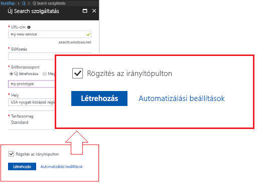
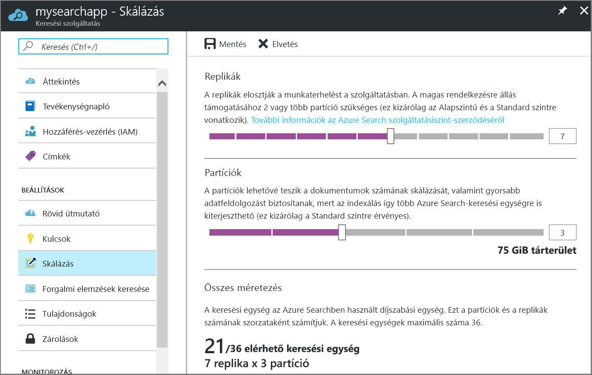

# Azure Search szolgáltatás létrehozása a portálon

Útmutató Azure Search szolgáltatás létrehozásához és üzembe helyezéséhez a portálon. 

Szívesebben használja a PowerShellt? Használja az Azure Resource Manager [szolgáltatássablonját](https://azure.microsoft.com/resources/templates/101-azure-search-create/). Az első lépésekhez az [Azure Search szolgáltatás kezelése a PowerShell használatával](search-manage-powershell.md) című cikkben ismertetett háttérinformációk nyújtanak segítséget.

## Feliratkozás (ingyenes vagy fizetős)

[Nyisson meg egy ingyenes Azure-fiókot](https://azure.microsoft.com/pricing/free-trial/?WT.mc_id=A261C142F), és fordítsa az ingyenes krediteket a fizetős Azure-szolgáltatások kipróbálására. A kreditek felhasználása után megtarthatja a fiókot, és továbbra is használhatja az olyan ingyenes Azure-szolgáltatásokat, mint a Websites. A bankkártyáját semmilyen költség nem terheli, hacsak Ön kifejezetten nem módosítja beállításait ennek engedélyezéséhez.

Választhatja az [MSDN-előfizetői értékelemek aktiválását](https://azure.microsoft.com/pricing/member-offers/msdn-benefits-details/?WT.mc_id=A261C142F) is. MSDN-előfizetéssel havonta kap fizetős Azure-szolgáltatásokra fordítható krediteket. 

## Az Azure Search megkeresése
1. Jelentkezzen be az [Azure Portalra](https://portal.azure.com/).
2. Kattintson a plusz jelre („+ Erőforrás létrehozása”) a bal felső sarokban.
3. Válassza a **Web** > **Azure Search** lehetőséget.

## A szolgáltatás és az URL-végpont elnevezése

A szolgáltatás neve része annak az URL-végpontnak, amelyre az API-hívások hivatkoznak: `https://your-service-name.search.windows.net`. Adja meg a szolgáltatás nevét az **URL** mezőben. 

A szolgáltatásnévre vonatkozó követelmények:
   * Egyedinek kell lennie a search.windows.net névtérben
   * Hossza 2 és 60 karakter között lehet
   * Kisbetűkből, számjegyekből vagy kötőjelekből ("-") állhat
   * Kerülje a kötőjel ("-") használatát az első 2 és az utolsó karakterben
   * Sehol sem tartalmazhat két egymást követő kötőjelet ("--")

## Előfizetés kiválasztása
Ha egynél több előfizetéssel rendelkezik, akkor olyat válasszon, amelyhez adat- vagy fájltárolási szolgáltatások is tartoznak. Az Azure Search automatikusan észleli a Azure-os tábla- és blobtárolókat, az SQL Database-t és az Azure Cosmos DB-t az [*indexelőkkel*](search-indexer-overview.md) történő indexeléshez, de csak az ugyanabban az előfizetésben lévő szolgáltatások esetén.

## Erőforráscsoport kiválasztása
Az erőforráscsoport együtt használt Azure-szolgáltatások és -erőforrások gyűjteménye. Ha az Azure Search szolgáltatást például egy SQL-adatbázis indexelésére használja, akkor mindkét szolgáltatásnak ugyanabban az erőforráscsoportban kell lennie.

> [!TIP]
> Egy erőforráscsoport törlésekor a benne lévő szolgáltatások is törölve lesznek. Több szolgáltatást igénybe vevő prototípus-projektek végén könnyebb mindent törölni, ha az összeset egy erőforráscsoportban helyezi el. 

## Üzemeltetési hely kiválasztása 
Az Azure Search mint Azure-szolgáltatás világszerte sok adatközpontban üzemeltethető. Fontos, hogy a földrajzi helytől függően az [árak eltérőek lehetnek](https://azure.microsoft.com/pricing/details/search/).

## Tarifacsomag (SKU) kiválasztása
[Az Azure Search jelenleg többféle tarifacsomagban is kapható](https://azure.microsoft.com/pricing/details/search/): Ingyenes, Alapszintű vagy Standard. Mindegyik szintet saját [kapacitás és korlátozások](search-limits-quotas-capacity.md) jellemzik. Útmutatást talál a [Tarifacsomag vagy SKU kiválasztása](search-sku-tier.md) című cikkben.

Ebben az útmutatóban a Standard szintet választottuk a szolgáltatáshoz.

A szolgáltatás létrehozása után már nem lehet tarifacsomagot váltani. Ha később magasabb vagy alacsonyabb csomagra kíván áttérni, akkor újra létre kell hoznia a szolgáltatást.

## A szolgáltatás létrehozása

Ne felejtse el rögzíteni a szolgáltatást az irányítópulton, így a bejelentkezés után könnyen elérheti.

## A szolgáltatás méretezése
Egy szolgáltatás létrehozása több percet is igénybe vehet (a csomagtól függően 15 percet vagy többet is). A szolgáltatást annak üzembe helyezése után igényei szerint méretezheti. Mivel az Azure Search szolgáltatáshoz a Standard csomagot választotta, a szolgáltatás kétféleképpen, replikák és partíciók szintjén méretezhető. Ha az alapszintű csomagot választotta volna, akkor csak replikákat adhatna hozzá. Ingyenes szolgáltatás üzembe helyezése esetén a méretezés nem elérhető.

A ***partíciókkal*** a szolgáltatás több dokumentum tárolására és keresésére alkalmas.

A ***replikákkal*** a szolgáltatás több keresési kérelem kiszolgálására alkalmas.

Az erőforrások hozzáadása növeli a havi költségeket. A [díjkalkulátor](https://azure.microsoft.com/pricing/calculator/) segíthet áttekinteni az erőforrások hozzáadásának számlázási vonatkozásait. Vegye figyelembe, hogy az erőforrások mennyisége a terheléshez igazítható. Például növelheti az erőforrások mennyiségét egy teljes körű első index létrehozásához, majd később csökkentheti azt a növekményes indexeléshez jobban megfelelő szintre.

> [!Important]
> A szolgáltatásnak [csak olvasható SLA esetén 2, írási/olvasási SLA esetén 3 replikával](https://azure.microsoft.com/support/legal/sla/search/v1_0/) kell rendelkeznie.

1. Nyissa meg a keresési szolgáltatás oldalát az Azure Portalon.
2. A bal oldali navigációs panelen válassza a **Beállítások** > **Méretezés** lehetőséget.
3. A csúszka segítségével bármelyik típusú erőforrásokat hozzáadhatja.

> [!Note] 
> Minden csomagban más [korlátozások](search-limits-quotas-capacity.md) érvényesek az egy szolgáltatásban megengedett keresési egységekre (replikák × partíciók = összes keresési egység).

## Mikor érdemes hozzáadni egy második szolgáltatást?

Az ügyfelek túlnyomó többsége egy csomagban csak egy üzembe helyezett szolgáltatást használ, amely biztosítja [az erőforrások megfelelő egyensúlyát](search-sku-tier.md). Egy szolgáltatásban több index is fenntartható [a választott csomag korlátozásainak megfelelő számban](search-capacity-planning.md), ha elkülönülnek egymástól. Az Azure Search szolgáltatásban a kérelmek csak egy indexre irányulhatnak. Így kisebb esély van adatok véletlen vagy szándékos lekérésére az egyazon szolgáltatáshoz tartozó más indexekből.

Bár az ügyfelek többsége csak egy szolgáltatást használ, szükség lehet a szolgáltatás redundanciájára, ha az üzemeltetési körülmények között az alábbiak szerepelnek:

+ Vészhelyreállítás (adatközpont-kimaradás). Kimaradás esetén az Azure Search nem biztosít azonnali feladatátvételt. Javaslatokat és útmutatást a [Szolgáltatásfelügyeletről](search-manage.md) szóló cikkben talál.
+ A több-bérlős modellezés vizsgálatával megállapította, hogy az optimális kialakítás további szolgáltatásokat is tartalmaz. További információ: [Tervezés több bérlő esetén](search-modeling-multitenant-saas-applications.md).
+ Ha globálisan üzembe helyezett alkalmazás esetén minimalizálni kívánja az alkalmazás belső forgalmának késését, akkor az Azure Search több példányára is szükség lehet különböző régiókban.

> [!NOTE]
> Az Azure Search szolgáltatásban az indexelés és a lekérdezés munkaterhelése nem választható szét, tehát sohasem fog több szolgáltatást létrehozni a külön munkaterhelésekhez. Az indexek lekérdezése mindig abban a szolgáltatásban történik, amelyben létre lettek hozva (nem lehet egy indexet egy szolgáltatásban létrehozni és egy másikba átmásolni).
>

A magas rendelkezésre álláshoz nincs szükség második szolgáltatásra. A lekérdezések magas rendelkezésre állása úgy érhető el, hogy egyazon szolgáltatáson belül 2 vagy több replikát használ. A replikák frissítése egymást követően történik, tehát legalább egy mindig működni fog a szolgáltatásfrissítés végrehajtása közben. A hasznos üzemidőről a [szolgáltatói szerződések](https://azure.microsoft.com/support/legal/sla/search/v1_0/) oldalán tájékozódhat bővebben.

## További lépések
Az Azure Search szolgáltatás üzembe helyezése után már készen áll egy [index definiálására](search-what-is-an-index.md) hogy feltölthesse adatait és keresést végezhessen. 

> [!div class="nextstepaction"]
> [Az Azure Search használata a .NET-ben](search-howto-dotnet-sdk.md)
