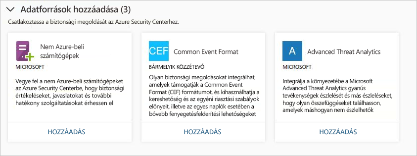
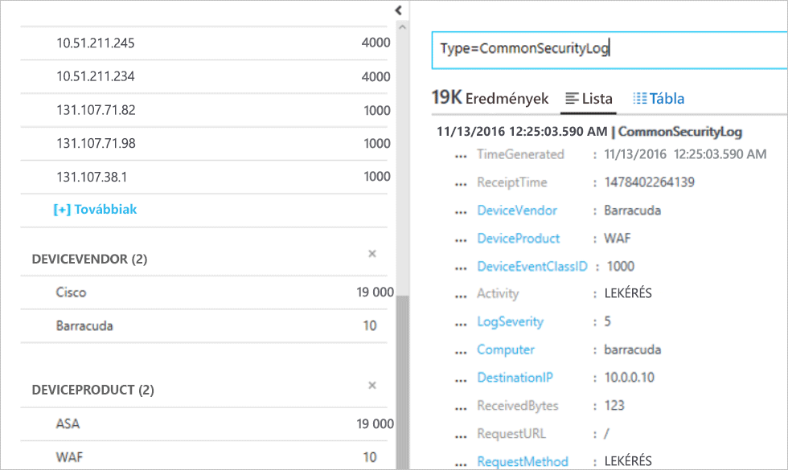

# Rövid útmutató – Biztonsági megoldások csatlakoztatása a Security Centerhez

A biztonsági adatok a számítógépekről történő begyűjtés mellett számos egyéb biztonsági megoldás használatával is integrálhatók, beleértve a Common Event Format (CEF) formátumot támogató megoldásokat is. A CEF egy iparági szabványnak számító, a Syslog-üzenetekre épülő formátum, amelyet számos, biztonsági megoldásokkal foglalkozó forgalmazó használ az események integrációjának biztosításához a különböző platformok között.

Ez a rövid útmutató a következőket mutatja be:
- Biztonsági megoldás csatlakoztatása a Security Centerhez CEF-naplók használatával
- A kapcsolat ellenőrzése a biztonsági megoldással

## Előfeltételek
A Security Center használatához Microsoft Azure-előfizetéssel kell rendelkeznie. Ha nem rendelkezik előfizetéssel, regisztrálhat egy [ingyenes fiókkal](https://azure.microsoft.com/free/).

A rövid útmutató lépéseinek végrehajtásához a Security Center Standard tarifacsomagjával kell rendelkeznie. Az első 60 napban díjmentesen próbálhatja ki a Security Center Standard verzióját. [Az Azure-előfizetés a Security Center Standard verziójába való felvételével](security-center-get-started.md) foglalkozó rövid útmutató végigvezeti azokon a lépéseken, amelyekkel frissíthet a Standard verzióra.

Emellett szükség van egy [Linux rendszerű számítógépre is](https://docs.microsoft.com/azure/log-analytics/log-analytics-agent-linux), amelyen a Syslog szolgáltatás már csatlakoztatva van a Security Centerhez.

## Megoldás csatlakoztatása CEF használatával

1. Jelentkezzen be az [Azure Portalra](https://azure.microsoft.com/features/azure-portal/).
2. A **Microsoft Azure** menüben válassza a **Security Center** elemet. Megnyílik a **Security Center – Áttekintés** képernyő.

      

3. A Security Center főmenüjében válassza a **Biztonsági megoldások** elemet.
4. A Biztonsági megoldások oldal **Adatforrások hozzáadása (3)** részének **Common Event Format** lehetőségénél kattintson a **Hozzáadás** elemre.

    

5. A Common Event Format-naplók oldalán bontsa ki a második lépést: **Syslog-továbbítás konfigurálása a szükséges naplóknak a 25226-os UDP-port ügynökéhez történő küldése érdekében**, majd Linux számítógépén kövesse az alábbi utasításokat:

    

6. Bontsa ki a harmadik lépést: **Az ügynökkonfigurációs fájl elhelyezése az ügynökszámítógépen**, majd Linux számítógépén kövesse az alábbi utasításokat:

    

7. Bontsa ki a negyedik lépést: **A syslog démon és az ügynök újraindítása**, majd Linux számítógépén kövesse az alábbi utasításokat:

    

## A kapcsolat ellenőrzése

Mielőtt továbbhaladna az alábbi lépésekhez, meg kell várnia, amíg a Syslog jelenteni kezd a Security Centernek. A környezet méretétől függően ez eltarthat némi ideig.

1.  A bal oldali panelen, a Security Center irányítópultján kattintson a **Keresés** elemre.
2.  Válassza ki a munkaterületet, amelyhez a Syslog (Linux számítógép) csatlakozik.
3.  Írja be a *CommonSecurityLog* kifejezést, majd kattintson a **Keresés** gombra.

Az alábbi példában a lépések eredménye szerepel: 

## Az erőforrások eltávolítása
A gyűjtemény részét képező többi rövid útmutató és oktatóanyag erre a rövid útmutatóra épül. Ha azt tervezi, hogy az ezt követő rövid útmutatókkal és oktatóanyagokkal dolgozik tovább, továbbra is a Standard szintet futtassa, és hagyja engedélyezve az automatikus kiépítést. Ha nem folytatja a munkát, vagy vissza szeretne térni az Ingyenes szintre:

1. Térjen vissza a Security Center főmenüjébe, és válassza a **Biztonsági szabályzat** elemet.
2. Válassza ki az előfizetést vagy a szabályzatot, amelyet vissza szeretne állítani Ingyenes állapotba. Megnyílik a **Biztonsági szabályzat** képernyő.
3. A **SZABÁLYZAT ÖSSZETEVŐI** alatt válassza a **Tarifacsomag** lehetőséget.
4. Válassza az **Ingyenes** lehetőséget az előfizetés Standard szintről Ingyenes szintre való módosításához.
5. Kattintson a **Mentés** gombra.

Ha le szeretné tiltani az automatikus kiépítést:

1. Térjen vissza a Security Center főmenüjébe, és válassza a **Biztonsági szabályzat** elemet.
2. Válassza ki azt az előfizetést, amelynél le szeretné tiltani az automatikus kiépítést.
3. Az automatikus kiépítés letiltásához a **Biztonsági szabályzat – Adatgyűjtés** területen válassza a **Ki** lehetőséget az **Előkészítés** elemnél.
4. Kattintson a **Mentés** gombra.

>[!NOTE]
> Az automatikus kiépítés letiltása nem távolítja el a Microsoft Monitoring Agentet azon Azure-beli virtuális gépekről, ahol az ügynök üzembe lett helyezve. Az automatikus kiépítés letiltása korlátozza az erőforrások biztonsági monitorozását.
>

## További lépések
Ebből a rövid útmutatóból megismerhette, hogyan csatlakoztathat egy Linux Syslog megoldást a Security Centerhez a CEF használatával. A CEF-naplók és a Security Center csatlakoztatása esetén élvezheti a kereshetőség és az egyéni riasztási szabályok előnyeit, illetve az egyes naplók esetében a bővebb fenyegetésfelderítési lehetőségeket. Ha többet szeretne megtudni a Security Center használatáról, tekintse meg a biztonsági szabályzat konfigurálásával és az erőforrások biztonságának felmérésével foglalkozó oktatóanyagot is.

> [!div class="nextstepaction"]
> [Oktatóanyag: Biztonsági szabályzatok meghatározása és értékelése](./tutorial-security-policy.md)
