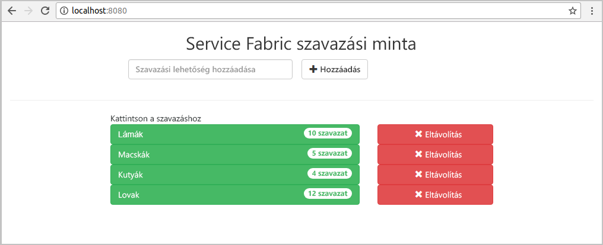
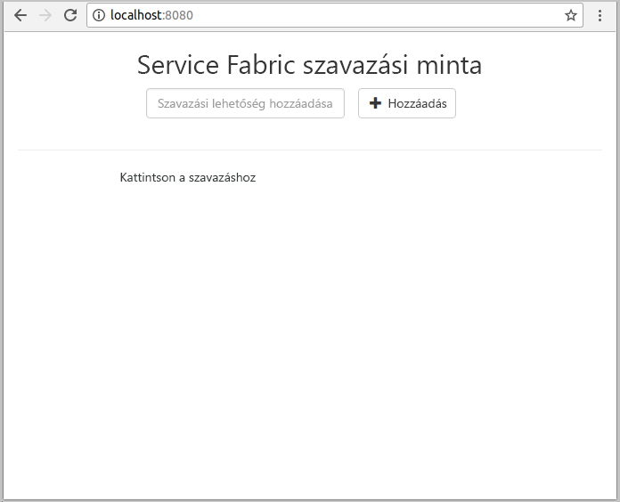
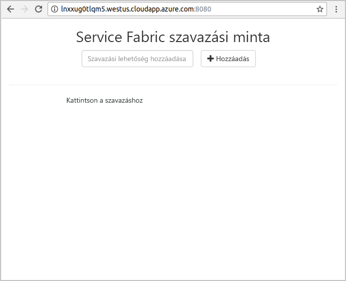
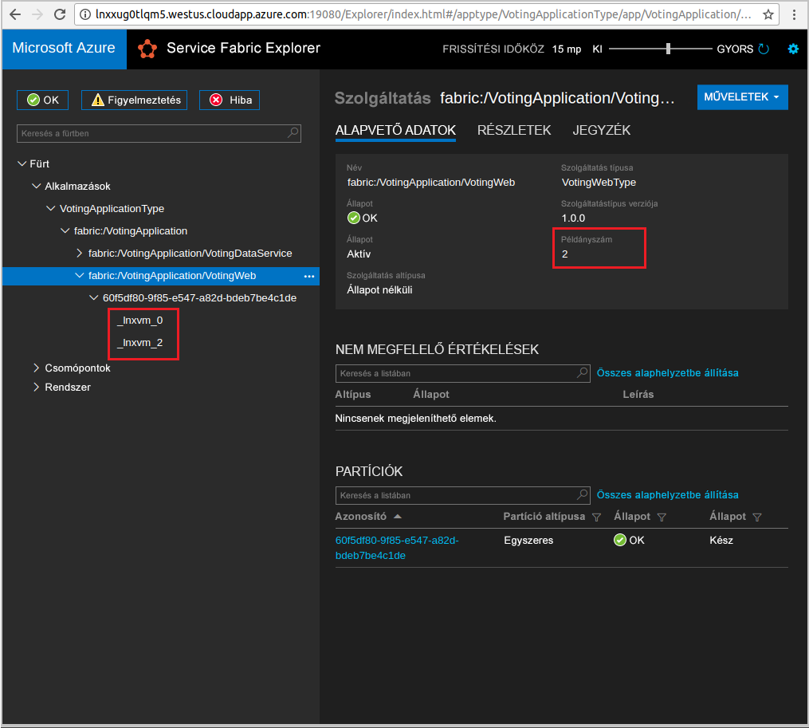

# <a name="quickstart-deploy-a-java-reliable-services-application-to-service-fabric"></a>Rövid útmutató: Java Reliable Services-alkalmazás üzembe helyezése a Service Fabricben

Az Azure Service Fabric egy elosztott rendszerplatform, amely mikroszolgáltatások és tárolók üzembe helyezésére és kezelésére szolgál.

Ez a gyors útmutató azt ismerteti, hogy hogyan helyezheti üzembe első Java-alkalmazását a Service Fabricben az Eclipse IDE használatával, Linux fejlesztői gépen. Az útmutató elvégzése után rendelkezni fog egy Java webes kezelőfelületes szavazóalkalmazással, amely egy a fürtben található állapotalapú háttérszolgáltatásba menti a szavazati adatokat.



Ezen rövid útmutató segítségével megtanulhatja a következőket:

* Az Eclipse használata a Service Fabricben üzemeltetett Java-alkalmazásokhoz
* Az alkalmazás központi telepítése a helyi fürtre
* Az alkalmazás központi telepítése egy fürtre az Azure-ban
* Az alkalmazás horizontális felskálázása több csomópontra

## <a name="prerequisites"></a>Előfeltételek

A gyorsútmutató elvégzéséhez:

1. [A Service Fabric SDK és a Service Fabric parancssori felület (CLI) telepítése](https://docs.microsoft.com/azure/service-fabric/service-fabric-get-started-linux#installation-methods)
2. [A Git telepítése](https://git-scm.com/)
3. [Az Eclipse telepítése](https://www.eclipse.org/downloads/)
4. [A Java környezet beállítása](https://docs.microsoft.com/azure/service-fabric/service-fabric-get-started-linux#set-up-java-development) az Eclipse beépülő modul telepítéséhez szükséges választható lépések elvégzésével

## <a name="download-the-sample"></a>A minta letöltése

Egy parancssori ablakban futtassa a következő parancsot a mintaalkalmazás-adattár helyi számítógépre történő klónozásához.

```git
git clone https://github.com/Azure-Samples/service-fabric-java-quickstart.git
```

## <a name="run-the-application-locally"></a>Az alkalmazás helyi futtatása

1. A helyi fürt elindításához futtassa a következő parancsot:

    ```bash
    sudo /opt/microsoft/sdk/servicefabric/common/clustersetup/devclustersetup.sh
    ```
    A helyi fürt elindítása eltarthat egy ideig. A fürt üzembe állásának ellenőrzéséhez nyissa meg a Service Fabric Explorert a **http://localhost:19080** címen. Ha öt kifogástalan csomópontot lát, a fürt megfelelően üzemel.

    

2. Nyissa meg az Eclipse környezetet.
3. Kattintson a File (Fájl) -> Import (Importálás) -> Gradle -> Existing Gradle Project (Meglévő Gradle-projekt) elemre, és kövesse a varázsló utasításait.
4. Kattintson a Directory (Címtár) elemre, és válassza ki a `Voting` könyvtárat abból a `service-fabric-java-quickstart` mappából, amelyet a GitHubról klónozott. Kattintson a Befejezés gombra. 

    

5. Ezzel létrehozta a `Voting` projektet az Eclipse-hez készült Package Explorerben.
6. Kattintson a jobb gombbal a projektre, és a válassza a **Publish Application...** (Alkalmazás közzététele) lehetőséget a **Service Fabric** legördülő menüből. Célprofilnak (Target Profile) válassza a **PublishProfiles/Local.json** lehetőséget, majd kattintson a Publish (Közzététel) gombra.

    

7. Nyissa meg a kedvenc webböngészőjét, és nyissa meg az alkalmazást a **http://localhost:8080** címen.

    

Most hozzáadhat szavazási lehetőségeket az alkalmazáshoz, és megkezdheti a szavazatok gyűjtését. Az alkalmazás különálló adatbázis nélkül futtatja és tárolja az összes adatot a Service Fabric-fürtben.

## <a name="deploy-the-application-to-azure"></a>Az alkalmazás központi telepítése az Azure-ban

### <a name="set-up-your-azure-service-fabric-cluster"></a>Azure Service Fabric-fürt beállítása

Az alkalmazás Azure-fürtön történő üzembe helyezéséhez hozzon létre egy saját fürtöt.

A nyilvános fürtök ingyenes, korlátozott időtartamú, Azure-ban üzemeltetett Service Fabric-fürtök, amelyek futtatását a Service Fabric csapata végzi. A nyilvános fürtökkel alkalmazásokat helyezhet üzembe, és megismerkedhet a platform használatával. A fürt egy önaláírt tanúsítványt használ a csomópontok közötti, valamint az ügyfél és a csomópont közötti biztonsághoz.

Jelentkezzen be, és csatlakozzon egy [Linux-fürthöz](http://aka.ms/tryservicefabric). A **PFX** hivatkozásra kattintva töltse le a PFX-tanúsítványt a számítógépre. Kattintson a **ReadMe** hivatkozásra a tanúsítvány jelszavának és a különböző környezetek a tanúsítvány használatára konfigurálása lépéseinek megismeréséhez. Hagyja megnyitva a **kezdőlapot** és a **ReadMe** oldalt, az itt található utasításokat a következő lépések során fogja használni.

> [!Note]
> Óránként korlátozott számú nyilvános fürt érhető el. Ha a nyilvános fürtre való regisztráláskor hiba lép fel, várjon egy kis ideig, majd próbálkozzon újra, vagy kövesse a [Service Fabric-fürt az Azure-ban való létrehozását ismertető](service-fabric-tutorial-create-vnet-and-linux-cluster.md) oktatóanyagban szereplő lépéseket, amelyekkel létrehozhat egy fürtöt az előfizetésben.
>
> A Spring Boot szolgáltatás a konfigurációja szerint a 8080-as porton figyeli a bejövő forgalmat. Győződjön meg róla, hogy a port nyitva van a fürtön. Ha a nyilvános fürtöt használja, ez a port nyitva van.
>

A Service Fabric számos eszközt nyújt, amelyekkel kezelheti a fürtöket és azok alkalmazásait:

* A Service Fabric Explorert, amely egy böngészőalapú eszköz.
* A Service Fabric parancssori felületet (CLI-t), amely az Azure CLI 2.0-n fut.
* PowerShell-parancsokat.

Ebben a rövid útmutatóban a Service Fabric parancssori felületet és a Service Fabric Explorert használja.

A parancssori felület használatához létre kell hoznia egy PEM-fájlt a letöltött PFX-fájl alapján. A fájl konvertálásához használja az alábbi parancsot. (Nyilvános fürtök esetén a PFX-fájlra vonatkozó parancsot másolhat a **ReadMe** oldal utasításai közül.)

    ```bash
    openssl pkcs12 -in party-cluster-1486790479-client-cert.pfx -out party-cluster-1486790479-client-cert.pem -nodes -passin pass:1486790479
    ```

A Service Fabric Explorer használatához importálnia kell a tanúsítvány PFX-fájlját, amelyet a nyilvános fürt webhelyéről a tanúsítványtárolóba (Windows vagy Mac) vagy magába a böngészőbe (Ubuntu) töltött le. Szüksége van a PFX titkos kulcs jelszavára, amelyet a **ReadMe** oldalról szerezhet be.

Tetszőleges módszerrel importálhatja a tanúsítványt a rendszerre. Például:

* Windows rendszeren: Kattintson duplán a PFX-fájlra, és kövesse a lépéseket a tanúsítvány a `Certificates - Current User\Personal\Certificates` személyes tárolóban való telepítéséhez. Másik lehetőségként használhatja a **ReadMe** utasításokban lévő PowerShell-parancsot is.
* Mac rendszeren: Kattintson duplán a PFX-fájlra, és kövesse a lépéseket a tanúsítvány a kulcskarikában való telepítéséhez.
* Ubuntu rendszeren: A Mozilla Firefox az alapértelmezett böngésző az Ubuntu 16.04-en. A tanúsítvány a Firefoxba importálásához kattintson a böngésző jobb felső sarkában lévő menügombra, majd a **Beállítások** gombra. A **Beállítások** oldalon a keresőmezővel keressen rá a „tanúsítványok” kifejezésre. Kattintson a **Tanúsítványkezelő** gombra, válassza a **Saját tanúsítványok** fület, kattintson az **Importálás** lehetőségre, és kövesse az utasításokat a tanúsítvány importálásához.

   

### <a name="add-certificate-information-to-your-application"></a>Tanúsítványadatok hozzáadása az alkalmazáshoz

A tanúsítvány ujjlenyomatát hozzá kell adnia az alkalmazáshoz, mert a Service Fabric programozási modelleket használ.

1. A tanúsítvány `Voting/VotingApplication/ApplicationManifest.xml` fájlban tárolt ujjlenyomatára lesz szükség, amikor biztonságos fürtön futtatja az alkalmazást. Futtassa a következő parancsot a tanúsítvány ujjlenyomatának kibontásához.

    ```bash
    openssl x509 -in [CERTIFICATE_PEM_FILE] -fingerprint -noout
    ```

2. A `Voting/VotingApplication/ApplicationManifest.xml` fájlban adja a következő kódrészletet az **ApplicationManifest** címke alá. Az **X509FindValue** elemnek az előző lépésből származó ujjlenyomatnak kell lennie (pontosvessző nélkül). 

    ```xml
    <Certificates>
        <SecretsCertificate X509FindType="FindByThumbprint" X509FindValue="0A00AA0AAAA0AAA00A000000A0AA00A0AAAA00" />
    </Certificates>
    ```

### <a name="deploy-the-application-using-eclipse"></a>Az alkalmazás üzembe helyezése az Eclipse használatával

Az alkalmazást és a fürtjét a létrehozása után közvetlenül az Eclipse-ből telepítheti egy fürtre.

1. Nyissa meg a **PublishProfiles** könyvtárban található **Cloud.json** fájlt, és töltse ki megfelelően a `ConnectionIPOrURL` és a `ConnectionPort` mezőket. Például:

    ```bash
    {
         "ClusterConnectionParameters":
         {
            "ConnectionIPOrURL": "lnxxug0tlqm5.westus.cloudapp.azure.com",
            "ConnectionPort": "19080",
            "ClientKey": "[path_to_your_pem_file_on_local_machine]",
            "ClientCert": "[path_to_your_pem_file_on_local_machine]"
         }
    }
    ```

2. Kattintson a jobb gombbal a projektre, és a válassza a **Publish Application...** (Alkalmazás közzététele) lehetőséget a **Service Fabric** legördülő menüből. Célprofilnak (Target Profile) válassza a **PublishProfiles/Cloud.json** lehetőséget, majd kattintson a Publish (Közzététel) gombra.

    

3. Nyissa meg a webböngészőjét, és nyissa meg az alkalmazást a **http://\<ConnectionIPOrURL>:8080** címen.

    

## <a name="scale-applications-and-services-in-a-cluster"></a>Alkalmazások és szolgáltatások méretezése a fürtökben

A szolgáltatások skálázhatók egy adott fürtben, hogy kövessék a szolgáltatások terhelésének változásait. A szolgáltatások méretezése a fürtben futó példányok számának módosításával történik. A szolgáltatásokat többféleképpen is skálázhatja, használhat például szkripteket, vagy a Service Fabric parancssori felület (sfctl) parancsait. A következő lépések során a Service Fabric Explorert használjuk.

A Service Fabric Explorer az összes Service Fabric-fürtben fut. Az eléréséhez egy böngészőben navigáljon az adott fürt HTTP-kezelési portjára (19080), például: `http://lnxxug0tlqm5.westus.cloudapp.azure.com:19080`.

A webes előtér-szolgáltatás skálázásához tegye a következőket:

1. Nyissa meg a Service Fabric Explorert a fürtben – például: `https://lnxxug0tlqm5.westus.cloudapp.azure.com:19080`.
2. Kattintson a három pontra a fanézetben a **fabric:/Voting/VotingWeb** csomópont mellett, és válassza a **Scale Service** (Szolgáltatás méretezése) lehetőséget.

    

    Most már méretezheti a webes előtér-szolgáltatás példányainak számát.

3. Módosítsa a számot **2**-re, és kattintson a **Szolgáltatás méretezése** gombra.
4. Kattintson a **fabric:/Voting/VotingWeb** csomópontra a fanézetben, és bontsa ki a partíciós csomópontot (egy GUID jelöli).

    

    Ekkor láthatja, hogy a szolgáltatás két példányban jelenik meg, a fanézetben pedig megtekintheti, hogy a példányok melyik csomópontokon futnak.

Ezzel az egyszerű felügyeleti eljárással megduplázta az előtér-szolgáltatás számára a felhasználói terhelések feldolgozásához rendelkezésre álló erőforrások mennyiségét. Fontos tudni, hogy nincs szükség több példányra ahhoz, hogy a szolgáltatás megbízhatóan fusson. Ha egy szolgáltatás meghibásodik, a Service Fabric gondoskodik róla, hogy egy új szolgáltatáspéldány elinduljon a fürtben.

## <a name="next-steps"></a>További lépések

Ennek a rövid útmutatónak a segítségével megtanulta a következőket:

* Az Eclipse használata a Service Fabricben üzemeltetett Java-alkalmazásokhoz
* Java-alkalmazások központi telepítése a helyi fürtre
* Java-alkalmazások központi telepítése egy fürtre az Azure-ban
* Az alkalmazás horizontális felskálázása több csomópontra

Ha bővebb információra van szüksége a Java-alkalmazások Service Fabricben való használatával kapcsolatban, lépjen tovább a Java-alkalmazásokról szóló oktatóanyagra.

> [!div class="nextstepaction"]
> [Java-alkalmazás üzembe helyezése](./service-fabric-tutorial-create-java-app.md)