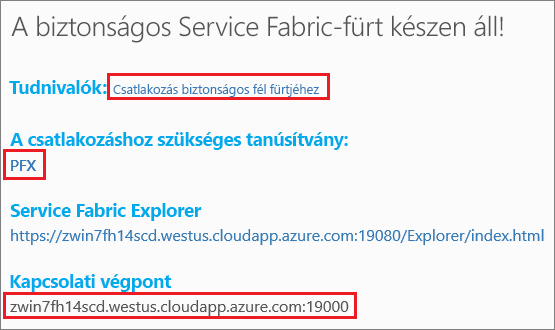
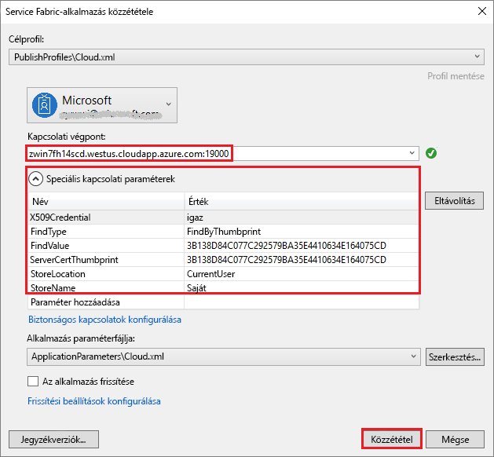

# <a name="tutorial-deploy-a-service-fabric-application-to-a-cluster-in-azure"></a>Oktatóanyag: Service Fabric-alkalmazás üzembe helyezése egy fürtön az Azure-ban

Ez az oktatóanyag egy sorozat második része. Azt mutatja be, hogy hogyan helyezhetők üzembe az Azure Service Fabric-alkalmazások egy új fürtön az Azure-ban.

Eben az oktatóanyagban az alábbiakkal fog megismerkedni:
> [!div class="checklist"]
> * Nyilvános fürt létrehozása.
> * Alkalmazás üzembe helyezése egy távoli fürtön Visual Studio használatával.

Ebben az oktatóanyag-sorozatban az alábbiakkal ismerkedhet meg:
> [!div class="checklist"]
> * [.NET Service Fabric-alkalmazás létrehozása](service-fabric-tutorial-create-dotnet-app.md).
> * Az alkalmazás üzembe helyezése egy távoli fürtön.
> * [HTTPS-végpont hozzáadása ASP.NET Core kezelőfelületi szolgáltatáshoz](service-fabric-tutorial-dotnet-app-enable-https-endpoint.md).
> * [A CI/CD konfigurálása a Visual Studio Team Services használatával](service-fabric-tutorial-deploy-app-with-cicd-vsts.md).
> * [Figyelés és diagnosztika beállítása az alkalmazáshoz](service-fabric-tutorial-monitoring-aspnet.md).

## <a name="prerequisites"></a>Előfeltételek

Az oktatóanyag elkezdése előtt:

* Ha nem rendelkezik Azure-előfizetéssel, hozzon létre egy [ingyenes fiókot](https://azure.microsoft.com/free/?WT.mc_id=A261C142F).
* [Telepítse a Visual Studio 2017-et](https://www.visualstudio.com/) az **Azure-fejlesztési**, valamint az **ASP.NET- és webfejlesztési** számítási feladatokkal.
* [A Service Fabric SDK telepítése](service-fabric-get-started.md).

## <a name="download-the-voting-sample-application"></a>A mintául szolgáló szavazóalkalmazás letöltése

Ha nem hozta létre a mintául szolgáló szavazóalkalmazást [az oktatóanyag-sorozat első részében](service-fabric-tutorial-create-dotnet-app.md), akkor le is töltheti. Egy parancssori ablakban futtassa a következő kódot a mintaalkalmazás-adattár helyi számítógépre történő klónozásához.

```git
git clone https://github.com/Azure-Samples/service-fabric-dotnet-quickstart 
```

## <a name="publish-to-a-service-fabric-cluster"></a>Közzététel Service Fabric-fürtön

Az alkalmazást a létrehozása után telepítheti a fürtben, közvetlenül a Visual Studióból. A [Service Fabric-fürt](https://docs.microsoft.com/en-gb/azure/service-fabric/service-fabric-deploy-anywhere) virtuális és fizikai gépek hálózaton keresztül csatlakozó készlete, amelyen mikroszolgáltatásokat helyezhet üzembe és felügyelhet.

Ez az oktatóanyag két alternatívát tartalmaz a szavazóalkalmazás egy Service Fabric-fürtben a Visual Studio használatával történő üzembe helyezésére:

* Közzététel egy próbaverziós (nyilvános) fürtön. 
* Közzététel az előfizetés egyik meglévő fürtjére. Service Fabric-fürtöket hozhat létre az [Azure Portal](https://portal.azure.com), a [PowerShell](./scripts/service-fabric-powershell-create-secure-cluster-cert.md) és [Azure CLI](./scripts/cli-create-cluster.md)-szkriptek segítségével, illetve akár egy [Azure Resource Manager-sablonból](service-fabric-tutorial-create-vnet-and-windows-cluster.md) is.

> [!NOTE]
> Számos szolgáltatás fordított proxyt használ az egymással folytatott kommunikációhoz. A Visual Studióból létrehozott fürtök és a nyilvános fürtök esetében a fordított proxy alapértelmezés szerint engedélyezve van. Ha egy meglévő fürtöt használ, [engedélyeznie kell a fürtben a fordított proxyt](service-fabric-reverseproxy-setup.md#).


### <a name="find-the-voting-web-service-endpoint-for-your-azure-subscription"></a>Az Azure-előfizetés VotingWeb szolgáltatásvégpontjának megkeresése

Ha a szavazóalkalmazást a saját Azure-előfizetésében szeretné közzétenni, keresse meg az előtér-webszolgáltatás végpontját. Ha nyilvános fürtöt használ, csatlakozzon a 8080-as porthoz az automatikusan megnyitott szavazási minta segítségével. Nem szükséges konfigurálnia a nyilvános fürt terheléselosztóján.

Az előtér-webszolgáltatás egy adott porton figyeli a kapcsolati kérelmeket. Az alkalmazások Azure-beli fürtön való üzembe helyezésekor a fürt és az alkalmazás is Azure-terheléselosztó mögött fut. Az alkalmazásportot meg kell nyitni az Azure Load Balancer egy, az adott fürtre vonatkozó szabályával. A bejövő forgalom ezen a nyitott porton keresztül éri el a webszolgáltatást. Ezt a portot a **VotingWeb/PackageRoot/ServiceManifest.xml** fájlban találhatja meg az **Endpoint** elemben. Például: 8080-as port.

```xml
<Endpoint Protocol="http" Name="ServiceEndpoint" Type="Input" Port="8080" />
```

Az Azure-előfizetésén ezt a portot egy terheléselosztó-szabállyal nyithatja meg az Azure-ban egy [PowerShell-szkript](./scripts/service-fabric-powershell-open-port-in-load-balancer.md) használatával vagy a fürt terheléselosztóján keresztül az [Azure Portalon](https://portal.azure.com).

### <a name="join-a-party-cluster"></a>Csatlakozás nyilvános fürthöz

> [!NOTE]
>  Ha az alkalmazást egy saját fürtön szeretné közzétenni az Azure-előfizetésében, folytassa [Az alkalmazás közzététele a Visual Studio használatával](#publish-the-application-by-using-visual-studio) szakaszban leírtakkal. 

A nyilvános fürtök ingyenes, korlátozott időtartamú, Azure-ban üzemeltetett Service Fabric-fürtök, amelyek futtatását a Service Fabric csapata végzi. Bárki üzembe helyezhet rajtuk alkalmazásokat, illetve megismerkedhet a platform használatával. A fürt egy önaláírt tanúsítványt használ a csomópontok közötti, valamint az ügyfél és a csomópont közötti biztonsághoz.

Jelentkezzen be, és [csatlakozzon egy Windows-fürthöz](http://aka.ms/tryservicefabric). A **PFX** hivatkozásra kattintva töltheti le a PFX-tanúsítványt a számítógépre. Válassza a **Csatlakozás biztonságos fél fürtjéhez** hivatkozást, és másolja a tanúsítvány jelszavát. A tanúsítványra, a tanúsítvány jelszavára és a **Kapcsolati végpont** értékére a következő lépésekben szükség lesz.



> [!Note]
> Óránként korlátozott számú nyilvános fürt érhető el. Ha a nyilvános fürtre való regisztráláskor hiba lép fel, várjon egy kis ideig, majd próbálkozzon újra. Vagy kövesse a [.NET-alkalmazás üzembe helyezését](https://docs.microsoft.com/azure/service-fabric/service-fabric-tutorial-deploy-app-to-party-cluster#deploy-the-sample-application) ismertető oktatóanyagban szereplő lépéseket, így létrehozhat egy Service Fabric-fürtöt az Azure-előfizetésben, és üzembe helyezheti rajta az alkalmazást. Ha még nem rendelkezik Azure-előfizetéssel, létrehozhat egy [ingyenes fiókot](https://azure.microsoft.com/free/?WT.mc_id=A261C142F).
>

Egy Windows rendszerű gépen telepítse a PFX-et a **CurrentUser\My** tanúsítványtárolóba.

```powershell
PS C:\mycertificates> Import-PfxCertificate -FilePath .\party-cluster-873689604-client-cert.pfx -CertStoreLocation Cert:\CurrentUser\My -Password (ConvertTo-SecureString 873689604 -AsPlainText -Force)


   PSParentPath: Microsoft.PowerShell.Security\Certificate::CurrentUser\My

Thumbprint                                Subject
----------                                -------
3B138D84C077C292579BA35E4410634E164075CD  CN=zwin7fh14scd.westus.cloudapp.azure.com
```

Jegyezze meg az ujjlenyomatot a következő lépéshez.

> [!Note]
> Alapértelmezés szerint a webes kezelőfelületi szolgáltatás a konfigurációja szerint a 8080-as porton figyeli a bejövő forgalmat. A 8080-as port a nyilvános fürtön nyitva van. Ha meg kell változtatnia az alkalmazásportot, olyat válasszon, amely nyitva van a nyilvános fürtön.
>

### <a name="publish-the-application-by-using-visual-studio"></a>Az alkalmazás közzététele a Visual Studio használatával

Az alkalmazást a létrehozása után telepítheti a fürtben, közvetlenül a Visual Studióból.

1. A Solution Explorer (Megoldáskezelő) felületén kattintson a jobb gombbal a **Voting** (Szavazás) elemre. Válassza a **Publish** (Közzététel) lehetőséget. Megjelenik a **Publish** (Közzététel) párbeszédpanel.

2. Másolja be a **Kapcsolati végpont** értékét a nyilvános fürt lapjáról vagy az Azure-előfizetéséből a **Connection Endpoint** (Kapcsolati végpont) mezőbe. Például: `zwin7fh14scd.westus.cloudapp.azure.com:19000`. Kattintson az **Advanced Connection Parameters** (Speciális kapcsolati paraméterek) lehetőségre.  Ellenőrizze, hogy a **FindValue** és **ServerCertThumbprint** értéke egyezik-e az egyik előző lépésben telepített tanúsítvány ujjlenyomatával a nyilvános fürt esetében vagy az Azure-előfizetéssel egyező tanúsítvánnyal.

    

    A fürtben szereplő minden alkalmazásnak egyedi névvel kell rendelkeznie. A nyilvános fürtök nyilvános és megosztott környezetek, így ütközés léphet fel a meglévő alkalmazásokkal. Névütközés esetén nevezze át a Visual Studio-projektet, és végezze el újra az üzembe helyezést.

3. Kattintson a **Publish** (Közzététel) elemre.

4. Ahhoz, hogy felkeresse a szavazóalkalmazást a fürtön, nyisson meg egy böngészőt, és írja be a fürt címét, majd a végéhez adja hozzá a **:8080** kifejezést. Vagy adja meg egy másik konfigurált port számát. Például: `http://zwin7fh14scd.westus.cloudapp.azure.com:8080`. Ezután megjelenik a fürtön futó alkalmazás az Azure-ban. A szavazás weboldalán próbáljon hozzáadni és törölni szavazási lehetőségeket, valamint szavazni ezek közül egyre vagy többre.

    


## <a name="next-steps"></a>További lépések

Folytassa a következő oktatóanyaggal:
> [!div class="nextstepaction"]
> [HTTPS engedélyezése](service-fabric-tutorial-dotnet-app-enable-https-endpoint.md)
