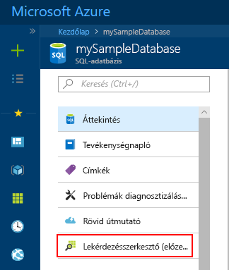
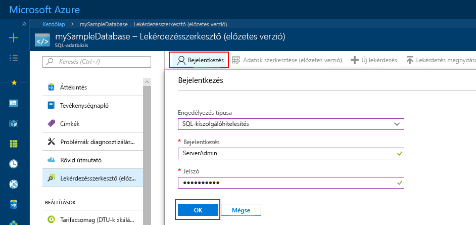
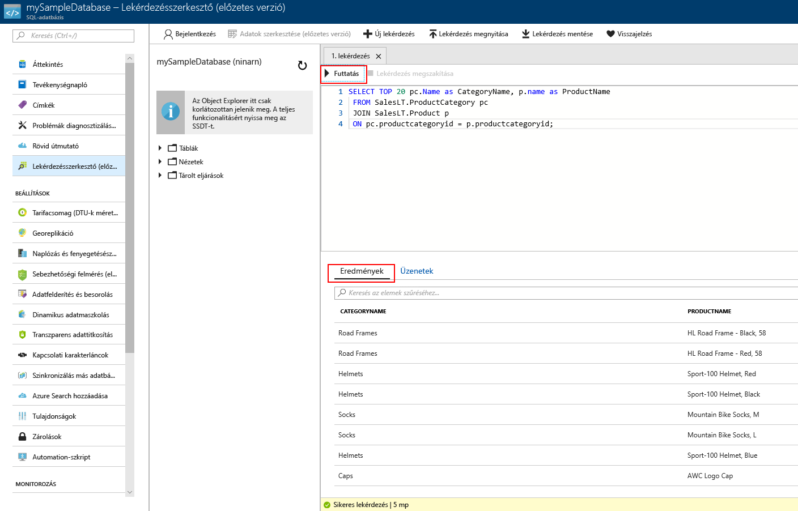

# <a name="azure-portal-use-the-sql-query-editor-to-connect-and-query-data"></a>Azure Portal: Csatlakozás és az adatok lekérdezése az SQL-lekérdezésszerkesztő használatával

Az SQL-lekérdezésszerkesztő egy böngészőből elérhető lekérdezési eszköz, amellyel hatékonyan és egyszerűen hajthat végre SQL-lekérdezéseket az Azure-beli SQL-adatbázison vagy az Azure-beli SQL-adattárházon az Azure Portal elhagyása nélkül. Ez a rövid útmutató ismerteti, hogyan használható a Lekérdezésszerkesztő az SQL-adatbázisokhoz való csatlakozáshoz, majd hogyan lehet Transact-SQL-utasításokkal adatokat lekérdezni, beszúrni, frissíteni és törölni az adatbázisban.

## <a name="prerequisites"></a>Előfeltételek

Ez a rövid útmutató az alábbi rövid útmutatókban létrehozott erőforrásokat használja kiindulási pontként:

[!INCLUDE [prerequisites-create-db](../../includes/sql-database-connect-query-prerequisites-create-db-includes.md)]

> [!NOTE]
> Győződjön meg arról, hogy az SQL Server tűzfalbeállításaiban az „Azure-szolgáltatásokhoz való hozzáférés engedélyezése” beállítás „BE” értékre van állítva. Ez a beállítás hozzáférést biztosít az SQL-lekérdezésszerkesztőnek az adatbázisokhoz és az adattárházakhoz.

## <a name="log-in-to-the-azure-portal"></a>Bejelentkezés az Azure Portalra

Jelentkezzen be az [Azure portálra](https://portal.azure.com/).


## <a name="connect-using-sql-authentication"></a>Csatlakozás SQL-hitelesítés használatával

1. Kattintson az **SQL-adatbázisok** elemre a bal oldali menüben, majd kattintson a lekérdezni kívánt adatbázisra.

2. Az adatbázishoz tartozó SQL Database oldalon keresse meg a **Lekérdezésszerkesztő (előzetes verzió)** elemet a bal oldali menüben, és kattintson rá.

    

3. Kattintson a **Bejelentkezés** elemre, majd amikor a rendszer kéri, válassza ki az **SQL Server-hitelesítés** lehetőséget, és adja meg a kiszolgáló rendszergazdai bejelentkezési nevét és jelszavát, amelyeket az adatbázis létrehozásakor adott meg.

    

4. A **bejelentkezéshez kattintson az OK** gombra.


## <a name="connect-using-azure-ad"></a>Csatlakozás az Azure AD használatával

Az Active Directory-rendszergazda konfigurálása lehetővé teszi, hogy egyetlen identitással jelentkezzen be az Azure Portalra és az SQL-adatbázisba. Kövesse az alábbi lépéseket egy Active Directory-rendszergazda konfigurálásához a létrehozott SQL Server számára.

> [!NOTE]
> Az e-mail-fiókok (például az outlook.com, hotmail.com, live.com, gmail.com, yahoo.com) Active Directory-rendszergazdaként való használata még nem támogatott. Mindenképpen olyan felhasználót használjon, amelyet az Azure Active Directoryban hoztak létre natív módon, vagy összevonták az Azure Active Directoryval.

1. Válassza ki az **SQL Server kiszolgálók** elemet a bal oldali menüben, majd válassza ki az SQL Server kiszolgálóját a kiszolgálólistából.

2. Válassza ki az **Active Directory-rendszergazda** beállítást az SQL Server beállítások menüjében.

3. Az Active Directory-rendszergazda panelen kattintson a **Rendszergazda beállítása** parancsra, majd válassza ki a felhasználót vagy csoportot, amely az Active Directory-rendszergazda lesz majd.

    

4. Az Active Directory-rendszergazda panel tetején kattintson a **Mentés** parancsra az Active Directory-rendszergazda beállításához.

Lépjen a lekérdezni kívánt SQL-adatbázisra, és kattintson az **Adatkezelő (előzetes verzió)** elemre a bal oldali menüben. Megnyílik az Adatkezelő oldal, és automatikusan csatlakozik az adatbázishoz.


## <a name="run-query-using-query-editor"></a>Lekérdezés futtatása a Lekérdezésszerkesztő használatával

A hitelesítés után írja be a következő lekérdezést a Lekérdezésszerkesztő panelén az első 20 termék kategóriánkénti lekérdezéséhez.

```sql
 SELECT TOP 20 pc.Name as CategoryName, p.name as ProductName
 FROM SalesLT.ProductCategory pc
 JOIN SalesLT.Product p
 ON pc.productcategoryid = p.productcategoryid;
```

Kattintson a **Futtatás** gombra, majd tekintse át a lekérdezési eredményeket az **Eredmények** ablaktáblán.



## <a name="insert-data-using-query-editor"></a>Adatok beszúrása a Lekérdezésszerkesztő használatával

A következő kód használatával beszúrhat egy új terméket a SalesLT.Product táblába az [INSERT](https://msdn.microsoft.com/library/ms174335.aspx) Transact-SQL-utasítással.

1. A lekérdezési ablakban cserélje le az előző lekérdezést a következő lekérdezésre:

   ```sql
   INSERT INTO [SalesLT].[Product]
           ( [Name]
           , [ProductNumber]
           , [Color]
           , [ProductCategoryID]
           , [StandardCost]
           , [ListPrice]
           , [SellStartDate]
           )
     VALUES
           ('myNewProduct'
           ,123456789
           ,'NewColor'
           ,1
           ,100
           ,100
           ,GETDATE() );
   ```

2. Az eszköztáron kattintson a **Futtatás** elemre az új sor Product táblába történő beszúrásához.

## <a name="update-data-using-query-editor"></a>Adatok frissítése a Lekérdezésszerkesztő használatával

A következő kód használatával frissítheti az előzőleg hozzáadott új terméket az [UPDATE](https://msdn.microsoft.com/library/ms177523.aspx) Transact-SQL-utasítással.

1. A lekérdezési ablakban cserélje le az előző lekérdezést a következő lekérdezésre:

   ```sql
   UPDATE [SalesLT].[Product]
   SET [ListPrice] = 125
   WHERE Name = 'myNewProduct';
   ```

2. Az eszköztáron kattintson az **Futtatás** elemre a Product tábla egy megadott sorának frissítéséhez.

## <a name="delete-data-using-query-editor"></a>Adatok törlése a Lekérdezésszerkesztő használatával

A következő kód használatával törölheti az előzőleg hozzáadott új terméket a [DELETE](https://msdn.microsoft.com/library/ms189835.aspx) Transact-SQL-utasítással.

1. A lekérdezési ablakban cserélje le az előző lekérdezést a következő lekérdezésre:

   ```sql
   DELETE FROM [SalesLT].[Product]
   WHERE Name = 'myNewProduct';
   ```

2. Az eszköztáron kattintson az **Futtatás** elemre a Product tábla egy megadott sorának törléséhez.


## <a name="query-editor-considerations"></a>Lekérdezésszerkesztési szempontok

Néhány szempontot fontos szem előtt tartani a Lekérdezésszerkesztő használata során:

1. Győződjön meg arról, hogy az Azure SQL Server tűzfalbeállításaiban az „Azure-szolgáltatásokhoz való hozzáférés engedélyezése” beállítást „BE” értékre állította. Ez a beállítás hozzáférést biztosít az SQL-lekérdezésszerkesztőnek az SQL-adatbázisokhoz és az adattárházakhoz.

2. Ha az SQL-kiszolgáló egy virtuális hálózatban van, akkor a Lekéredzésszerkesztővel nem kérdezhetők le a kiszolgálóban lévő adatbázisok.

3. Az F5 billentyű lenyomásával frissíti a Lekérdezésszerkesztő lapját, és elveszti a jelenleg szerkesztett lekérdezést. A lekérdezések végrehajtásához használja az eszköztár Futtatás gombját.

4. A Lekérdezésszerkesztő nem támogatja a főadatbázishoz való csatlakozást

5. A lekérdezés végrehajtására 5 perces időkorlát vonatkozik.

6. Az Azure Active Directory rendszergazdai bejelentkezése nem működik olyan fiókokkal, amelyeken engedélyezve van a kéttényezős hitelesítés.

7. Az e-mail-fiókok (például az outlook.com, hotmail.com, live.com, gmail.com, yahoo.com) Active Directory-rendszergazdaként való használata még nem támogatott. Győződjön meg arról, hogy olyan felhasználót használ, amelyet az Azure Active Directoryban hoztak létre natív módon, vagy összevonták az Azure Active Directoryval

8. A Lekérdezésszerkesztő kizárólag a geográfiai adattípusokhoz tartozó hengervetületet támogatja.

9. Az adatbázistáblákhoz és -nézetekhez tartozó IntelliSense nem támogatott. A szerkesztő azonban támogatja a korábban már beírt nevek automatikus kiegészítését.


## <a name="next-steps"></a>További lépések

- Az Azure SQL-adatbázisokban támogatott Transact-SQL-lel kapcsolatos információkért lásd a [Transact-SQL-lel kapcsolatos különbségek az SQL-adatbázisokban](sql-database-transact-sql-information.md) című cikket.
