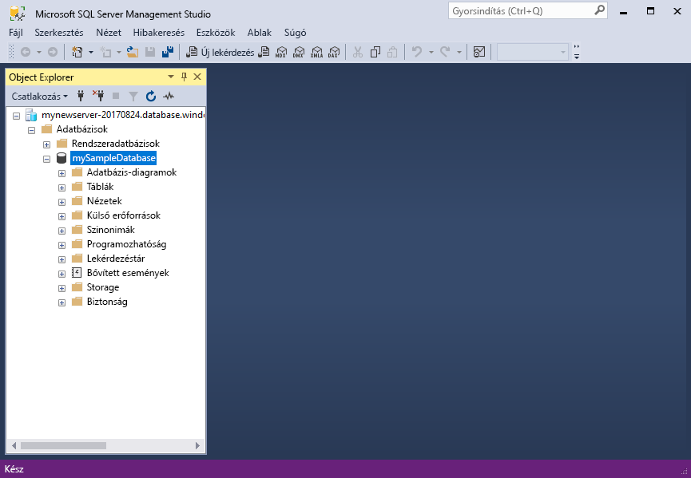

# <a name="azure-sql-database-use-sql-server-management-studio-to-connect-and-query-data"></a>Azure SQL Database: Az SQL Server Management Studio segítségével csatlakozhat és kérdezhet le adatokat

Az [SQL Server Management Studio][ssms-install-latest-84g] (SSMS) egy bármely SQL-infrastruktúra kezelésére alkalmas integrált környezet az SQL Servertől egészen az SQL Database for Microsoft Windowsig. Ez a gyors útmutató azt ismerteti, hogyan használható az SSMS egy Azure SQL Database-adatbázishoz való csatlakozáshoz, és hogyan lehet Transact-SQL-utasításokkal adatokat lekérdezni, beszúrni, frissíteni és törölni az adatbázisban. 

## <a name="prerequisites"></a>Előfeltételek

Ez a rövid útmutató az alábbi rövid útmutatókban létrehozott erőforrásokat használja kiindulási pontként:

[!INCLUDE [prerequisites-create-db](../../includes/sql-database-connect-query-prerequisites-create-db-includes.md)]

#### <a name="install-the-latest-ssms"></a>Az SSMS legújabb verziójának telepítése

A kezdés előtt győződjön meg arról, hogy az [SSMS][ssms-install-latest-84g] legújabb verziója van telepítve. 

## <a name="sql-server-connection-information"></a>Az SQL-kiszolgáló kapcsolatadatai

[!INCLUDE [prerequisites-server-connection-info](../../includes/sql-database-connect-query-prerequisites-server-connection-info-includes.md)]

## <a name="connect-to-your-database"></a>Csatlakozás az adatbázishoz

Az SQL Server Management Studióban építse fel a kapcsolatot az Azure SQL Database kiszolgálóval. 

> [!IMPORTANT]
> Egy Azure SQL Database logikai kiszolgáló figyel az 1433-as porton. Ha vállalati tűzfalon belülről szeretne csatlakozni egy Azure SQL Database logikai kiszolgálóhoz, ennek a portnak nyitva kell lennie a vállalati tűzfalon a sikeres csatlakozáshoz.
>

1. Nyissa meg az SQL Server Management Studiót.

2. A **Connect to Server** (Kapcsolódás a kiszolgálóhoz) párbeszédpanelen adja meg a következő adatokat:

   | Beállítás      | Ajánlott érték    | Leírás | 
   | ------------ | ------------------ | ----------- | 
   | **Kiszolgáló típusa** | Adatbázismotor | Kötelezően megadandó érték. |
   | **Kiszolgálónév** | A teljes kiszolgálónév | A névnek a következőhöz hasonlónak kell lennie: **mynewserver20170313.database.windows.net**. |
   | **Hitelesítés** | SQL Server-hitelesítés | Ebben az oktatóanyagban az SQL-hitelesítésen kívül más hitelesítéstípus nincs konfigurálva. |
   | **Bejelentkezés** | A kiszolgálói rendszergazdafiók | Ezt a fiókot adta meg a kiszolgáló létrehozásakor. |
   | **Jelszó** | A kiszolgálói rendszergazdafiók jelszava | Ezt a jelszót adta meg a kiszolgáló létrehozásakor. |
   ||||

     

3. A **Connect to server** (Kapcsolódás a kiszolgálóhoz) párbeszédpanelen kattintson az **Options** (Beállítások) elemre. A **Connect to database** (Csatlakozás az adatbázishoz) szakaszban adja meg a következőt: **mySampleDatabase** az adatbázishoz való csatlakozáshoz.

     

4. Kattintson a **Connect** (Csatlakozás) gombra. Megnyílik az Object Explorer ablak az SSMS-ben. 

     

5. Az Object Explorerben bontsa ki a **Database** (Adatbázisok), majd a **mySampleDatabese** csomópontot a mintaadatbázisban található objektumok megtekintéséhez.

## <a name="query-data"></a>Adatok lekérdezése

A következő kód használatával lekérdezheti kategóriánként az első 20 terméket a [SELECT](https://msdn.microsoft.com/library/ms189499.aspx) Transact-SQL-utasítással.

1. Az Object Explorerben kattintson a jobb gombbal a **mySampleDatabase** adatbázisra, majd kattintson a **New Query** (Új lekérdezés) elemre. Megnyílik egy, az adatbázishoz csatlakoztatott üres lekérdezési ablak.
2. A lekérdezési ablakban írja be a következő lekérdezést:

   ```sql
   SELECT pc.Name as CategoryName, p.name as ProductName
   FROM [SalesLT].[ProductCategory] pc
   JOIN [SalesLT].[Product] p
   ON pc.productcategoryid = p.productcategoryid;
   ```

3. Az eszköztáron kattintson az **Execute** (Végrehajtás) elemre a Product és ProductCategory táblák adatainak lekérdezéséhez.

    

## <a name="insert-data"></a>Adat beszúrása

A következő kód használatával beszúrhat egy új terméket a SalesLT.Product táblába az [INSERT](https://msdn.microsoft.com/library/ms174335.aspx) Transact-SQL-utasítással.

1. A lekérdezési ablakban cserélje le az előző lekérdezést a következő lekérdezésre:

   ```sql
   INSERT INTO [SalesLT].[Product]
           ( [Name]
           , [ProductNumber]
           , [Color]
           , [ProductCategoryID]
           , [StandardCost]
           , [ListPrice]
           , [SellStartDate]
           )
     VALUES
           ('myNewProduct'
           ,123456789
           ,'NewColor'
           ,1
           ,100
           ,100
           ,GETDATE() );
   ```

2. Az eszköztáron kattintson az **Execute** (Végrehajtás) elemre az új sor Product táblába történő beszúrásához.

    

## <a name="update-data"></a>Adatok frissítése

A következő kód használatával frissítheti az előzőleg hozzáadott új terméket az [UPDATE](https://msdn.microsoft.com/library/ms177523.aspx) Transact-SQL-utasítással.

1. A lekérdezési ablakban cserélje le az előző lekérdezést a következő lekérdezésre:

   ```sql
   UPDATE [SalesLT].[Product]
   SET [ListPrice] = 125
   WHERE Name = 'myNewProduct';
   ```

2. Az eszköztáron kattintson az **Execute** (Végrehajtás) elemre a Product tábla egy megadott sorának frissítéséhez.

    

## <a name="delete-data"></a>Adat törlése

A következő kód használatával törölheti az előzőleg hozzáadott új terméket a [DELETE](https://msdn.microsoft.com/library/ms189835.aspx) Transact-SQL-utasítással.

1. A lekérdezési ablakban cserélje le az előző lekérdezést a következő lekérdezésre:

   ```sql
   DELETE FROM [SalesLT].[Product]
   WHERE Name = 'myNewProduct';
   ```

2. Az eszköztáron kattintson az **Execute** (Végrehajtás) elemre a Product tábla egy megadott sorának törléséhez.

    

## <a name="next-steps"></a>További lépések

- Kiszolgálók és adatbázisok Transact-SQL-lel történő létrehozásáról és kezeléséről az [Azure SQL Database-kiszolgálók és -adatbázisok megismerése](sql-database-servers-databases.md) című cikkből tájékozódhat.
- Az SSMS eszközről további információt [az SQL Server Management Studio használatát ismertető cikkben talál](https://msdn.microsoft.com/library/ms174173.aspx).
- Az Azure Portal használatával történő csatlakozásról és lekérdezésről lásd az [Azure Portal SQL-lekérdezésszerkesztővel végzett csatlakozásról és lekérdezésről](sql-database-connect-query-portal.md) szóló témakört.
- A Visual Studio Code használatával történő csatlakozásról és lekérdezésről lásd a [Visual Studio Code használatával végzett csatlakozásról és lekérdezésről](sql-database-connect-query-vscode.md) szóló témakört.
- A .NET használatával történő csatlakozásról és lekérdezésről lásd a [.NET használatával végzett csatlakozásról és lekérdezésről](sql-database-connect-query-dotnet.md) szóló témakört.
- A PHP-vel történő csatlakozásról és lekérdezésről lásd a [PHP-vel végzett csatlakozásról és lekérdezésről](sql-database-connect-query-php.md) szóló témakört.
- A Node.js használatával történő csatlakozásról és lekérdezésről lásd a [Node.js használatával végzett csatlakozásról és lekérdezésről](sql-database-connect-query-nodejs.md) szóló témakört.
- A Java használatával történő csatlakozásról és lekérdezésről lásd a [Java használatával végzett csatlakozásról és lekérdezésről](sql-database-connect-query-java.md) szóló témakört.
- A Python használatával történő csatlakozásról és lekérdezésről lásd a [Python használatával végzett csatlakozásról és lekérdezésről](sql-database-connect-query-python.md) szóló témakört.
- A Ruby használatával történő csatlakozásról és lekérdezésről lásd a [Ruby használatával végzett csatlakozásról és lekérdezésről](sql-database-connect-query-ruby.md) szóló témakört.


<!-- Article link references. -->

[ssms-install-latest-84g]: https://docs.microsoft.com/sql/ssms/sql-server-management-studio-ssms

