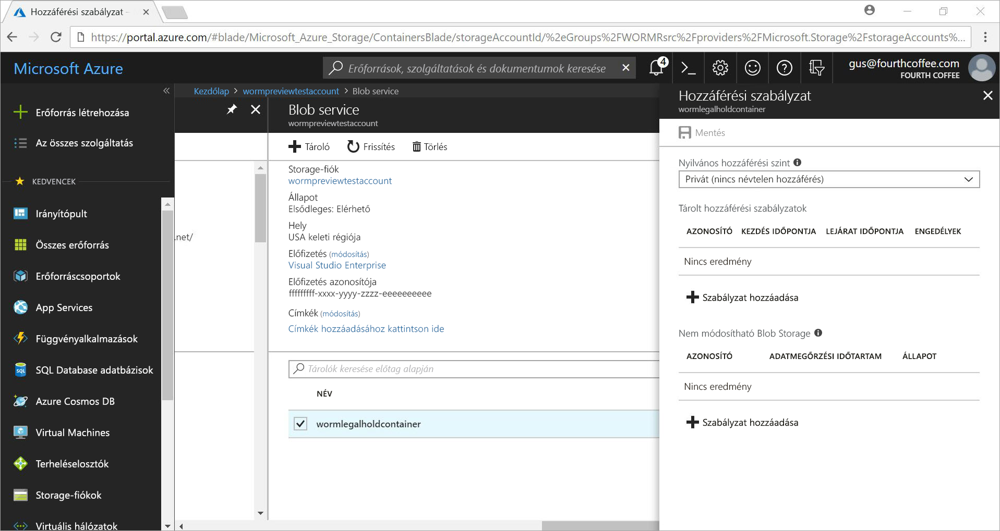
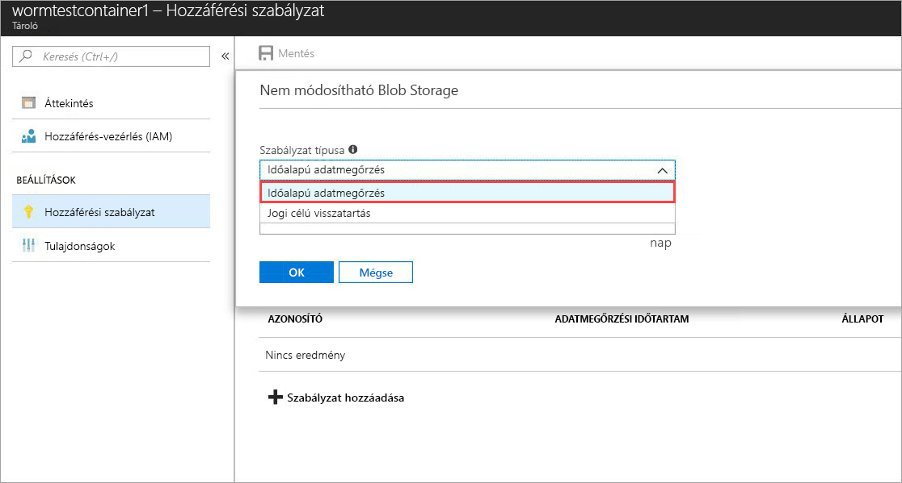
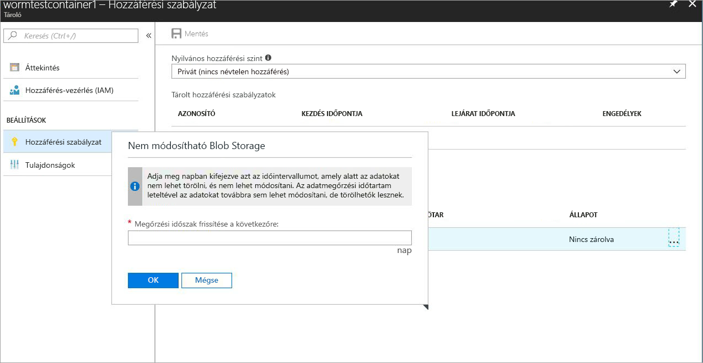
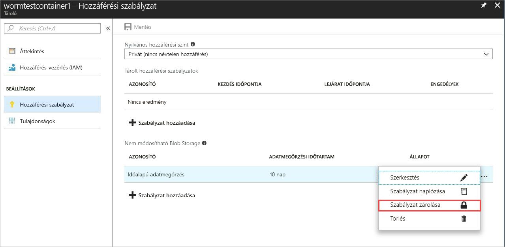
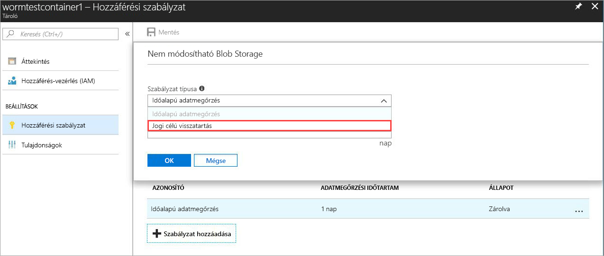

# <a name="immutable-storage-feature-of-azure-blob-storage-preview"></a>Az Azure Blob Storage Immutable Storage (nem módosítható tárolás) funkciója (előzetes verzió)

Az Azure-blobok Immutable Storage (nem módosítható tárolás) funkciója lehetővé teszi a felhasználók számára, hogy fontos üzleti adataikat WORM- (Write Once Read Many, egyszer írható és többször olvasható) állapotban tárolhassák egy Azure Blob-tárolóban. Ebben az állapotban az adatokat a felhasználó által megadott időtartamig nem lehet törölni, és nem lehet módosítani. A megőrzési intervallum alatt a blobokat létre lehet hozni és be lehet olvasni, de nem lehet őket sem módosítani, sem törölni.

## <a name="overview"></a>Áttekintés

A nem módosítható tárolási funkció lehetővé teszi számos szabályozott iparágban tevékenykedő cég, különösen az értékpapír-kereskedők számára, hogy adataikat az SEC 17a-4(f) és egyéb szabályozásokkal összhangban tárolhassák.

Jellemző alkalmazási területek:

- **Előírásoknak való megfelelés**: Az Azure-blobok nem módosítható tárolási funkcióját úgy terveztük, hogy segítse a pénzügyi és ahhoz kapcsolódó iparágban tevékenykedő cégeket az SEC 17a-4(f), a CFTC 1.31©-(d), a FINRA és más szabályozások betartásában.

- **Dokumentumok biztonságos megőrzése**: a felhasználók a lehető legszéleskörűbb adatvédelemben részesülnek, ugyanis a Blob Storage szolgáltatás gondoskodik róla, hogy az adatokat a felhasználók ne módosíthassák vagy törölhessék, még a rendszergazdai jogosultságokkal rendelkező felhasználók sem.

- **Jogi célú visszatartás**: Az Azure-blobok nem módosítható tárolás funkciója lehetővé teszi a felhasználók számára, hogy a bírósági vagy büntetőjogi eljárások szempontjából alapvető fontosságú, kényes információkat feltörésbiztos állapotban tárolhassák a kívánt időtartamig.

A nem módosítható tárolási funkció lehetővé teszi a következőket:

- **Időalapú adatmegőrzési szabályzatok támogatása:** Felhasználók által meghatározott szabályzatok az adatok előre megadott ideig tartó tárolásához.

- **Jogi célú visszatartási szabályzatok támogatása:** Ha a kívánt adatmegőrzési időtartam nem ismert, a felhasználók jogi célú visszatartást is beállíthatnak az adatok nem módosítható tárolása érdekében, amely a jogi zárolás feloldásáig marad érvényben.  Jogi célú visszatartás esetén a blobokat létre lehet hozni és be lehet olvasni, de nem lehet őket sem módosítani, sem törölni. A rendszer minden jogi célú visszatartáshoz egy felhasználó által megadott alfanumerikus címkét rendel, amely azonosító sztringként funkcionál (mint egy esetazonosító).

- **Támogatás minden blobszinthez:** A WORM-szabályzatok az Azure Blob Storage-szintektől függetlenek, és minden szintre vonatkoznak, legyen az ritka elérésű, gyakori elérésű vagy archív. Ez lehetővé teszi az ügyfelek számára, hogy a számítási feladataik szempontjából leginkább költségoptimalizált szinten tárolhassák adataikat, amellett, hogy az adataikat továbbra sem lehet módosítani.

- **Tárolószintű konfiguráció:** A nem módosítható tárolási funkció segítségével a felhasználóknak lehetősége nyílik az időalapú adatmegőrzési szabályzat és a jogi célú visszatartási címkék konfigurálására a tárolók szintjén.  Az egyszerű tárolószintű beállítások segítségével a felhasználók létrehozhatnak és lezárhatnak időalapú adatmegőrzési szabályzatokat, meghosszabbíthatják a megőrzési időtartamot, célú visszatartást állíthatnak be vagy oldhatnak fel, és más műveleteket is végezhetnek.  Ezek a szabályzatok a tárolóban található összes blobra vonatkoznak, a meglévőkre és az újakra is.

- **Naplózási támogatás:** Minden tárolóhoz tartozik egy auditnapló, amely legfeljebb öt időalapú adatmegőrzési parancsot jelenít meg a legfeljebb három megőrzésiidőtartam-hosszabbítási bejegyzéssel rendelkező zárolt időalapú adatmegőrzési szabályzatokhoz.  Az időalapú adatmegőrzések esetében a naplóbejegyzés tartalmazza a felhasználói azonosítót, a parancs típusát, az időbélyegeket és a megőrzési időtartamot. A jogi célú visszatartások esetében a bejegyzés tartalmazza a felhasználói azonosítót, a parancs típusát, az időbélyegeket és a jogi céllal történő zárolás címkéit. Az SEC 17a-4(f) szabályozási irányelveknek megfelelően a bejegyzés mindaddig megőrzésre kerül, amíg a tároló létezik. A vezérlősík összes tevékenységét tartalmazó átfogóbb naplót az [Azure tevékenységnaplóban](https://docs.microsoft.com/azure/monitoring-and-diagnostics/monitoring-overview-activity-logs) talál. A felhasználó felelőssége, hogy gondoskodjon a naplók állandó tárolásáról, mivel szabályozási és egyéb célból is szükség lehet rájuk.

 Ez a funkció minden nyilvános Azure-régióban elérhető.

## <a name="how-it-works"></a>Működés

Az Azure-blobok nem módosítható tárolási funkciója két típusú WORM vagy nem módosítható szabályzatot támogat: az időalapú adatmegőrzést és a jogi célú visszatartást. A nem módosítható szabályzatok létrehozásáról további információkat az [Első lépések](#Getting-started) fejezetben talál.
Amikor egy időalapú adatmegőrzési szabályzatot vagy egy jogi célú visszatartást állít be egy tárolón, minden meglévő blob nem módosítható állapotúvá válik (azaz írás- és törlésvédett lesz). A tárolóba feltöltött összes új blob szintén nem módosítható állapotúvá válik.

> [!IMPORTANT]
> Az SEC 17a-4(f) és más szabályozásoknak való megfelelés érdekében a blobnak nem módosítható (írás- és törlésvédett) állapotban kell lennie. Ehhez *zárolni* kell egy időalapú adatmegőrzési szabályzatot. Javasoljuk, hogy a szabályzatot észszerű időtartamon, általában 24 órán belül zárolja. A *zárolatlan* állapot használatát semmilyen célra nem javasoljuk az egyes funkciók rövidtávú, próba jellegű használatának kivételével.

 Amikor egy időalapú adatmegőrzési szabályzatot alkalmaz egy tárolón, a tárolóban található összes blob nem módosítható állapotban marad a *tényleges* adatmegőrzési időtartam alatt. A meglévő blobok esetében a tényleges adatmegőrzési időtartam megegyezik a blob létrehozási ideje és a felhasználó által megadott megőrzési intervallum különbözetével. Az új blobok esetében az adatmegőrzési időtartam egyenlő a felhasználó által megadott adatmegőrzési intervallummal. Mivel a felhasználóknak lehetősége van megváltoztatni az adatmegőrzési időtartamot, így a felhasználó által legutoljára megadott adatmegőrzési időtartam lesz mérvadó a tényleges megőrzési időtartam kiszámolásakor.

> [!TIP]
> Például: A felhasználó létrehoz egy öt éves adatmegőrzési intervallummal bíró időalapú adatmegőrzési szabályzatot.
> Adott egy létező blob, a testblob1, az érintett tárolóban, amelyet egy évvel korábban hoztak létre. Így a testblob1 esetében a tényleges adatmegőrzési idő négy év lesz.
> Egy új blob, a testblob2, feltöltésre kerül a tárolóba. Az új blob tényleges megőrzési időtartama öt év lesz.

### <a name="legal-holds"></a>Jogi célú visszatartások

A jogi célú visszatartások esetén minden már létező és újonnan létrehozott blob nem módosítható állapotban marad, amíg a jogi célú visszatartás feloldásra nem kerül.
A jogi célú visszatartások beállításáról és feloldásáról további információkat az [Első lépések](#Getting-started) fejezetben talál.

A tároló jogi célú visszatartással és időalapú adatmegőrzési szabályzattal is rendelkezhet egyszerre. Az adott tárolóban található összes blob nem módosítható állapotban marad, amíg az összes jogi célú visszatartás feloldásra nem kerül, még ha azok tényleges adatmegőrzési időtartama le is jár. Ugyanekkor egy blob addig nem módosítható állapotban marad, amíg a tényleges megőrzési időtartam le nem jár, még a jogi célú visszatartások feloldását követően is.
Az alábbi táblázat a különböző nem módosítható forgatókönyvek esetén letiltott blobművelet-típusokat mutatja be.
Tekintse át az [Azure Blob Service API](https://docs.microsoft.com/rest/api/storageservices/blob-service-rest-api) dokumentációját a Blob REST API-jával kapcsolatos részletes információkért.

|Forgatókönyv  |Blob állapota  |Nem engedélyezett blobműveletek  |
|---------|---------|---------|
|A blob tényleges adatmegőrzési időtartama még nem járt le és/vagy jogi célú visszatartás van érvényben     |Nem módosítható: törlés- és írásvédett         |Delete Container, Delete Blob, Put Blob1, Put Block, Put Block List, Set Blob Metadata, Put Page, Set Blob Properties, Snapshot Blob, Incremental Copy Blob, Append Block         |
|A blobon beállított tényleges megőrzési időtartam lejárt     |Csak írásvédett (a törlési műveletek engedélyezettek)         |Put Blob, Put Block, Put Block List, Set Blob Metadata, Put Page, Set Blob Properties, Snapshot Blob, Incremental Copy Blob, Append Block         |
|A tárolón semmilyen jogi célú visszatartás és időalapú adatmegőrzési szabályzat nem érvényesül     |Változtatható         |None         |
|Nincs WORM-szabályzat (időalapú adatmegőrzés vagy jogi célú visszatartás) létrehozva     |Változtatható         |None         |

> [!NOTE]
> A blob létrehozásához szükséges első Put Blob, illetve Put Block List és Put Block műveletek a fenti listán szereplő első két forgatókönyvben engedélyezve vannak, de az ezeket követő összes további művelet tiltott.
> A nem módosítható tárolási funkció csak a GPv2-ben érhető el, a Blob Storage-fiókokat pedig az [Azure Resource Manageren](https://docs.microsoft.com/azure/azure-resource-manager/resource-group-overview) keresztül kell létrehozni.

## <a name="pricing"></a>Díjszabás

A funkció felár nélkül használható, a nem módosítható adatok árazása pedig megegyezik a módosítható adatokéval. A vonatkozó díjszabási információk megtekintéséhez látogasson el az [Azure Storage díjszabását tartalmazó oldalra](https://azure.microsoft.com/pricing/details/storage/blobs/).

### <a name="restrictions"></a>Korlátozások

A nyilvános előzetes verzió használatára a következő korlátozások érvényesek:

- **Ne tároljon kulcsfontosságú termelési vagy üzleti adatokat**
- Az előzetes verziókra vonatkozó és a titoktartási szerződésekben foglalt minden korlátozás érvényes

## <a name="getting-started"></a>Első lépések

Az Azure-blobok Azure Immutable Storage (nem módosítható tárolás) funkcióját az [Azure Portal](http://portal.azure.com), az Azure [CLI 2.0](https://docs.microsoft.com/cli/azure/install-azure-cli?view=azure-cli-latest) és az Azure [PowerShell](https://github.com/Azure/azure-powershell/releases/tag/Azure.Storage.v4.4.0-preview-May2018) legújabb verziói is támogatják.

### <a name="azure-portal"></a>Azure Portal

1. Hozzon létre egy új tárolót, vagy válasszon ki egy már meglévőt a nem módosítható állapotban tartandó blobok tárolására.
 A tárolónak egy GPv2-tárfiókban kell lennie.
2. Kattintson a Hozzáférési szabályzat elemre a Tároló beállításai pontnál, majd kattintson a **+ Szabályzat hozzáadása** lehetőségre a **Nem módosítható blobtároló** szabályzat alatt az alábbi ábrának megfelelően.

    

3. Az időalapú adatmegőrzés engedélyezéséhez válassza az Időalapú adatmegőrzés lehetőséget a legördülő menüben.

    

4. Adja meg a kívánt adatmegőrzési időtartamot napokban (legalább egy nap).

    

    Ahogy azt fent is láthatja, a szabályzat állapota alapértelmezés szerint zárolatlan. Így kisebb adatmegőrzési időtartammal is tesztelheti a funkciót, és változtatásokat eszközölhet a szabályzatban, mielőtt zárolná. A zárolás elengedhetetlen az SEC 17a-4 és más szabályozásoknak való megfelelés érdekében.

5. Zárolja a szabályzatot úgy, hogy a jobb egérgombbal a ... gombra kattint. Ekkor a következő menü jelenik meg:

    

    Kattintson a Szabályzat zárolása gombra. Ezt követően a szabályzat állapota zároltra változik. A szabályzatot a zárolást követően nem lehet törölni, és csak a megőrzési időtartam meghosszabbítására van lehetőség.

6. A jogi célú visszatartások engedélyezéséhez kattintson a + Szabályzat hozzáadása elemre, és válassza a Jogi célú visszatartás lehetőségét a legördülő menüben.

    

7. Hozzon létre egy egy vagy több címkével rendelkező jogi célú visszatartást.

    

### <a name="cli-20"></a>CLI 2.0

Telepítse a [CLI-bővítményt](http://docs.microsoft.com/cli/azure/install-azure-cli?view=azure-cli-latest) az `az extension add -n storage-preview` paranccsal.

Ha már telepítette a bővítményt, használja a következő parancsot a nem módosítható tárolási funkció engedélyezéséhez: `az extension update -n storage-preview`

A következő parancscsoportok tartalmazzák a funkciót (a parancsok megtekintéséhez futtassa rajtuk a „-h”-t): `az storage container immutability-policy` és `az storage container legal-hold`.

### <a name="powershell"></a>PowerShell

A nem módosítható tárolási funkciót a [PowerShell 4.4.0-s előzetes verziója](https://github.com/Azure/azure-powershell/releases/tag/Azure.Storage.v4.4.0-preview-May20180) is támogatja.
A funkció engedélyezéséhez kövesse a következő lépéseket:

1. Az `Install-Module PowerShellGet –Repository PSGallery –Force` használatával győződjön róla meg, hogy a PowerShellGet legújabb verziója van telepítve.
2. Távolítsa el az Azure PowerShell összes korábbi verzióját.
3. Telepítse az AzureRM szolgáltatást (az Azure hasonlóképpen telepíthető ebből az adattárból): `Install-Module AzureRM –Repository PSGallery –AllowClobber`
4. Telepítse a tároló-felügyeleti sík parancsmagjainak előzetes verzióját: `Install-Module -Name AzureRM.Storage -AllowPrerelease -Repository PSGallery -AllowClobber`

Alább talál egy PowerShell-mintakódot, amely bemutatja a funkció használatát.

## <a name="client-libraries"></a>Ügyfélkódtárak

Az Azure-blobok nem módosítható tárolási funkcióját az ügyfélkódtárak következő kiadásai támogatják

- [.net-ügyfélkódtár (7.2.0-s előzetes vagy annál újabb verziók)](https://www.nuget.org/packages/Microsoft.Azure.Management.Storage/7.2.0-preview)
- [node.js-ügyfélkódtár (4.0.0-s vagy annál újabb verziók)](https://www.npmjs.com/package/azure-arm-storage)
- [Python-ügyfélkódtár (2.0.0 Release Candidate 2 és újabb verziók)](https://pypi.org/project/azure-mgmt-storage/2.0.0rc1/)

## <a name="supported-values"></a>Támogatott értékek

- A minimális megőrzési időtartam egy nap, a maximális 400 év
- Egy adott tárfiókban legfeljebb 1000 olyan tároló lehet, amelyre zárolt nem módosítható szabályzat vonatkozik
- Egy adott tárfiókban legfeljebb 1000 olyan tároló lehet, amelyre jogi célú visszatartás vonatkozik
- Egy adott tárolóhoz legfeljebb 10 jogi célú visszatartási címkét lehet megadni
- A jogi célú visszatartási címke maximális hossza 23, minimális hossza pedig három alfanumerikus karakter
- Egy adott tárolóban a zárolt nem módosítható szabályzatok adatmegőrzési időtartamát legfeljebb háromszor lehet módosítani
- Egy zárolt nem módosítható szabályzattal rendelkező tároló esetében a tároló létezésének időtartama során legfeljebb öt olyan napló őrizhető meg, amely időalapú adatmegőrzési szabályzatra, és legfeljebb 10, amely jogi célú visszatartási szabályzatra vonatkozik.

## <a name="faq"></a>GYIK

**Kizárólag blokkblobokhoz, vagy lap- és hozzáfűző blobokhoz is alkalmazható a funkció?**

A nem módosítható tárolási funkció minden blobtípushoz alkalmazható.  Érdemes azonban figyelembe venni, hogy a használatát leginkább a blokkblobokhoz ajánljuk. A blokkbloboktól eltérően a lap- és a hozzáfűző blobokat a WORM-tárolón kívül kell létrehozni, és csak ezután lehet őket bemásolni.  A WORM-tárolóba történő bemásolást követően nem lehet további *hozzáfűzéseket* hozzáadni a hozzáfűző blobokhoz, és a lapblobok további módosítása sem engedélyezett.

**Minden egyes alkalommal új tárfiókot kell létrehoznom a funkció használatához?**

A nem módosítható tárolási funkciót bármely már létező GPv2-fiókkal vagy újonnan létrehozott tárfiókkal használhatja, ha a fiók típusa GPv2. Jelenleg a funkció csak blobtárolókhoz érhető el.

**Mi történik, ha megpróbálok törölni egy tárolót, amelyre *zárolt* időalapú adatmegőrzési szabályzat vagy jogi célú visszatartás vonatkozik?**

A tároló törlési művelete sikertelen lesz, ha a tároló legalább egy olyan blobot tartalmaz, amelyen zárolt időalapú adatmegőrzési szabályzat vagy jogi célú visszatartás van beállítva. Ez az adatok [helyreállítható törlése](storage-blob-soft-delete.md) esetén is igaz. A tároló törlési művelete sikeres lesz, ha nincs benne aktív adatmegőrzési időtartammal és jogi célú visszatartással beállított blob. A tároló törlése előtt törölnie kell a blobokat. 

**Mi történik, ha megpróbálok törölni egy olyan WORM-tárolót tartalmazó tárfiókot, amelyre *zárolt* időalapú adatmegőrzési szabályzat vagy jogi célú visszatartás vonatkozik?**

A tárfiók törlése sikertelen lesz, ha legalább egy jogi célú visszatartással ellátott WORM-tárolót vagy aktív adatmegőrzési időtartammal rendelkező blobot tartalmaz.  A tárfiók törlése előtt minden WORM-tárolót törölni kell.  A tárolók törlésével kapcsolatos további információkért tekintse meg az előző kérdést.

**Áthelyezhetem az adatokat különböző blobrétegek között (gyakran, ritkán és alig használt rétegek), ha a blob nem módosítható állapotban van?**

Igen, a Blobszint beállítása parancs segítségével úgy helyezheti át az adatokat a blobrétegek között, hogy azok nem módosítható állapotban maradnak. A nem módosítható tárolási funkció a gyakran, ritkán és alig használt blobrétegek esetében is támogatott.

**Mi történik, ha elmulasztok fizetni, és a megőrzési időtartam még nem járt le?**

Elmaradt fizetés esetén a normál adatmegőrzési szabályzat lép érvénybe a Microsofttal kötött szerződés feltételei és kikötései alapján meghatározott türelmi idő lejárta után.

**Létezik a funkció kipróbálására lehetőséget biztosító ingyenes próba- vagy türelmi időszak?**

Igen, az időalapú adatmegőrzési szabály első létrehozásakor az *zárolatlan* állapotban lesz. Ebben az állapotban bármilyen kívánt változtatást eszközölhet az adatmegőrzési időtartammal kapcsolatban, például meghosszabbíthatja vagy lerövidítheti, de akár törölheti is a szabályzatot, ha szeretné. A szabályzat a zárolását követően véglegesen zárolt állapotban marad a törlés megelőzése érdekében. Ekkor már a megőrzési időtartam csökkentésére sincs lehetőség. Határozottan javasoljuk, hogy a *zárolatlan* állapotot kizárólag kipróbálás céljából használja, és 24 órán belül zárolja a szabályzatot, hogy ne kockáztassa az SEC 17a-4(f) és más szabályozásoknak való meg nem felelést.

**A szolgáltatás országos és kormányzati felhőkben is elérhető?**

A nem módosítható tárolási funkció kizárólag a nyilvános Azure-régiókban érhető el. Ha kérdései vannak egy adott országos felhővel kapcsolatban, küldjön e-mailt a következő címre: azurestoragefeedback@microsoft.com.

## <a name="sample-code"></a>Mintakód

Alább referenciaként megadunk egy PowerShell-mintaszkriptet.
Ez a szkript létrehoz egy új tárfiókot és tárolót, majd bemutatja, hogy a felhasználó hogyan állíthat be és oldhat fel jogi célú visszatartásokat, hogyan hozhat létre és zárolhat időalapú megőrzési (azaz módosíthatatlansági) szabályzatokat, és hogyan hosszabbíthatja meg a megőrzési időtartamot.

```powershell
\$ResourceGroup = "\<Enter your resource group\>”

\$StorageAccount = "\<Enter your storage account name\>"

\$container = "\<Enter your container name\>"

\$container2 = "\<Enter another container name\>”

\$location = "\<Enter the storage account location\>"

\# Login to the Azure Resource Manager Account

Login-AzureRMAccount

Register-AzureRmResourceProvider -ProviderNamespace "Microsoft.Storage"

\# Create your Azure Resource Group

New-AzureRmResourceGroup -Name \$ResourceGroup -Location \$location

\# Create your Azure storage account

New-AzureRmStorageAccount -ResourceGroupName \$ResourceGroup -StorageAccountName
\$StorageAccount -SkuName Standard_LRS -Location \$location -Kind Storage

\# Create a new container

New-AzureRmStorageContainer -ResourceGroupName \$ResourceGroup
-StorageAccountName \$StorageAccount -Name \$container

\# Create Container 2 with Storage Account object

\$accountObject = Get-AzureRmStorageAccount -ResourceGroupName \$ResourceGroup
-StorageAccountName \$StorageAccount

New-AzureRmStorageContainer -StorageAccount \$accountObject -Name \$container2

\# Get container

Get-AzureRmStorageContainer -ResourceGroupName \$ResourceGroup
-StorageAccountName \$StorageAccount -Name \$container

\# Get Container with Account object

\$containerObject = Get-AzureRmStorageContainer -StorageAccount \$accountObject
-Name \$container

\#list container

Get-AzureRmStorageContainer -ResourceGroupName \$ResourceGroup
-StorageAccountName \$StorageAccount

\#remove container (Add -Force to dismiss prompt)

Remove-AzureRmStorageContainer -ResourceGroupName \$ResourceGroup
-StorageAccountName \$StorageAccount -Name \$container2

\#with Account object

Remove-AzureRmStorageContainer -StorageAccount \$accountObject -Name
\$container2

\#with Container object

\$containerObject2 = Get-AzureRmStorageContainer -StorageAccount \$accountObject
-Name \$container2

Remove-AzureRmStorageContainer -InputObject \$containerObject2

\#Set LegalHold

Add-AzureRmStorageContainerLegalHold -ResourceGroupName \$ResourceGroup
-StorageAccountName \$StorageAccount -Name \$container -Tag tag1,tag2

\#with Account object

Add-AzureRmStorageContainerLegalHold -StorageAccount \$accountObject -Name
\$container -Tag tag3

\#with Container object

Add-AzureRmStorageContainerLegalHold -Container \$containerObject -Tag tag4,tag5

\#Clear LegalHold

Remove-AzureRmStorageContainerLegalHold -ResourceGroupName \$ResourceGroup
-StorageAccountName \$StorageAccount -Name \$container -Tag tag2

\#with Account object

Remove-AzureRmStorageContainerLegalHold -StorageAccount \$accountObject -Name
\$container -Tag tag3,tag5

\#with Container object

Remove-AzureRmStorageContainerLegalHold -Container \$containerObject -Tag tag4

\# create/update ImmutabilityPolicy

\#\# with account/container name

Set-AzureRmStorageContainerImmutabilityPolicy -ResourceGroupName \$ResourceGroup
-StorageAccountName \$StorageAccount -ContainerName \$container
-ImmutabilityPeriod 10

\#with Account object

Set-AzureRmStorageContainerImmutabilityPolicy -StorageAccount \$accountObject
-ContainerName \$container -ImmutabilityPeriod 1 -Etag \$policy.Etag

\#with Container object

\$policy = Set-AzureRmStorageContainerImmutabilityPolicy -Container
\$containerObject -ImmutabilityPeriod 7

\#\# with ImmutabilityPolicy object

Set-AzureRmStorageContainerImmutabilityPolicy -ImmutabilityPolicy \$policy
-ImmutabilityPeriod 5

\#get ImmutabilityPolicy

Get-AzureRmStorageContainerImmutabilityPolicy -ResourceGroupName \$ResourceGroup
-StorageAccountName \$StorageAccount -ContainerName \$container

\#with Account object

Get-AzureRmStorageContainerImmutabilityPolicy -StorageAccount \$accountObject
-ContainerName \$container

\#with Container object

Get-AzureRmStorageContainerImmutabilityPolicy -Container \$containerObject

\#Lock ImmutabilityPolicy (Add -Force to dismiss prompt)

\#\# with ImmutabilityPolicy object

\$policy = Get-AzureRmStorageContainerImmutabilityPolicy -ResourceGroupName
\$ResourceGroup -StorageAccountName \$StorageAccount -ContainerName \$container

\$policy = Lock-AzureRmStorageContainerImmutabilityPolicy -ImmutabilityPolicy
\$policy -force

\#\# with account/container name

\$policy = Lock-AzureRmStorageContainerImmutabilityPolicy -ResourceGroupName
\$ResourceGroup -StorageAccountName \$StorageAccount -ContainerName \$container
-Etag \$policy.Etag

\#with Account object

\$policy = Lock-AzureRmStorageContainerImmutabilityPolicy -StorageAccount
\$accountObject -ContainerName \$container -Etag \$policy.Etag

\#with Container object

\$policy = Lock-AzureRmStorageContainerImmutabilityPolicy -Container
\$containerObject -Etag \$policy.Etag -force

\#Extend ImmutabilityPolicy

\#\# with ImmutabilityPolicy object

\$policy = Get-AzureRmStorageContainerImmutabilityPolicy -ResourceGroupName
\$ResourceGroup -StorageAccountName \$StorageAccount -ContainerName \$container

\$policy = Set-AzureRmStorageContainerImmutabilityPolicy -ImmutabilityPolicy
\$policy -ImmutabilityPeriod 11 -ExtendPolicy

\#\# with account/container name

\$policy = Set-AzureRmStorageContainerImmutabilityPolicy -ResourceGroupName
\$ResourceGroup -StorageAccountName \$StorageAccount -ContainerName \$container
-ImmutabilityPeriod 11 -Etag \$policy.Etag -ExtendPolicy

\#with Account object

\$policy = Set-AzureRmStorageContainerImmutabilityPolicy -StorageAccount
\$accountObject -ContainerName \$container -ImmutabilityPeriod 12 -Etag
\$policy.Etag -ExtendPolicy

\#with Container object

\$policy = Set-AzureRmStorageContainerImmutabilityPolicy -Container
\$containerObject -ImmutabilityPeriod 13 -Etag \$policy.Etag -ExtendPolicy

\#Remove ImmutabilityPolicy (Add -Force to dismiss prompt)

\#\# with ImmutabilityPolicy object

\$policy = Get-AzureRmStorageContainerImmutabilityPolicy -ResourceGroupName
\$ResourceGroup -StorageAccountName \$StorageAccount -ContainerName \$container

Remove-AzureRmStorageContainerImmutabilityPolicy -ImmutabilityPolicy \$policy

\#\# with account/container name

Remove-AzureRmStorageContainerImmutabilityPolicy -ResourceGroupName
\$ResourceGroup -StorageAccountName \$StorageAccount -ContainerName \$container
-Etag \$policy.Etag

\#with Account object

Remove-AzureRmStorageContainerImmutabilityPolicy -StorageAccount \$accountObject
-ContainerName \$container -Etag \$policy.Etag

\#with Container object

Remove-AzureRmStorageContainerImmutabilityPolicy -Container \$containerObject
-Etag \$policy.Etag
```
