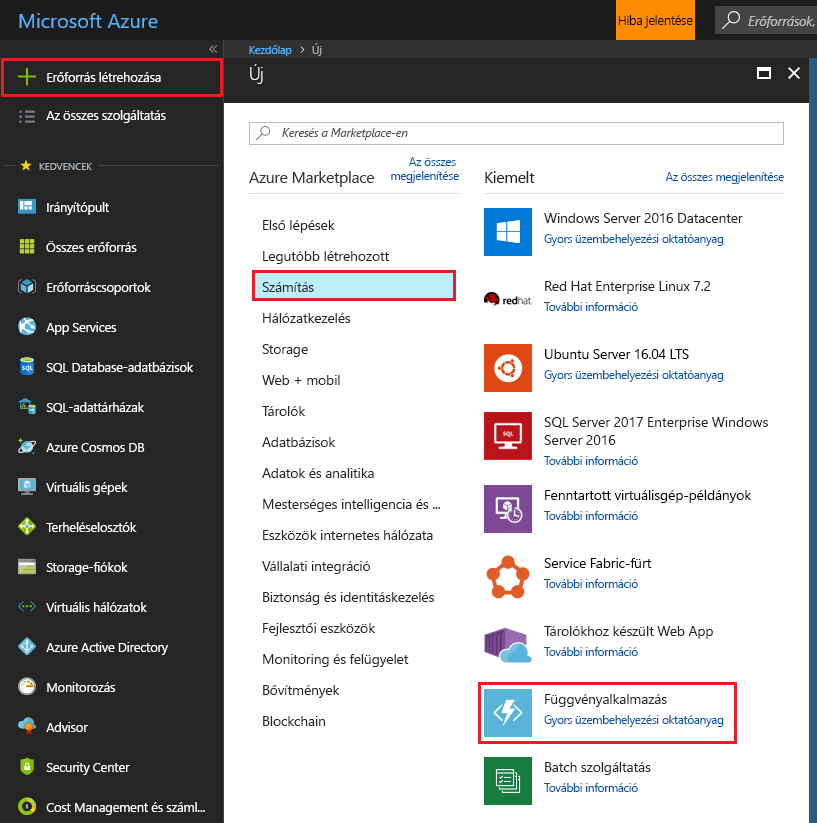

1. Válassza az Azure Portal bal felső sarkában található **Új** gombot, majd válassza a **Számítás** > **Függvényalkalmazás** lehetőséget. 

    

2. Használja az ábra alatti táblázatban megadott függvényalkalmazás-beállításokat.

    

    | Beállítás      | Ajánlott érték  | Leírás                                        |
    | ------------ |  ------- | -------------------------------------------------- |
    | **Alkalmazás neve** | Globálisan egyedi név | Az új függvényalkalmazást azonosító név. Érvényes karakterek: `a-z`, `0-9` és `-`.  | 
    | **Előfizetés** | Az Ön előfizetése | Az előfizetés, amelyben létrehozta az új függvényalkalmazást. | 
    | **[Erőforráscsoport](../articles/azure-resource-manager/resource-group-overview.md)** |  myResourceGroup | Az új erőforráscsoport neve, amelyben létrehozza a függvényalkalmazást. | 
    | **OS** | Windows | A kiszolgáló nélküli üzemeltetés jelenleg csak Windows rendszeren történő futtatás esetében érhető el. Linuxon való üzemeltetés esetében: [Az első függvény létrehozása Linux rendszerben az Azure CLI használatával](../articles/azure-functions/functions-create-first-azure-function-azure-cli-linux.md). |
    | **[Szolgáltatási csomag](../articles/azure-functions/functions-scale.md)** | Használatalapú csomag | Szolgáltatási csomag, amely meghatározza az erőforrások lefoglalását a függvényalkalmazáshoz. Az alapértelmezett **használatalapú csomagban** az erőforrások hozzáadása dinamikusan történik a függvények igényeinek megfelelően. Ebben a [kiszolgáló nélküli](https://azure.microsoft.com/overview/serverless-computing/) üzemeltetésben, csak azért az időért fizet, amikor futnak a függvényei. Ha App Service-csomagot használ, foglalkoznia kell a [függvényalkalmazás méretezésével](../articles/azure-functions/functions-scale.md).  |
    | **Hely** | Nyugat-Európa | Válasszon egy [régiót](https://azure.microsoft.com/regions/) a közelben, vagy a függvények által elért más szolgáltatások közelében. |
    | **[Tárfiók](../articles/storage/common/storage-quickstart-create-account.md)** |  Globálisan egyedi név |  A függvényalkalmazás által használt új tárfiók neve. A tárfiókok neve 3–24 karakter hosszúságú lehet, és csak számokból és kisbetűkből állhat. Meglévő fiókot is használhat, amennyiben az megfelel a [tárfiókokra vonatkozó követelményeknek](../articles/azure-functions/functions-scale.md#storage-account-requirements). |

3. Kattintson a **Létrehozás** elemre a függvényalkalmazás kiépítéséhez és üzembe helyezéséhez.

4. Válassza a portál jobb felső sarkában található Értesítések ikont, és várja meg az **üzembe helyezés sikerességét** jelző üzenetet. 

    

5. Az új függvényalkalmazás megtekintéséhez válassza az **Erőforrás megnyitása** lehetőséget.

> [!TIP]
> Ha nem találja a portálon a függvényalkalmazásokat, próbáljon [Függvényalkalmazásokat felvenni a kedvencek közé az Azure Portalon](../articles/azure-functions/functions-how-to-use-azure-function-app-settings.md#favorite).   
