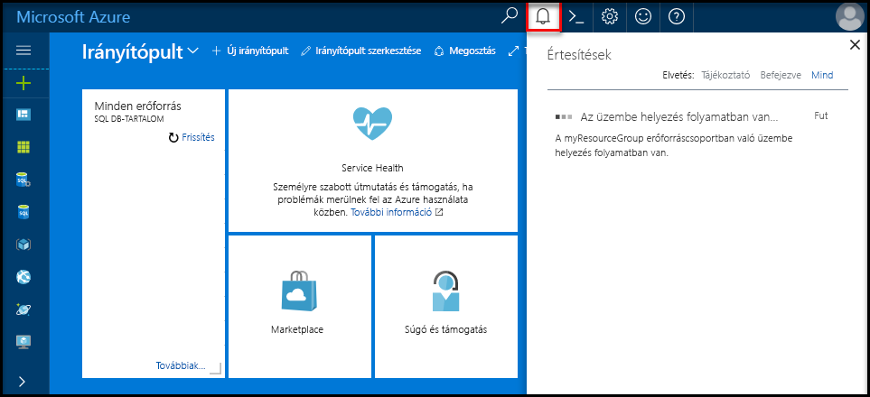

## Bejelentkezés az Azure Portalra

Jelentkezzen be az [Azure portálra](https://portal.azure.com/).

## Üres SQL-adatbázis létrehozása

Az Azure SQL-adatbázis [számítási és tárolási erőforrások](../articles/sql-database/sql-database-service-tiers.md) egy meghatározott készletével együtt jön létre. Az adatbázis egy [Azure-erőforráscsoporton](../articles/azure-resource-manager/resource-group-overview.md) belül egy [Azure SQL Database logikai kiszolgálón](../articles/sql-database/sql-database-features.md) jön létre. 

Kövesse az alábbi lépéseket egy üres SQL-adatbázis létrehozásához. 

1. Kattintson az Azure Portal bal felső sarkában található **Erőforrás létrehozása** gombra.

2. Az **Új** oldalon válassza az **Adatbázisok** lehetőséget, majd az **Új** oldal **SQL Database** területén válassza a **Létrehozás** lehetőséget.

   

3. Töltse ki az SQL Database űrlapját a következő információkkal az előző képen látható módon:   

   | Beállítás       | Ajánlott érték | Leírás | 
   | ------------ | ------------------ | ------------------------------------------------- | 
   | **Adatbázis neve** | mySampleDatabase | Az érvényes adatbázisnevekkel kapcsolatban lásd az [adatbázis-azonosítókat](https://docs.microsoft.com/sql/relational-databases/databases/database-identifiers) ismertető cikket. | 
   | **Előfizetés** | Az Ön előfizetése  | Az előfizetései részleteivel kapcsolatban lásd az [előfizetéseket](https://account.windowsazure.com/Subscriptions) ismertető cikket. |
   | **Erőforráscsoport** | myResourceGroup | Az érvényes erőforráscsoport-nevekkel kapcsolatban lásd az [elnevezési szabályokat és korlátozásokat](https://docs.microsoft.com/azure/architecture/best-practices/naming-conventions) ismertető cikket. |
   | **Forrás kiválasztása** | Üres adatbázis | Meghatározza, hogy egy üres adatbázist kell létrehozni. |

4. Kattintson a **Kiszolgáló** lehetőségre új kiszolgáló létrehozásához és konfigurálásához az új adatbázis számára. Adja meg az alábbi adatokat az **Új kiszolgálóűrlapon**: 

   | Beállítás       | Ajánlott érték | Leírás | 
   | ------------ | ------------------ | ------------------------------------------------- | 
   | **Kiszolgálónév** | Bármely globálisan egyedi név | Az érvényes kiszolgálónevekkel kapcsolatban lásd az [elnevezési szabályokat és korlátozásokat](https://docs.microsoft.com/azure/architecture/best-practices/naming-conventions) ismertető cikket. | 
   | **Kiszolgálói rendszergazdai bejelentkezés** | Bármely érvényes név | Az érvényes bejelentkezési nevekkel kapcsolatban lásd az [adatbázis-azonosítókat](https://docs.microsoft.com/sql/relational-databases/databases/database-identifiers) ismertető cikket.|
   | **Jelszó** | Bármely érvényes jelszó | A jelszónak legalább 8 karakter hosszúságúnak kell lennie, és tartalmaznia kell karaktereket a következő kategóriák közül legalább háromból: nagybetűs karakterek, kisbetűs karakterek, számjegyek és nem alfanumerikus karakterek. |
   | **Hely** | Bármely érvényes hely | A régiókkal kapcsolatos információkért lásd [az Azure régióit](https://azure.microsoft.com/regions/) ismertető cikket. |

   

5. Kattintson a **Kiválasztás** gombra.

6. Kattintson a **Tarifacsomag** parancsra a szolgáltatásszint, a DTU-szám és a tárterületméret megadásához. Fedezze fel a DTU-k és a tárterület mennyiségének az egyes szolgáltatásszinteken elérhető lehetséges beállításait. 

7. Ebben az oktatóanyagban válassza a **Standard** szolgáltatásszintet, majd a csúszkával állítson be **100 DTU (S3)** egységet, illetve **400** GB tárhelyet.

   

8. A **Kiegészítő tárterület** beállítás használatához el kell fogadnia az előzetes verziójú szolgáltatás feltételeit. 

   > [!IMPORTANT]
   > \* A szolgáltatási keretbe foglaltnál nagyobb tárterületek előzetes verzióban érhetők el, és extra költségek vonatkoznak rájuk. Részletes információ: [SQL Database – Díjszabás](https://azure.microsoft.com/pricing/details/sql-database/). 
   >
   >\* Az 1 TB tárhelyméretet meghaladó prémium szintű készletek jelenleg a következő régiókban érhetők el: Közép-Kanada, Kelet-Kanada, Közép-Franciaország, Közép-Németország, Kelet-Japán, Korea középső régiója, USA déli középső régiója, Délkelet-Ázsia, USA 2. keleti régiója, USA nyugati régiója, USA-beli államigazgatás – Virginia és Nyugat-Európa. Lásd: [P11–P15 – Aktuális korlátozások](../articles/sql-database/sql-database-dtu-resource-limits.md#single-database-limitations-of-p11-and-p15-when-the-maximum-size-greater-than-1-tb).  
   > 

9. A kiszolgálószint, a DTU-szám és a tárterületméret kiválasztása után kattintson az **Alkalmaz** gombra.  

10. Válasszon **rendezést** az üres adatbázis számára (ebben az oktatóanyagban használja az alapértelmezett értéket). A rendezésekkel kapcsolatos további információkért lásd: [Rendezések](https://docs.microsoft.com/sql/t-sql/statements/collations)

11. Kattintson a **Létrehozás** elemre az adatbázis létrehozásához. Az üzembe helyezés nagyjából másfél percig tart. 

12. Az eszköztáron kattintson az **Értesítések** parancsra az üzembe helyezési folyamat megfigyeléséhez.
    
     

## Kiszolgálószintű tűzfalszabály létrehozása

Az SQL Database szolgáltatás egy tűzfalat hoz létre a kiszolgáló szintjén, amely megakadályozza, hogy a külső alkalmazások és eszközök csatlakozzanak a kiszolgálóhoz vagy a kiszolgálón lévő adatbázisokhoz, kivéve, ha létrehoz tűzfalszabályt, hogy adott IP-címek számára megnyissa a tűzfalat. A következő lépésekkel hozzon létre egy [kiszolgálószintű SQL Database-tűzfalszabályt](../articles/sql-database/sql-database-firewall-configure.md) az ügyfél IP-címéhez, és engedélyezze a külső kapcsolatokat csak az Ön IP-címéhez az SQL Database-tűzfalon keresztül. 

> [!NOTE]
> Az SQL Database az 1433-as porton kommunikál. Ha vállalati hálózaton belülről próbál csatlakozni, elképzelhető, hogy a hálózati tűzfal nem engedélyezi a kimenő forgalmat az 1433-as porton keresztül. Ebben az esetben nem tud csatlakozni az Azure SQL Database-kiszolgálóhoz, ha az informatikai részleg nem nyitja meg az 1433-as portot.
>

1. Az üzembe helyezés befejezése után kattintson az **SQL-adatbázisok** elemre a bal oldali menüben, majd kattintson a **mySampleDatabase** adatbázisra az **SQL-adatbázisok** lapon. Megnyílik az adatbázis áttekintő oldala, amelyen látható a teljes kiszolgálónév (például **mynewserver20170824.database.windows.net**), valamint a további konfigurálható beállítások. 

2. Másolja le ezt a teljes kiszolgálónevet, mert a későbbi rövid útmutatók során szüksége lesz rá a kiszolgálóhoz és az adatbázisokhoz való csatlakozáshoz. 

    

3. Kattintson a **Kiszolgálótűzfal beállítása** lehetőségre az eszköztáron. Megnyílik az SQL Database kiszolgálóhoz tartozó **Tűzfalbeállítások** oldal. 

    

4. Az eszköztár **Ügyfél IP-címének hozzáadása** elemére kattintva vegye fel aktuális IP-címét egy új tűzfalszabályba. A tűzfalszabály az 1433-as portot egy egyedi IP-cím vagy egy IP-címtartomány számára nyithatja meg.

5. Kattintson a **Save** (Mentés) gombra. A rendszer létrehoz egy kiszolgálószintű tűzfalszabályt az aktuális IP-címhez, és megnyitja az 1433-as portot a logikai kiszolgálón.

6. Kattintson az **OK** gombra, majd zárja be a **Tűzfalbeállítások** lapot.

Mostantól csatlakozhat az SQL Database-kiszolgálóhoz és annak adatbázisaihoz erről az IP-címről az SQL Server Management Studióval vagy más választott eszközzel, az előzőekben létrehozott kiszolgálói rendszergazdai fiókkal.

> [!IMPORTANT]
> Alapértelmezés szerint az összes Azure-szolgáltatás számára engedélyezett a hozzáférés az SQL Database tűzfalán keresztül. Kattintson a **KI** gombra ezen az oldalon az összes Azure-szolgáltatás hozzáférésének letiltásához.

## Az SQL-kiszolgáló kapcsolatadatai

Kérje le az Azure SQL Database kiszolgáló teljes kiszolgálónevét az Azure Portalon. Használja a teljes kiszolgálónevet az SQL Server Management Studióban a kiszolgálóhoz történő csatlakozáshoz.

1. Jelentkezzen be az [Azure portálra](https://portal.azure.com/).
2. Válassza az **SQL-adatbázisok** elemet a bal oldali menüben, majd kattintson az új adatbázisra az **SQL-adatbázisok** oldalon. 
3. Az Azure Portalon az adatbázishoz tartozó lap **Alapvető erőforrások** ablaktábláján keresse meg, majd másolja ki a **Kiszolgáló nevét**.

   
