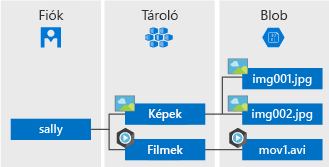

Az Azure Blob storage egy Microsoft objektum tárolási megoldás a felhőben. A BLOB storage nagy mennyiségű strukturálatlan adatot, például a szöveges vagy bináris adatok tárolására van optimalizálva.

A BLOB storage ideális:

* Képek vagy dokumentumok közvetlenül egy böngésző kiszolgáló.
* Megosztott hozzáférésre fájlok tárolásához.
* Adatfolyam-video- és.
* Írás a naplófájlokba.
* Adattárolás biztonsági mentés és helyreállításhoz, vészhelyreállításhoz és archiváláshoz.
* Adattárolás elemzés által egy helyszíni vagy Azure által üzemeltetett szolgáltatás.

A Blob Storage tárolóban objektumok is bárhonnan elérhetők a világ HTTP vagy HTTPS PROTOKOLLON keresztül. Felhasználók vagy ügyfélalkalmazások hozzáférhet az URL-címek, blobok a [Azure Storage REST API felülete](https://docs.microsoft.com/rest/api/storageservices/blob-service-rest-api), [Azure PowerShell](https://docs.microsoft.com/powershell/module/azure.storage), [Azure CLI](https://docs.microsoft.com/cli/azure/storage), vagy egy Azure Storage ügyféloldali kódtára. A storage ügyfélkódtáraival érhetők el több nyelv, beleértve a [.NET](https://docs.microsoft.com/dotnet/api/overview/azure/storage/client), [Java](https://docs.microsoft.com/java/api/overview/azure/storage/client), [Node.js](http://azure.github.io/azure-storage-node), [Python](https://azure-storage.readthedocs.io/en/latest/index.html), [PHP](http://azure.github.io/azure-storage-php/), és [Ruby](http://azure.github.io/azure-storage-ruby).

## A Blob szolgáltatással kapcsolatos fogalmak

A BLOB storage is közzétesz három erőforrások: a tárfiókot, a fiók a tárolók és a tárolóban lévő blobok. Az alábbi ábrán látható, az ezen erőforrások közötti kapcsolat.

### Tárfiók

Az Azure Storage adatobjektumainak hozzáférésének tárfiók során történik. További információkért lásd: [tudnivalók az Azure storage-fiókok](../articles/storage/common/storage-create-storage-account.md?toc=%2fazure%2fstorage%2fblobs%2ftoc.json).

### Tároló

Egy tároló rendezi a blobok hasonló egy mappába a fájlrendszer készlete. Összes BLOB a tárolóban található. A storage-fiók korlátlan számú tárolót tartalmazhat, és egy tároló korlátlan számú BLOB tárolhatja. Vegye figyelembe, hogy a tároló neve csak kisbetűket tartalmazhat.

### Blob
 
Az Azure Storage kínál háromféle blobot--blokkblobokat, hozzáfűző blobokat, és [lapblobokat](../articles/storage/blobs/storage-blob-pageblob-overview.md) (használt VHD-fájlokat).

* Blokkblobok szöveg és a bináris adatok, akár 4.7 TB-os tárolásához. Blokkblobok külön-külön kezelhető adatblokkjait épülnek fel.
* Hozzáfűző blobok blokkok alkotják blokkblobokhoz hasonló, de vannak optimalizálva, műveletek hozzáfűzésére. Hozzáfűző blobok ideálisak ahhoz hasonló forgatókönyvek esetén a virtuális gépekről a naplózási adatokat.
* Lap BLOB tároló elérésű fájlok legfeljebb 8 TB-nál. Lapblobokat a virtuális gépek biztonsági VHD-fájlokat tárolja.

Összes BLOB a tárolóban található. Egy tároló hasonlít egy mappát a fájlrendszerben. Akkor is további blobok a virtuális könyvtárak, hasonlóan rendszerezhet és bejárhat őket a fájlrendszerek. 

A nagy adatkészleteknél, ahol a hálózati korlátok miatt irreális lenne az adatok vezetékes le- vagy feltöltése a Blob Storage-ba, elküldhet a Microsoftnak egy teljes merevlemez-készletet, hogy az adatokat közvetlenül az adatközpontból importálják vagy oda exportálják. További információkért lásd: [adatok átviteléhez a Blob Storage a Microsoft Azure Import/Export szolgáltatás használata](../articles/storage/common/storage-import-export-service.md).
  
A tárolók és blobok elnevezésével kapcsolatos részletekért lásd: [Naming and Referencing Containers, Blobs, and Metadata](/rest/api/storageservices/Naming-and-Referencing-Containers--Blobs--and-Metadata) (Tárolók, blobok és metaadatok elnevezése és hivatkozása).
